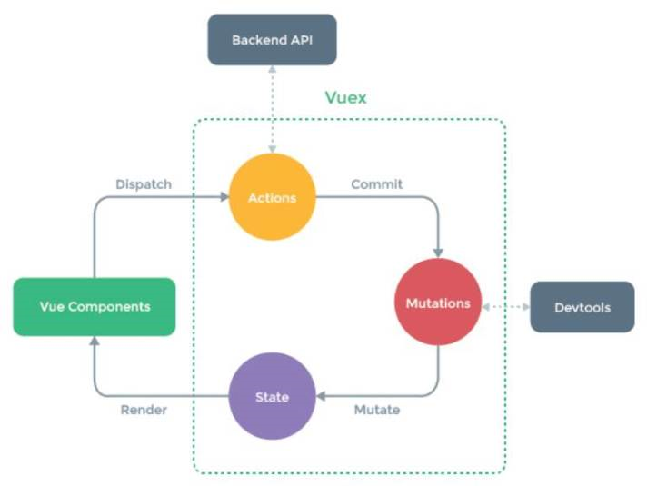

====
Vuex
====

| Vuex es un patrón de gestión de estado que nos permite tener los datos centralizados y accesibles en cualquier componente dentro de la aplicación.
| Se puede instalar usando Cli o bien usando el comando npm install vuex –save.

Arquitectura
============

| Vuex proporciona 3 estados básicos los cuales se pueden apreciar en la imagen. Aunque tenemos que tener en cuenta uno más que son los getters.

- State: Es un objeto que puede contener cualquier tipo de información y está almacenado de forma centralizada en toda la app.
- Mutation: Son funciones que modifican el estado, son llamadas por las acciones.
- Mutation: Son funciones que modifican el estado, son llamadas por las acciones.
- Getters: Son funciones que devuelven estados. Se llaman desde un componente a través de getters.

Estructura
==========

1. Store

  - Modules

     - player.js

- index.js

Index.js
========

.. code-block:: javascript

		export default new Vuex.Store({
		    modules: {
		      player
		    }
		})

Player.js
=========

.. code-block:: javascript

		const state = () => ({
		    players: [],
		    player: {},
		    playersOnline : 0
		})

		const getters = {
		    getPlayers (state) {
			return state.players
		    },
		    getPlayer (state) {
			return state.player
		    },
		    getPlayersOnline (state) {
			return state.playersOnline
		    }
		}

		const actions = {
		    async retrievePlayersByRank({ commit }, name) {
			const players = await playerService.retrievePlayersByRank(name)
			commit('setPlayers', players)
		    },
		    async retrievePlayerByName({ commit }, name) {
			const player = await playerService.retrievePlayerByName(name)
			commit('setPlayer', player)
		    },
		    async retrievePlayersOnlineNumber({ commit }) {
			const player = await playerService.retrievePlayersOnlineNumber()
			var playersOnline = 0
			if (typeof player === 'undefined') {
			    playersOnline = 0
			} else {
			    playersOnline = player.length
			}
			commit('setPlayersOnline', playersOnline)
		    }
		}

		const mutations = {
		    setPlayers (state, players) {
			state.players = players
		    },
		    setPlayer (state, player) {
			state.player = player
		    },
		    setPlayersOnline (state, playersOnline) {
			state.playersOnline = playersOnline
		    }
		}

		export default {
		    namespaced: true,
		    state,
		    getters,
		    actions,
		    mutations
		}

Cómo usar los estados desde un componente
=========================================

.. code-block:: javascript
	
		await this.$store.dispatch('player/retrievePlayerByName', this.name)
		await this.$store.getters['player/getPlayer']

- Acciones: Se llaman usando dispatch, al usar módulos se tiene que indicar el nombre del módulo seguido del nombre de la acción.
- Getters: Se llaman usando getter, al usar módulos se tiene que indicar el nombre del módulo seguido del nombre del getter.

