=============================
Características implementadas
=============================

| Algunas de las características que se han implementado son las siguientes.

Mensaje de bienvenida
=====================

| Al entrar en el servidor se muestra un mensaje de bienvenida mostrando el rango y el nombre del jugador.

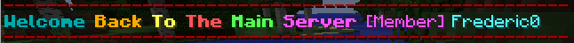

Sistema de rangos
=================

| Se usa para autorizar a los jugadores a usar los recursos y/o comandos que ejecuten.
| 
| De momento los rangos que se usan son miembro y dueño.

Guardar los logros de un jugador
=================================

| Los logros son una forma de orientar a los nuevos jugadores de Minecraft y proponer desafíos a completar.
| 
| Cuando se realiza ese evento, el logro que ha conseguido el jugador se guarda en la base de datos.

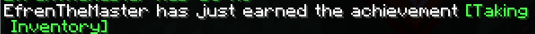
   
Comandos
========

| Lo que está entre llaves son los parámetros del comando.

-----
/ping
-----

| Comprueba la latencia del jugador con el servidor.

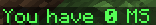

----------------------
/ping {nombre_jugador}
----------------------

| La diferencia con el comando anterior es que se comprueba la latencia del jugador que se indica.
| 
| El jugador requiere tener el rango dueño.

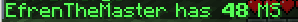
   
--------------------------
/create warp {nombre_warp}
--------------------------

| Crea un checkpoint para que un jugador se pueda teletransportar en cualquier momento.

| Los jugadores con el rango miembro sólo pueden crear 1 warp mientras que los jugadores con el rango dueño pueden crear 2 warps.

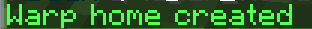
   
--------------------------
/warp {nombre_warp}
--------------------------

| El jugador se transporta a las coordenadas de ese warp automáticamente.

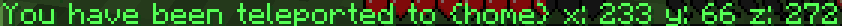
      
--------------------------
/delete warp {nombre_warp}
--------------------------

| Borra un warp creado anteriormente.

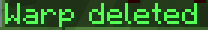
   
-----------
/list warps
-----------

| Muesta una lista con el nombre de los warps creados.

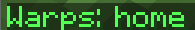
      
---------------------------------
/change name color {nombre_color}
---------------------------------

| Cambia el color del nombre del jugador. Sólo el jugador con el rango dueño puede usar el color arcoiris.

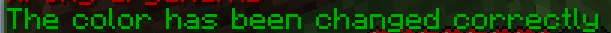

| 
   

--------------------------------------------------
/change name color {nombre_color} {nombre_jugador}
--------------------------------------------------

------------
/list colors
------------

| Muestra los colores disponibles.

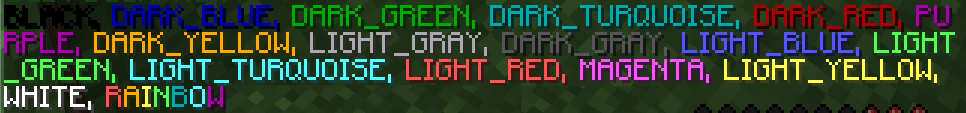
   
-----
/seen
-----

| Muestra la fecha en la que el jugador se ha conectado al servidor por última vez.

----------------------
/seen {nombre_jugador}
----------------------

| La diferencia con el comando anterior es que muesta la fecha del jugador que se indica.
| 
| El jugador requiere tener el rango dueño.

-------------
/chunksLoaded
-------------

| Muestra la parte que está carga del mapa del servidor.
| 
| El jugador requiere tener el rango dueño.

Errores personalizados al ejecutar un comando
=============================================

----------------------------
Comando con pocos argumentos
----------------------------

   
---------------------------------
Comando con demasiados argumentos
---------------------------------

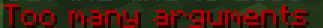
   
----------------------------------
Comando con argumentos incorrectos
----------------------------------

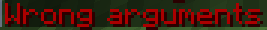
   
--------------------------------
Si el jugador no está autorizado
--------------------------------

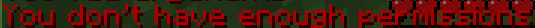

