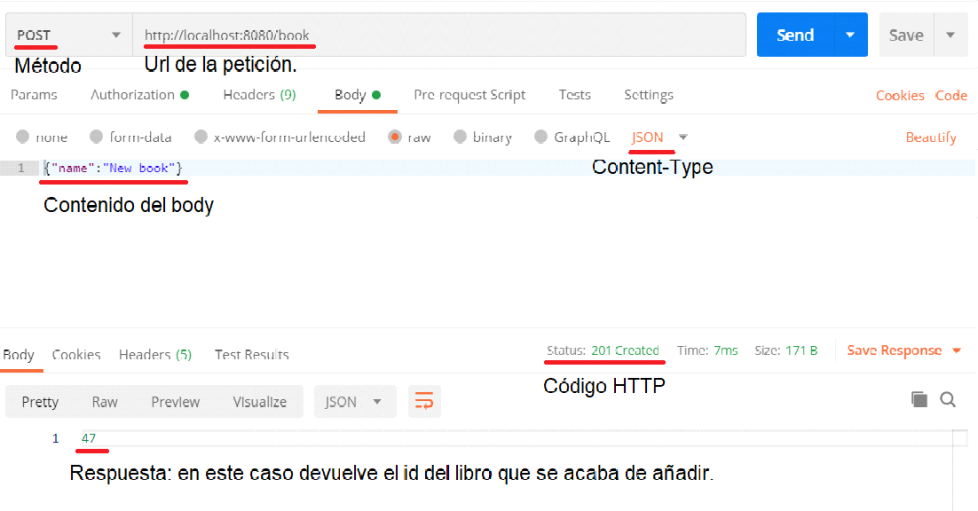

=======
Postman
=======

| Postman es una herramienta que permite realizar peticiones HTTP a cualquier API. Es muy útil a la hora de realizar pruebas para comprobar el correcto funcionamiento de la API.

