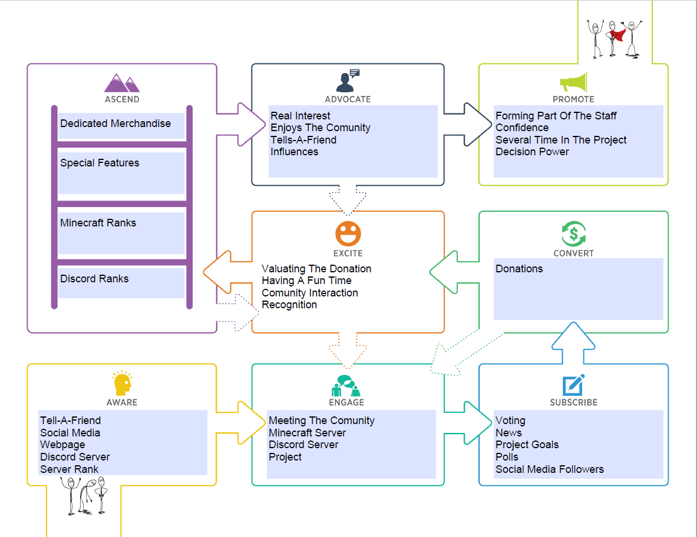
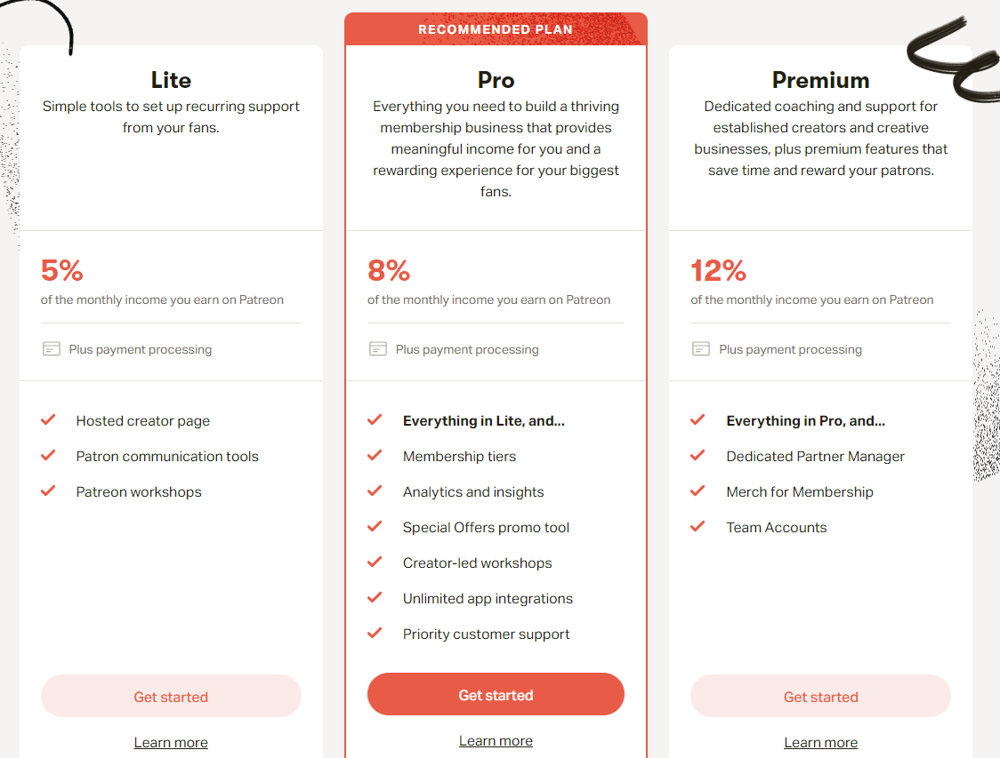
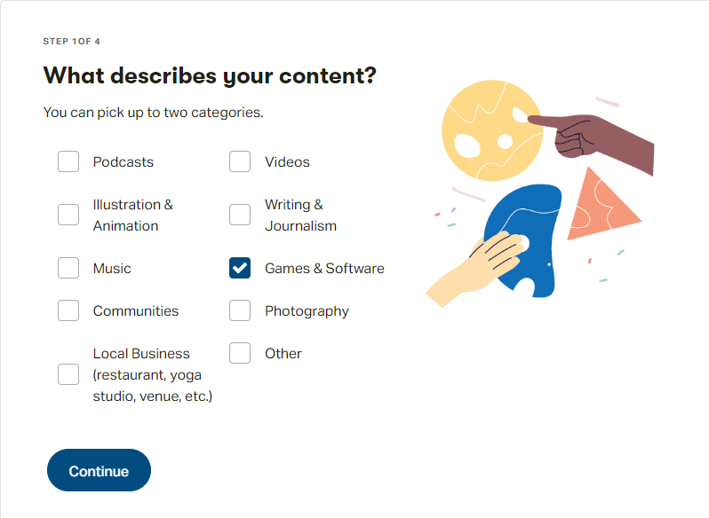
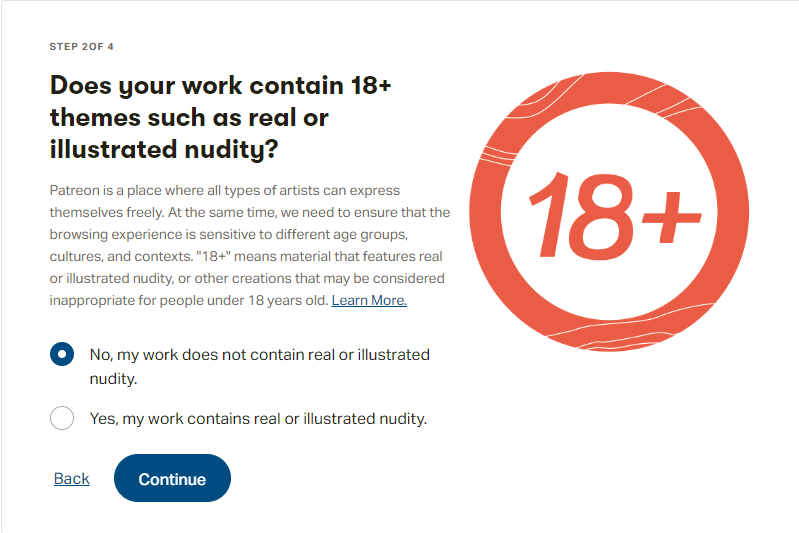
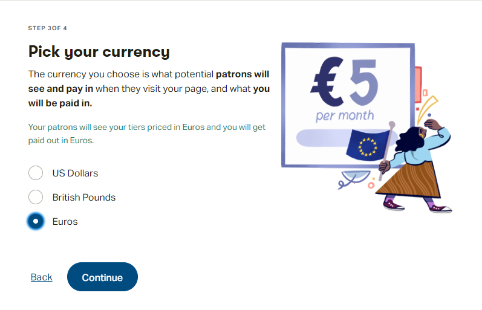
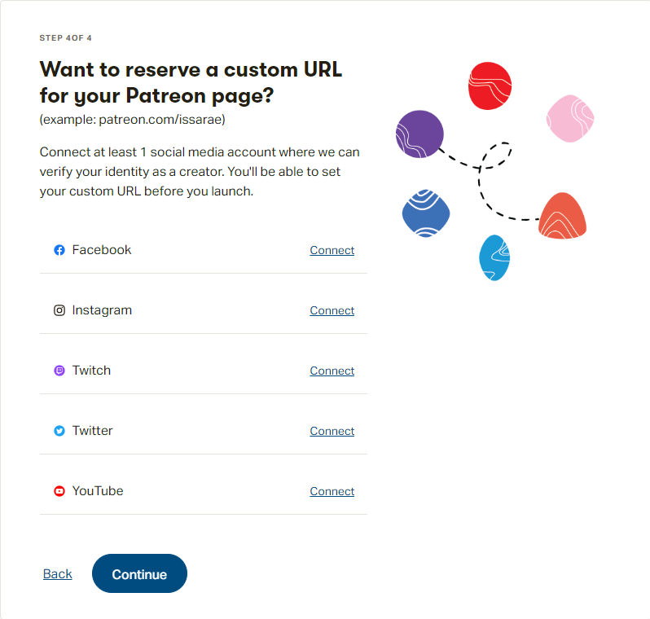
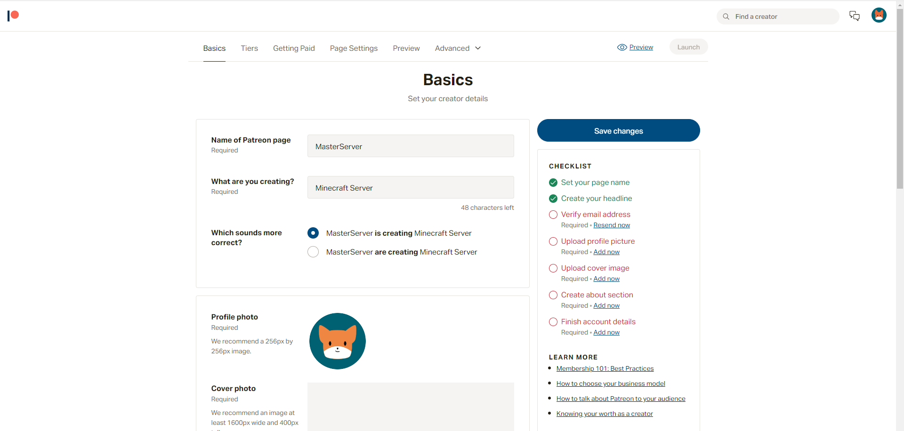
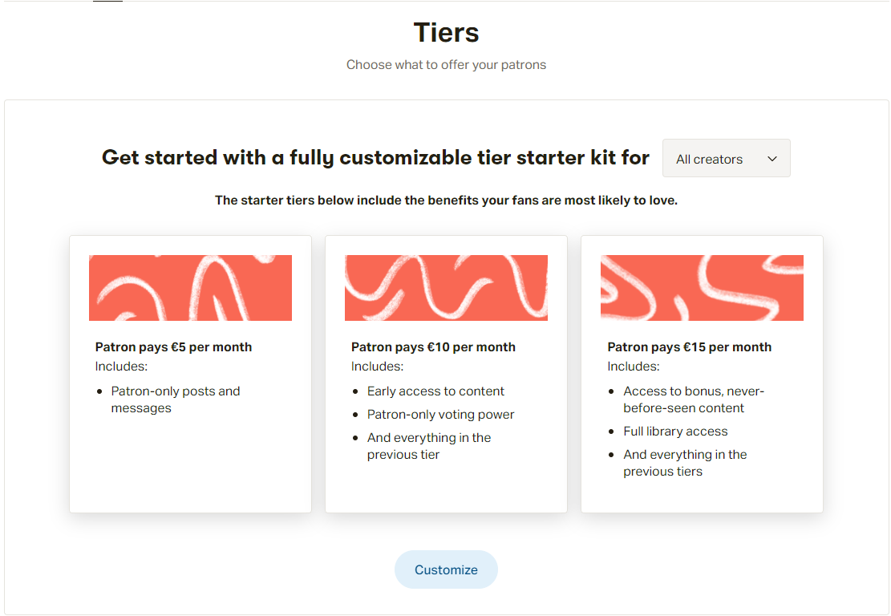
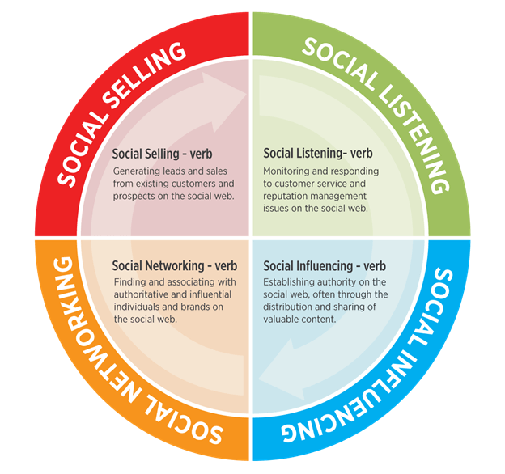

=================
Digital Marketing
=================

| Starting an enterprise and then launching a project in production is the common way to approach a business, but in this case it was the other way around; The project idea was already created and just needed to launch it to the market
| 
| The traditional way of marketing is physical but as the technologies, necessities and facilities evolve, digital marketing was born.
| 
| Its strenghts compared to traditional marketing are the following

- Makes it easier to create awareness and engagement, both before and after the sale
- Helps converting new buyers into fans who buy more and more often
- Kickstarts the word-of-mouth, tell-a-friend and social sharing strategies, along with all their benefits
- Shortens the buyer's journey by presenting the right offers at the right time
- Worldwide, anyone in the world can have knowledge of it

| The MasterServer main idea is making people **enjoy for free** the offered services.
| To keep that philosophy, instead of the traditional buyer-seller or purchases sytem I decided using the **donations** system.

| Money won't be used in exchange to get a product, but instead in a way to *crowd-fund* the project and help it reaching goals, apart from including **rewards** that vary depending on the amount donated.
| 
| The main steps of the plan I'm going to base my project in are the following

#. Finding a need and filling it based in the released project
#. Customer Value Journey
#. Designing a logo or slogan
#. Designing and building a webpage or place for the comunity
#. Establishing a good reputation through social media
#. Following up with the comunity and donators
#. Increasing income through donations and merchandising

Finding A Need
==============

| Minecraft is a multiplayer sandbox game with a huge players and media creators comunity of over 112 million monthly players. It's one of the most played games at the date.
| 

+-------------------------------+-----------------+----------------+
| Game                          | Monthly Players | Release Date   |
+-------------------------------+-----------------+----------------+
| PlayerUnknown's Battlegrounds | 227 million     | November 2015  |
+-------------------------------+-----------------+----------------+
| Honor of Kings                | 200 million     | December 2017  |
+-------------------------------+-----------------+----------------+
| Pokémon Go                    | 147 million     | July 2016      |
+-------------------------------+-----------------+----------------+
| Roblox                        | 146 million     | August 2006    |
+-------------------------------+-----------------+----------------+
| Grand Theft Auto V            | 120 million     | September 2012 |
+-------------------------------+-----------------+----------------+
| League of Legends             | 115 million     | October 2009   |
+-------------------------------+-----------------+----------------+
| Minecraft                     | 112 million     | November 2011  |
+-------------------------------+-----------------+----------------+
| CityVille                     | 100 million     | July 2011      |
+-------------------------------+-----------------+----------------+
| Subway Surfers                | 100 million     | May 2012       |
+-------------------------------+-----------------+----------------+
| FarmVille                     | 83 million      | June 2009      |
+-------------------------------+-----------------+----------------+
| Mini World                    | 80 million      | December 2015  |
+-------------------------------+-----------------+----------------+
| Mobile Legends: Bang Bang     | 80 million      | November 2016  |
+-------------------------------+-----------------+----------------+
| Fortnite Battle Royale        | 78.3 million    | September 2017 |
+-------------------------------+-----------------+----------------+

| 
| Its main competitor is **Roblox**, which has more monthly players and was released before Minecraft.

- Roblox and Minecraft are rated *E 10+* in the US and *PEGI 7* in Europe, what makes them playable by almost everyone.
- Minecraft costs an average of 26,95$ depending on the platform, store and currency, while Roblox is totally free.
- Roblox only supports phone and PC platforms. Meanwhile Minecraft also supports consoles.
- Both of them have their own in-game paid content, but the comunity created content is where most of the money is spent.

| In Minecraft, each server or comunity of players is a digital business, in the meaning of competency between them to get the most amount of active players.
| Active players in a server translate into more popularity and income.
| The key is turning players into costumers.

Customer Value Journey
======================

| The **Customer Value Journey** is the most important part of the process to ensure a good start and growth of the comunity, popularity and finally income.
| 
| The reason it's called the Customer Value Journey comes from the fact that customers (or in this case, players or members) have the most value.
| It can be seen just as an ecosystem, where the MasterServer is the system that depends on the players, donators and customers to work and improve
| 
| I designed the following journey plan

| And further explanations for the journey I designed

#. Awareness

   * Tell-A-Friend; Advocates or promoters spread the word to other people to join the comunity via Minecraft or Discord
   * Social Media; A new follower is potentially becoming new member of the comunity
   * Webpage; A player finds the webpage and develops interest on the server
   * Discord Server; A player is invited to the Discord server thanks to an advocate
   * Server Rank; A player looking for Minecraft servers to play finds it

#. Engagement

   * Meeting The Comunity; The player becomes a new member of the comunity and interacts with other players that are already part of it
   * Minecraft Server; The player explores the minecraft server and has a good time playing
   * Discord Server; The player stays in touch during or after playing in the Minecraft server
   * Project; The member discovers more about the MasterServer project

#. Subscribe

   * Voting; The member votes for the server to increase its popularity and earn in-game rewards
   * News; The member receives news through Discord and Minecraft
   * Project Goals; The member is aware of the project goals and success
   * Polls; The member can interact in decissions through polls to improve the MasterServer
   * Social Media Followers; The members following the MasterServer through social media is an extra

#. Convert

   * Donations; There are not purchases, just donations!. By donating to the project people collaborate to achieve its goals and also get rewards

#. Excite

   * Valuating The Donation; The member must be aware that his or her donation has a huge value and means a lot for the project
   * Having A Fun Time; Enjoying the time and money spent on the server is the main target of the project
   * Comunity Interaction; Maintaining an exicted and active comunity is the basis of a happy comunity
   * Recognition; Donators must be recognized and valuated

#. Ascend

   * Discord Ranks; Further and more expensive donations will reward with a Discord rank
   * Minecraft Ranks; Further and more expensive donations will reward with a Minecraft rank
   * Special Features; Further and more expensive donations will reward with special in-game features
   * Dedicated Merchandise; The most expensive donations will reward with a custom dedicated merchandise for the donator

#. Advocate

   * Real Interest; Advocates apart from excitement developes another level of interes in the project
   * Enjoys The Comunity; Advocates also maintain the comunity and its activity
   * Tells-A-Friend; Advocates are the major source of awareness of new people about the MasterServer
   * Influences; Advocates can cheer up and influence other people about the MasterServer

#. Promote

   * Forming Part Of The Staff; Promoters must be mature people who want to improve the MasterServer
   * Confidence; Promoters must be confident about their decissions which have a major impact on the MasterServer popularity
   * Several Time In The Project; Promoters must have been a gentle amount of time forming part of the project and comunity
   * Decision Power; Staff must be responsible of their decisions and its power

| The intial steps are the **most important** ones, since early supporters will see the project raising and earn better rewards. That's why turning players into costumers is acquired by making them enjoy the server.
| 
| In the engagement process, instead of flooding the player with a regular email subscription or asking for personal data, I will add a message bot that sends small text advertisements automatically every 15 minutes in the server chat, so the own customer will engage in a relationship without being annoyed or spammed.
| 
| When it comes to rewards, **time-limited** offers or **limited-edition** rewards can excite the customers.

Logo
====

| I designed the MasterServer logo by my own without any copyrighted sources or programs to avoid any kind of copyright issues.
| 
| I created 2 formats; The small one only with the MasterServer initials, *MS* and the full-lenght one with the complete name, *MasterServer*. 
| Both of them have a transparent background so it can be easily edited, distributed and posted.
| 
| They can be found on the left top banner and the home page of the document.

Website
=======

| The website has already a nice and attractive design, but lacks in popularity.
| 
| Some future upgrades to bring more people and raise the income would be the following

1. **Domain name**, to make it easier and more attractive for people to remember; 15€/year at `Google Domains <https://domains.google/>`__ for *masterserver.biz*
2. **Search engines**, to appear more often in the Google search results
3. **Advertisements**, offering a new subscription to avoid them

Discord Server
==============

| The Discord server, along with the Minecraft one, are the **best ways** to communicate with the members.
| 
| Some features to keep the comunity active and hyped/excited are the following

- **Special ranks** and channels for supporters and players that are active.
- **Special events** with rewards .
- **News channel** to keep people updated.
- **Polls channel** to let members choose over some decisions.

Patreon
=======

| Patreon it's one of the ways to launch an online donations platform. It doesn't require much knowledge and it's totally free.
| Depending on the plan, Patreon will take from 5% to 12% of the benefits, which is a low amount compared to other platforms.
| 
| First of all, there are different plans. The one I will use is *Pro* since it features a Discord bot that can be linked to Patreon.

| After creating an account with an email, it will ask a series of questions about the project content. All of this configurations can be changed later.

| More questions concerning the payout currency and media connections

| Finally the main page will be prompted. Everything can be edited there, including the profile picture, description and main page.
| 
| It must be attractive to people that is whiling to donate

| The most important part are the **Tiers**. Those are the kind of plans people can use to donate. There's no limit in the amount of plans and they can be *Creation* plans or *Monthly* plans.
|
| Plans per creation are only payed once, meanwhile monthly ones are payed at the end of every month.
| 
| For this case I would use creation plans. The tiers look like this

| When everything is configured, the Patreon page can be launched.

Minecraft Server List
=====================

| Minecraft Server List is a webpage linked to Minecraft servers that use the **Votifier** plugin. Players can vote for MasterServer in-game in exchange of some rewards.
| 
| The webapge can be found `here <https://minecraft-server-list.com>`__.
| Just issuing a command in Minecraft will give a link to vote for the server. To vote players just have to type in their Minecraft username.
| The more votes MasterServer receives, the more popularity it will gain in the server list, being ranked higher and easier to find.
| 
| Problem is the server must be always online. If it goes offline, the Minecraft Server List will detect it and remove it from the list until it comes back on again.
| Since I can't let it stay powered on 24/7 for now, I will add it to the list when I move the server structure to its final place.

Social Media
============

| Social media can have a major influence over a product or comunity.
| 
| The comunity is focused for young people, ranging from 12 up to 30 years old, but anyone can join it.
| 
| The social media strategy will be using Facebook, Instagram and Twitter as advertising places for donations, events and news about the server.

Roadmap
=======

| I set the following goals to achieve as the MasterServer improves in terms of popularity and income.

#. Adding new ranks
#. Improve the webpage with search engines and a better domain name
#. Develope new Minecraft server features and improve their quality 
#. Improve the server performance and security to allow more players in
#. Create a store integrated in the webpage with no fees
#. Create MasterServer merch, like t-shirts, posters, a signed shirt or envelope by the owners, etc.
