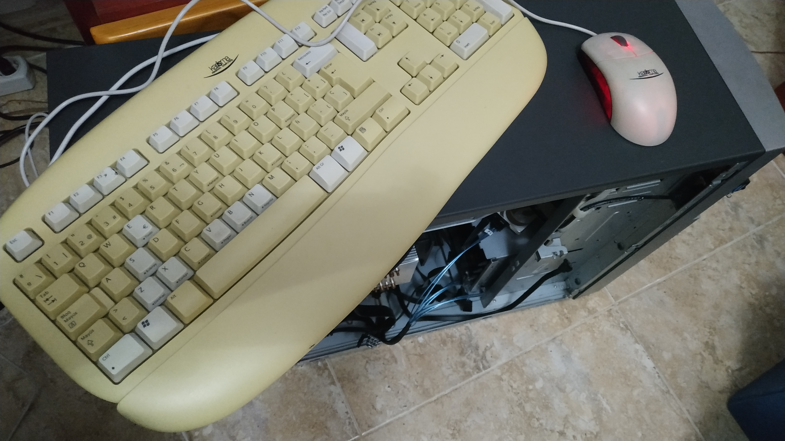
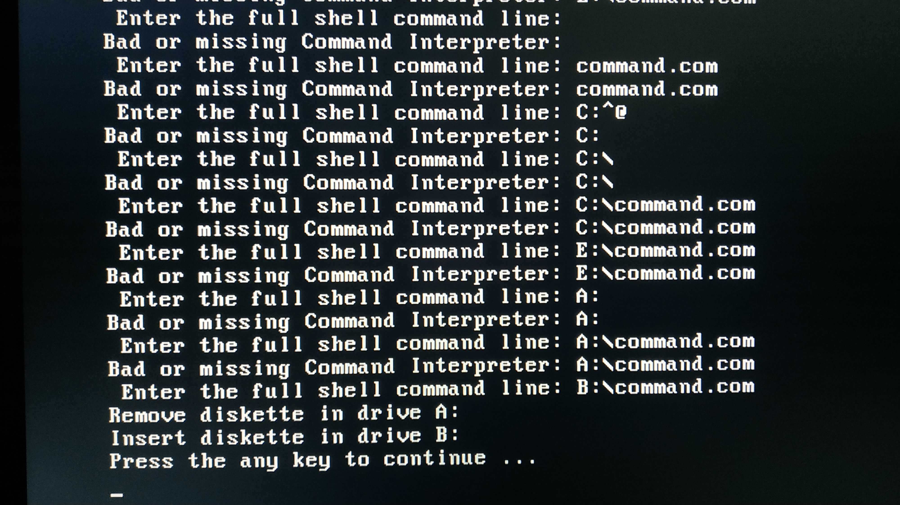

===========
BIOS Update
===========

| The **BIOS** is the Basic I/O System flash chip located in the motherboard.
|
| Its main functions are configuring hardware settings and performing overclock.
| The server comes with a 1MB **Legacy Phoenix BIOS**. The motherboard came with the first release BIOS version so I decided to update it.
| 
| Updating the BIOS is a delicate process and recommended to do it only if there's any improvement or fixed bug that is needed.
| A power outage or any kind of problem with the source media containing the new BIOS files can brick the motheboard [#]_

Update Process
==============
--------------
Required Files
--------------

| To find the BIOS update files I went to the `Fujitsu webpage <https://support.ts.fujitsu.com/Index.asp?lng=ES&OICOpen=Servers>`_ clicked *Select a new product* and typed in the serial number found on the case sticker.
| Then all the available and compatible software for my server appeared in the `downloads section <https://support.ts.fujitsu.com/Index.asp?lng=es&OpenTab=>`_.
| 
| There are many ways to update it. Some of them are using a floppy, running a program in the OS [#]_ or through the server IRMC.
| 
| The method I chose was via USB drive.
| 
| I proceeded to download the latest version, which includes the following features.
| 
| 
| BIOS - Change V4.06 Release 1.10.2509 Date 20.12.2010
|
| CPU Microcode update for Intel Xeon 5100/ 5200/ 5300 5400 based processor
| (CPUID/Patch ID: 6FB/BC; 10676/60F;  1067A/A0B)
| 
| 
| Here you can read the whole `changelog <changelog.txt>`_.

------------
USB Creation
------------

| The file downloaded from the Fujitsu web page was a *.exe*.
| 
| I plugged in a fresh FAT 32 formatted 32 GB USB stick and made sure there was no other USB stick plugged in to avoid confusion.
| Executing the file will warn that all the selected drive data will be cleaned.

| Some new windows will appear, letting to either make an image file from the USB files or create a USB drive with an image file.
| 
| I chose to use the BIOS **image file** and the device I wanted to use. Then I copied the IMG [#]_ to the USB.

| I skipped the Windows warning to format the drive and accepted the prompted window.

| Surprise! the image file was a FreeDOS OS with the BIOS update program.

-------
FreeDOS
-------

Introduction
------------

| **FreeDOS** is a free **terminal-based** and low size OS.
| 
| As many other **DOS** operative systems its based in CP/M [#]_.
| Even tho most people would think that DOS operative systems are based on **MSDOS**, that's wrong!
| 
| The earlier versions of MSDOS were a **copy of CP/M** (in fact, MSDOS was programed with the CP/M API). MSDOS was just more widespread and compatible with any **x86** computer, unlike CP/M.
| CP/M also pioneered the idea of a **ROM** based BIOS for commonly used routines on a given computer, which made it easy to port.
| 
| Its source code can be found `here <http://s3data.computerhistory.org/cpm-source-v3.zip>`__

Hands-On
--------

| To avoid any problems with USB drivers or BIOS detection I used my handy and trusted PS2 keyboard and plugged in the USB stick in the server.
| 
| Then I booted into the BIOS, removed the exclamation mark on the USB drive so it would allow it to boot, and as soon as FreeDOS booted I got the following error.

| **COMMAND.COM** is the default command-line interpreter in DOS operative systems.
| 
| To overcome this error I had to reverse engineer it.
| 
| First I tried looking for any **drive letter** that could be detected in the DOS (C:, A: and B: are the common disk and floppy drives).
| 
| After trying all the drive letters the only ones that gave a hint were A: and B:, but still it didn't detect the COMMAND.COM file that should be in the USB stick. It seemed like there was no COMMAND.COM!

| So the solution I came across after thinking was making a FreeDOS USB stick with a newer version, moving all the files that I considered necessary for the BIOS update process and also added the missing COMMAND.COM file.
|
| I created the FreeDOS USB with an image resulting in this.

| Then I added the required BIOS update files and the COMMAND.COM (which even with hidden files toggled on was not visible in the Windows file explorer).
| 
| Since Microsoft finally published the MSDOS source code in 2018 I could grab the COMMAND.COM from `here <https://github.com/microsoft/MS-DOS>`__

| There was no manual or guide for the BIOS update program so I just executed it to see the valid arguments.
| The command I executed was ``BIOFLASH.EXE /AUTO`` so it would take the suitable BIOS **OMF** file and flash it.

| After finishing the flashing process I turned on the MasterServer on and it POSTed. Success!

| Finally I checked that the BIOS was actually updated to its latest version from the BIOS.

.. image:: media/bios17.jpg
   :width: 400px

| 
| 
| 

.. rubric:: *Footnotes*

.. [#] Bricking a motherboard is the result of a bad flashing process that makes the BIOS unusable and the PC wont POST (I haveve done it and I dont recommend it)
.. [#] Raw Image format. ISO files are CD/DVD images intended to distribute software, IMG files are floppy images intented to serve as backups of HDDs
.. [#] Operative System
.. [#] Control Program for Microcomputers

