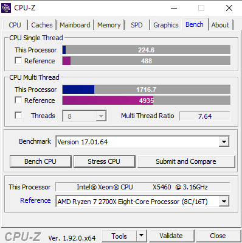
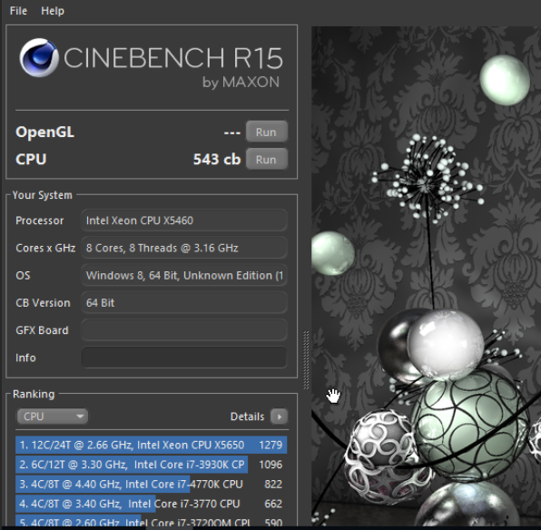
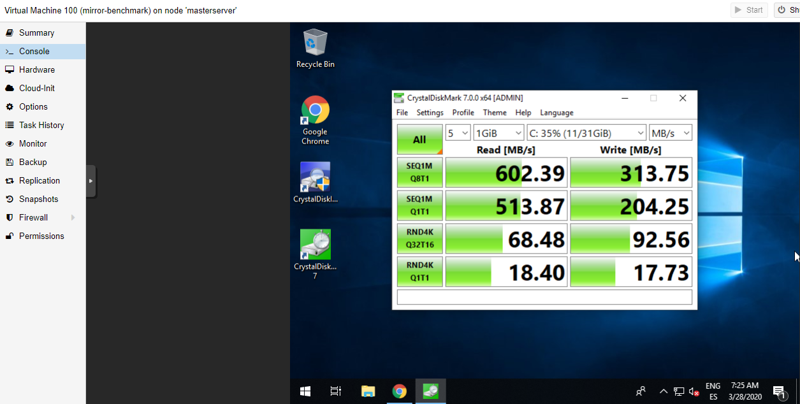
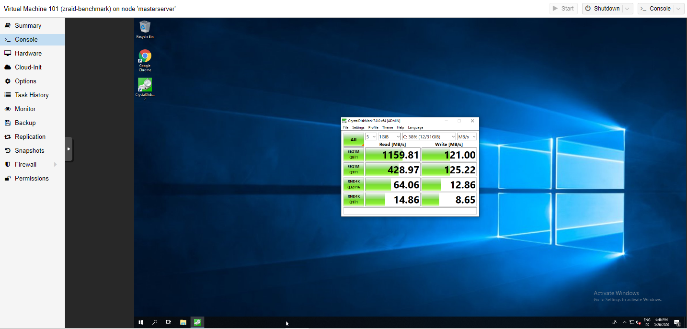

============
Benchmarking
============

| Benchmarking is a series of tests where a computer is brought to its limits to measure its performance. Benchmarks are oriented to different parts or algorithms.
| Most common ones are for disks, GPUs and CPUs.
| In this case I only benchmarked the CPU and HDDs in a Windows 10 VM.

---
CPU
---

| The benchmarks I used are **Cinebench R15** and **CPU-Z**. The results were the following.

---
HDD
---

| I used CrystalDiskMark with the VirtIO driver installed in the OS. I ran the benchmark in a VM stored in the the SSDs mirror and another one in the Z-RAID.
| The Mirror has pretty much the same speeds as it would have a single SSD

| The Z-RAID improved hugely the read speeds compared to the SSDs and the writing ones became a little slower.

