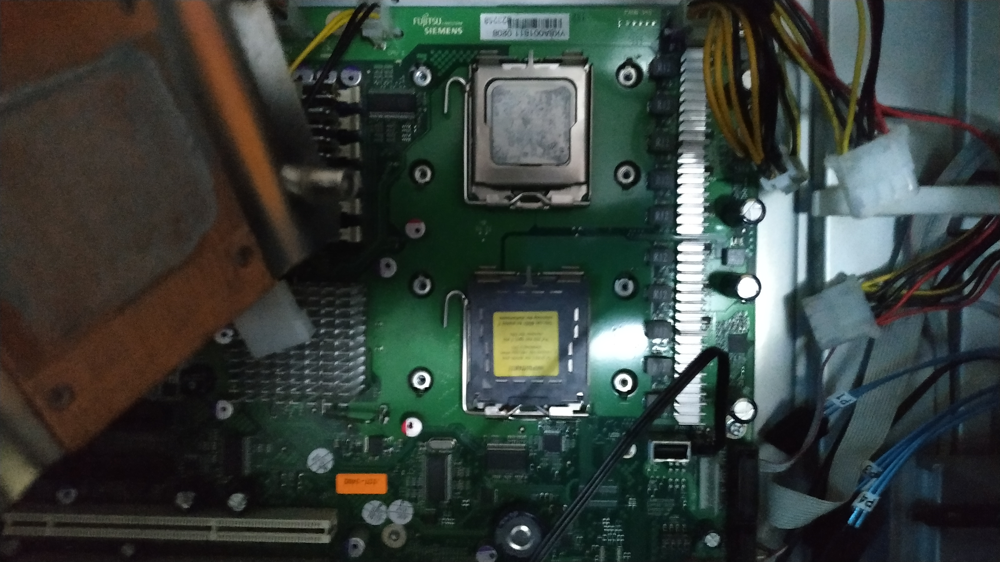
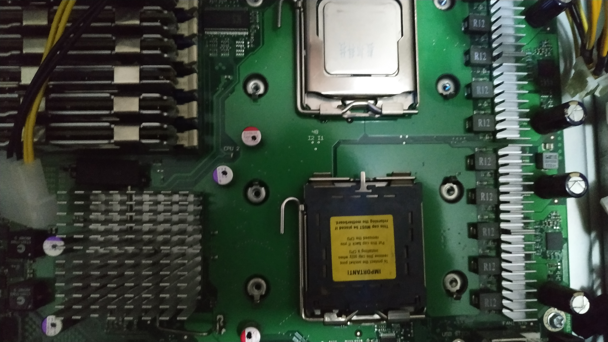
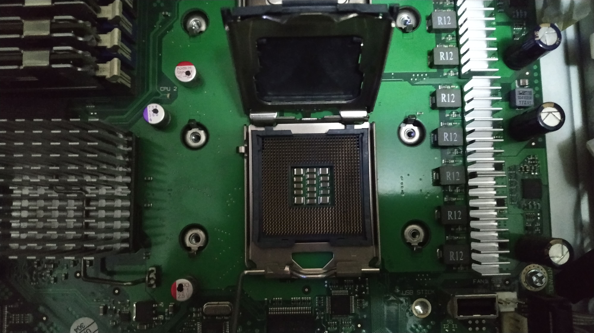
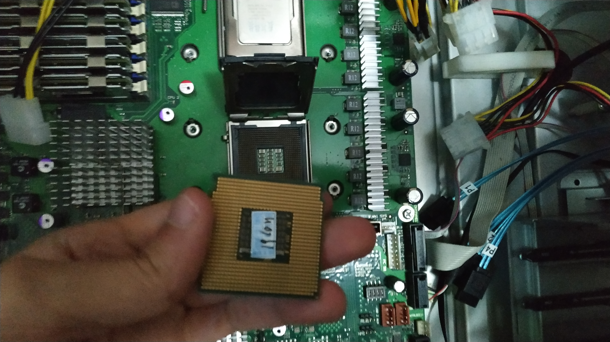
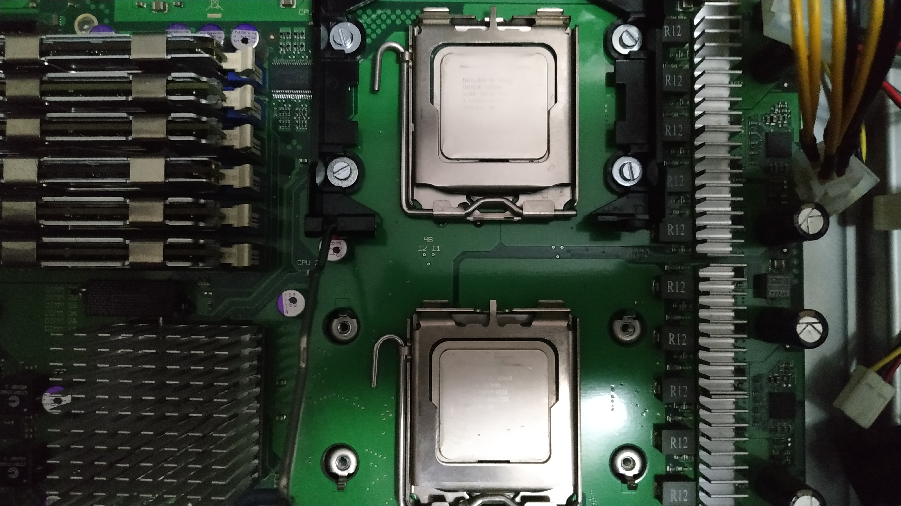

===
CPU
===

| The server bundle I bought came with an Intel® Xeon® E5404 and I upgraded it to 2 Intel® Xeon® X5460 SLANP

Features
========

+-------------------+-------------------------+
|     Features      |         Values          |
+===================+=========================+
| Cores             | 4                       |
+-------------------+-------------------------+
| Threads           | 4                       |
+-------------------+-------------------------+
| Frequency         | 3.16 GHz                |
+-------------------+-------------------------+
| L1 Cache          | 64KB Data Write-Through |
+-------------------+-------------------------+
| L2 Cache          | 12MB Unified Write-Back |
+-------------------+-------------------------+
| FSB               | 1333 MHz                |
+-------------------+-------------------------+
| FSB Parity        | Yes                     |
+-------------------+-------------------------+
| TDP               | 120 W                   |
+-------------------+-------------------------+
| VID Voltage Range | 0.850V-1.3500V          |
+-------------------+-------------------------+
| Litography        | 45 nm                   |
+-------------------+-------------------------+
| Transistors       | 820 million             |
+-------------------+-------------------------+
| Intel VT-x        | Yes                     |
+-------------------+-------------------------+
| Release Date      | Q4 '07                  |
+-------------------+-------------------------+
| Release Price     | 1245$                   |
+-------------------+-------------------------+

--------
Stepping
--------

| The **stepping** is a processor revision that fixes bugs or improves some of its features but they are not enough to launch another model.
| 
| It's made up with a letter, dash and number.
| An increase of the number results in a minor change, while increasing the letter means complex or major changes.
| 
| The X5460 has 2 steppings; **C0** and **E0**

------
S-Spec
------

| The **S-Spec Number** [#]_ is a string of 4 to 6 alphanumeric characters that represent an exact **IC batch** or set of batches.
| The S-Spec number can uniquely identify the model number and the core stepping.

- **Production** chips have an S-Spec number that start with the letter **S**
- **Qualification** samples have an S-Spec number that starts with the letter **Q**

| The X5460 has the following steppings and S-Spec Numbers
| 

+----------+--------+----------------------------------------------------------+
| Stepping | S-Spec |                         Features                         |
+==========+========+==========================================================+
| C0       | Q5XQ   | Engineering sample                                       |
|          +--------+----------------------------------------------------------+
|          | SLANP  | Enhanced Halt State enabled.                             |
|          |        | The processor supports I/O Acceleration Technology.      |
|          |        | Demand Based Switching                                   |
+----------+--------+----------------------------------------------------------+
| E0       | QFTX   | Engineering sample                                       |
|          +--------+----------------------------------------------------------+
|          | SLBAA  |                                                          |
|          |        | XSAVE and XRSTORE instructions                           |
|          |        | ACNT2 feature used for determining processor utilization |
|          |        | Halide-free package and lower temperature                |
+----------+--------+----------------------------------------------------------+

Installation
============

| All I had to do was remove the cooler with a screwdriver and take off the CPU from the ZIF [#]_ socket.

| The other socket has never been used before so I removed the socket protection plastic and placed it carefully, paying attention to the triangle mark in both the CPU and socket corners. 

| Finally I put the socket lever back in holding the CPU and done!

Overclock
=========

| The LGA771 and 775 are classics when it comes to **overclocking**.
| 
| Overclock means making electronic components or just computer parts go above their limits or default safe settings.
| 
| Intel released its first unlocked CPUs in the LGA775 with the Core 2 Extreme. The reason they are called unlocked is because their **multiplier** is unlocked and can be changed from the BIOS.
| 
| Intel doesn't even tell the default CPU multiplier in the specs page (you can check it by yourself in case you dont trust me), so I have to calculate it by myself with the **master formula**.
| 
| **CPU MHz = CPUM x FSB**
|
| Where *CPU MHz* is the speed of the CPU in MegaHertzs and *CPUM* the CPU multiplier.  
|
| Even tho Intel released the Extreme CPUs as the best CPUs to overclock that didn't happen. Extreme CPUs were really expensive compared to the rest, so everyone overclocked their CPUs playing with the FSB [#]_ value.
|
| Motherboards could have different FSB frequency. Some supported only up to 800 MHz, while top notch ones like the *XFX nForce 790I Ultra SLI* supported up to 1600 MHz.
|
| Same happened with CPUs. Their FSB was different, so aiming for a low FSB CPU would allow for more overclock, most of the times.
| 
| Anyway Intel gives the CPU FSB value **quad pumped**. That means the real FSB value is the result of dividing it by 4.
|
| For example, my X5460 has a 1333 MHz FSB but thats quad pumped, which would be 333 MHz.
|
| Knowing that its stock frequency is 3,16 GHz I can easyly find the multiplier;
| 
| 
| **CPUM = 3160/333**
| 
| 
| The result would be a 9.5 multiplier, written as **x9.5**
| 
| For the RAM, due to the DDR [#]_ technology it will be running at double the speed of the FSB
| 
| 
| **DRAM MHz = 2 x FSB**
| 
| 
| In my case the DRAM frequency is 666 MHz.
| 
| Most motherboards had FSB:DRAM dividers. That allows to control the RAM frequency separately from the CPU
| 
| Another **master formula** to take in account when overclocking is the following.
| 
| 
| **P = CFV^2**
| 
| 
| Where *P* is power, *C* capacitance, *F* frequency and *V* voltage.
| 
| Since the capacitance value cant be changed from the BIOS and more power means more temperature, I simplified the equation for an overclocking environment.
| 
| 
| **T = F x V^2**
|
| 
| Where *T* is temperature, *V* is voltage and *F* is frequency.
|
| That means an increase in the voltage will impact twice on the temperature raise if it was the same increase in the FSB.
| Raising the voltage a little (few mV) may have a noticeable impact in the CPU temperature.   
| 
| 
| 

.. rubric:: *Footnotes*

.. [#] Sample-Specification Number
.. [#] Zero Insertion Force
.. [#] FrontSide Bus
.. [#] Double Data Rate

