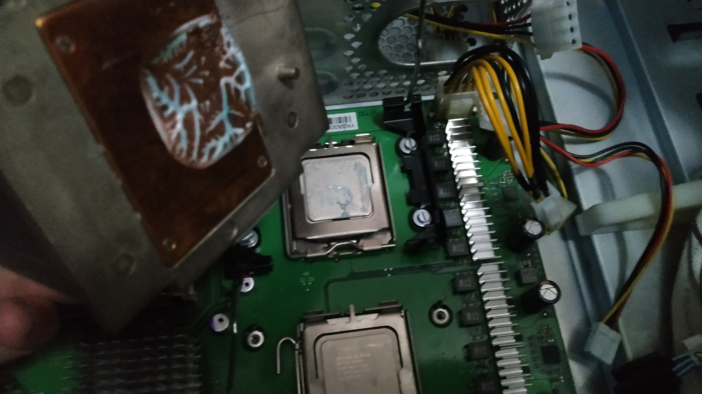

=======
Cooling
=======

| The server bundle came with the stock passive CPU cooler and without fans.
| 
| Since the second CPU didnt have a cooler I bought one for the socket LGA771 since the mounting holes are totally different from the LGA775. In LGA771 the cooler screws are directly attached to the case instead of a backplate like most nowadays motherboards.
| 
| The problem was server manufacturers make their products only compatible for their own servers, so the only way to obatain a replacement part is contacting the server manufacturer, unlike desktop PCs.
|
| In my case, the first time I called Fujitsu's support to check if the BIOS CPU microcode supported the X5460 they just told me to check the manual and that the server was old anyway, so I wasn't even going to bother about asking if they would give me a cooler for the second CPU.
| 
| I found a cooler from an HP server and bought it, even tho I knew it was not going to be compatible.
| 
| The modding time began.

--------
Cleaning
--------

| First of all I analized the parts that came with the cooler and its design.

| Then I removed the fan and cleaned it with a brush.

| But the brush was not enough. I wanted it to be shining bright so...

| No need to worry about the water, they are rustproof.
| After my washing treatment both of the coolers were shining like they never did.

.. image:: media/cooling20.jpg
   :width: 400px

-------
Modding
-------

VRM
---

| The server comes with no cooling on the VRM. I bought some heatspreeders with stickers that fit perfectly on top of the VRM MOSFETS [#]_ as seen in the picture.
| Its a cheap and nice solution.

.. image:: media/heatspreeder2.jpg
   :width: 400px

Cabling
-------

| I had to make the fan cable longer since it wasn't long enough to reach the 3 pin molex fan connector. First I prepared the working area and cut the cable.

.. image:: media/cooling33.jpg
   :width: 400px

| Then, cable by cable I did the same steps

#. Put a piece of **heat shrink** tube through it.
#. Peel the insulation of each cable
#. Join them according to the NASA standard; Making a 90º fold and then roll them with each others.
#. Apply the **flux** so the joint is clean and the tin attaches properly to the copper and it doesn't rust

.. image:: media/cooling35.jpg
   :width: 400px

Mounting
--------

| The HP server fan came with 2 plastic mounts that are attached to the motherboard, allowing both the cooler and CPU to be hot swapped.
| 
| First of all I had to remove the backplate from the MoBo since it was designed for the Fujitsu stock cooler.

| The next step was finding a way to screw the plastic mounts to the motherboard. No, the original screws didn't fit because they were designed for the HP server.
|
| I bought 4 screws and nuts at the hardware store. It was time to apply math.
| 
| The screws must apply enough **pressure** to the plastic mounts so the cooler will be firmly attached to them. The screws were obviously too long.
| 
| To measure how long should the screws be, I put a nut in one of them and then screwed it through the plastic mount to the motherboard. While the bolt was screwed all the way in, I unscrewed the nut until it sat on the plastic mount.

| Then I removed the bolt without moving the nut from that position.
|
| With a classic analogic **caliper** I measured from the top part of the nut to the bottom of the bolt. That was the final measure for the bolts.

| I moved that measure to each bolt, measuring from the top of the bolt head and cutting them.
| The result was great but I still had to check that the cooler was applying enough pressure.

| How did I check the pressure? Well, I applied a drop of toothpaste on the CPU, placed the cooler and attached it with the sticks on the plastic mount sides.

| The result was a success! The toothpaste spreaded correctly. I could check that based on the squared shape left on the base of the cooler.
| Even tho it was a little off from the middle of the copper base, it turned out awesome.

Passive Into Active Cooler
--------------------------

| The stock cooler was passive and I had 2 80mm fans from other faulty computers or PSUs, so I decided to attach both of them to the cooler in a pull and push configuration.
| 
| First of all, I cleaned the fans and lubricated them since they were pretty old-

| Gently, pulled out the sticker and put 2 drops of sewing machine oil.
| It works wonders and the fans won't make any kind of rusty sound.

| The sticker in one of them was loose so I replaced it. I had to use one of those circle stickers that kids play around with at kindergarten.

| The real problem was how to attach the fans.
| I tried with a ziptie but they were not long enough, plus screws was an impossible way.
| 
| Finally I decided to **hot glue** them and it turned out great. Thats what we call **ghetto mounting** in the modding community.

| The final result, beautiful.

| 
| 
| 

.. rubric:: *Footnotes*
.. [#] Metal-Oxide-Semiconductor Field-Effect Transistor
