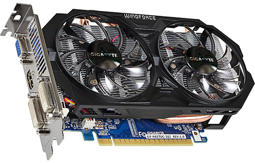

===
GPU
===

| The server includes a **Matrox** on-board iGPU [#]_.
| Since it's really outdated and not powerful enough for other than basic tasks and I had a spare **GTX 650 TI**, I installed it on the server.

Features
========

+--------------+-------------+
| GPU Core     | GK106       |
+==============+=============+
| Base Clock   | 1032 MHz    |
+--------------+-------------+
| CUDA Cores   | 768         |
+--------------+-------------+
| Memory       | 2 GB GDDR5  |
+--------------+-------------+
| Memory Clock | 5,4 GHz     |
+--------------+-------------+
| FLOPS        | 2,07 TFLOPS |
+--------------+-------------+
| TDP          | 110 W       |
+--------------+-------------+
| Slots        | 2           |
+--------------+-------------+

| 
| 
| 

.. rubric:: *Footnotes*
.. [#] Integrated GPU
