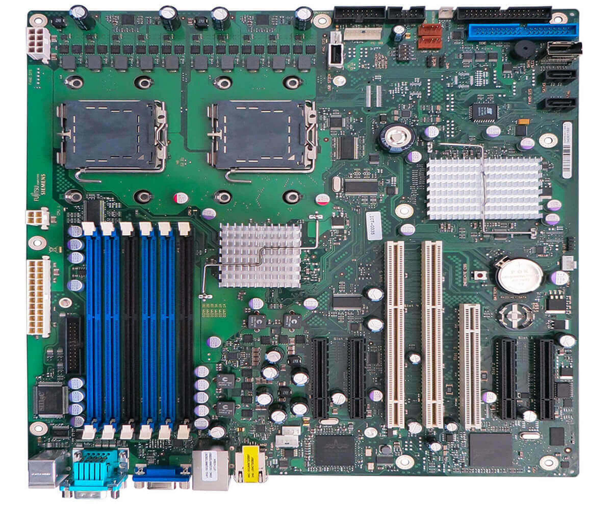
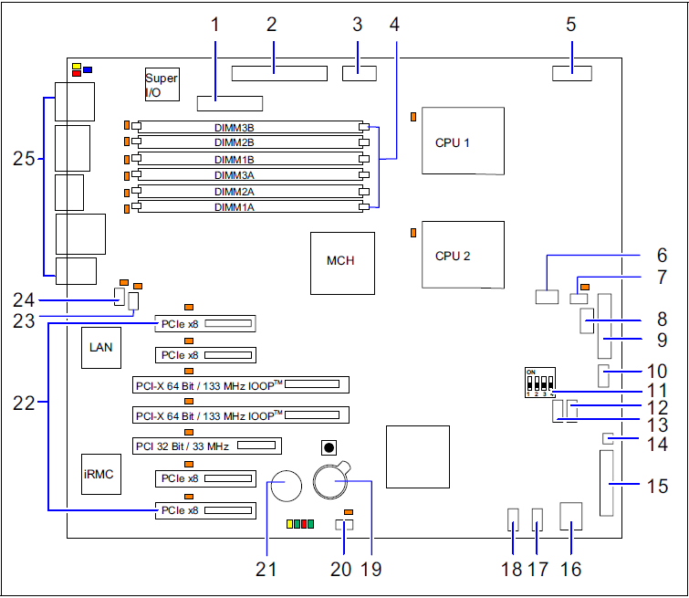
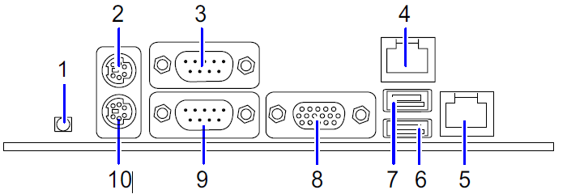
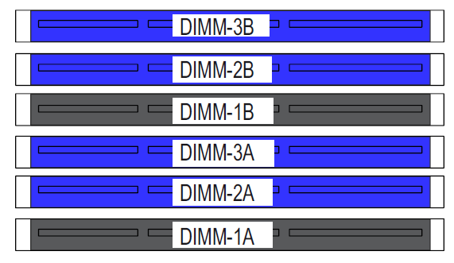
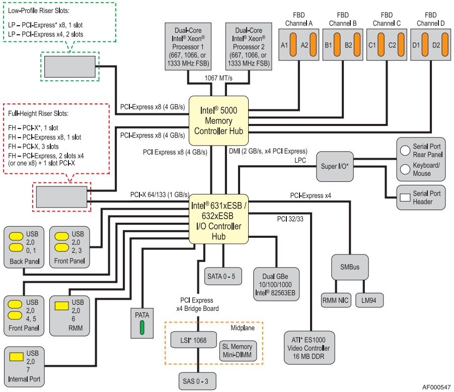
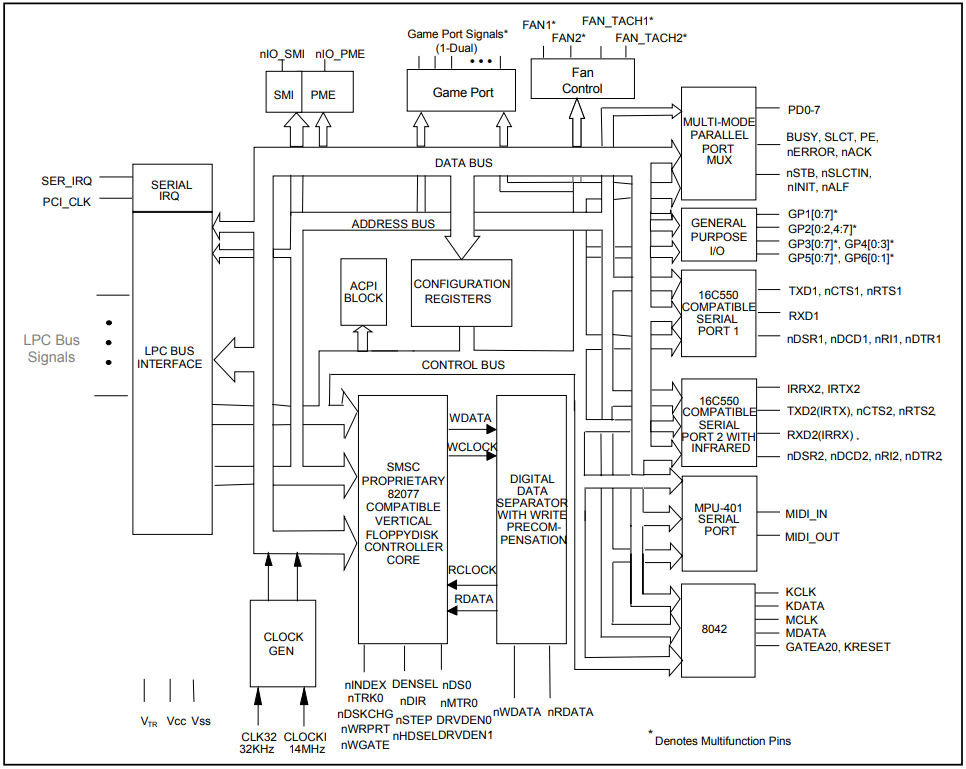
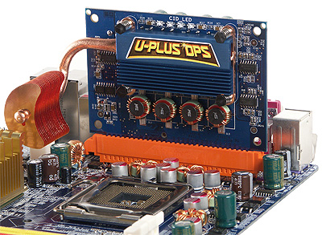

===========
Motherboard
===========

The MasterServer features a FUJITSU SIEMENS D2509 motherboard

Features
========

- 6x4GB FB-DDR2 ECC RAM
- Dual LGA771 Socket For Xeon 5100-5400 Series
- IRMC
- MegaRaid Integrated Controller
- Gigabit Ethernet Broadcom 5708C
- Service LAN Ethernet
- SSI EEB Baseboard 12x13 Inches (E-ATX)

Architecture
============

------
Scheme
------

*Legend:*

.. hlist::
    :columns: 2

    * 1 = Printer (optional)
    * 2 = Power supply PWR1
    * 3 = Power supply PWR3
    * 4 = Slots for main memory modules
    * 5 = Power supply PWR2
    * 6 = USB stick
    * 7 = System fan 1
    * 8 = PC98
    * 9 = Front panel
    * 10 = USB Front
    * 11 = DIP switch
    * 12 = USB1 AUX
    * 13 = USB2 AUX
    * 14 = Intrusion
    * 15 = Floppy disk drive
    * 16 = SATA MLC1
    * 17 = SATA 5
    * 18 = SATA 6
    * 19 = Battery
    * 20 = System fan 2
    * 21 = RAID key
    * 22 = PCI slots
    * 23 = System fan 3
    * 24 = Redundant system fan 4
    * 25 = External ports

-----
Ports
-----

---------
RAM Slots
---------

---------
PCI Slots
---------

+---------------+-----------------+---------------------------------------------------------------+
| PCI slot Type | Type Mechanical | Function                                                      |
+===============+=================+===============================================================+
| 1             | PCIe x8         | PCIe x4 or PCIe x8 slot (optional)                            |
+---------------+-----------------+---------------------------------------------------------------+
| 2             | PCIe x4         | PCIe x8 PCIe x4 slot or not available if slot 1 x8 (optional) |
+---------------+-----------------+---------------------------------------------------------------+
| 3             | PCI 32          | 32-bit PCI slot                                               |
+---------------+-----------------+---------------------------------------------------------------+
| 4             | PCI-X 64        | 64-bit PCI-X slot                                             |
+---------------+-----------------+ 133 MHz if only one card has been populated in slot 4 or 5    |
| 5             | PCI-X 64        | 100 MHz for population with 2 cards                           |
+---------------+-----------------+---------------------------------------------------------------+
| 6             | PCIe x8         | PCIe x4 or PCIe x8 slot (optional)                            |
+---------------+-----------------+---------------------------------------------------------------+
| 7             | PCIe x8         | PCIe x4 slot or not available if slot 6 x8 (optional)         |
+---------------+-----------------+---------------------------------------------------------------+

.. Note::  The PCIe slots are v1.1 x4 1GB/s and x8 2GB/s rated throughput.

-------
Chipset
-------

| The Motherboard features an Intel 5000Z MCH [#]_ and Intel 631xESB SB [#]_ 

---------
Super I/O
---------

| The motherboard features a LPC47M10x Super I/O controller chip which manages all the I/O [#]_ ports through the LPC bus

---
VRM
---

| The motherboard features a double EVRD 11.0 (VRM [#]_).
|
| The common term nowadays is **VRM** but when this motherboard first came out, Intel designated its voltage regulator circuit as an **Enterprise Voltage Regulator-Down**.
| 
| The only difference is that the EVRD is compliant to all the CPUs power specifications by Intel that are compatible with the motherboard, which means its more enterprise and high-end suitable
| 
| Gigabyte called it **DPS** and it was an add-in pluggable module that provided some Pentium 4 CPUs with 4 extra power phases to reach higher overclock.

| Having a look at the VRM, it can be said its design is a 4+1 **power phases** without doublers. Each CPU has its own VRM module and also PWM [#]_ chip
| 
| Most high-end motherboards come with passive or active cooled heatspreeders for the VRM MOSFETs since they get pretty hot and are responsible of providing and filtering the power to the CPU.
| Some of them are even water cooled
| 
| 
| 

.. rubric:: *Footnotes*

.. [#] Memory Controller Hub
.. [#] South Bridge
.. [#] Input/Output
.. [#] Voltage Regulator Module
.. [#] Pulse With Modulation

