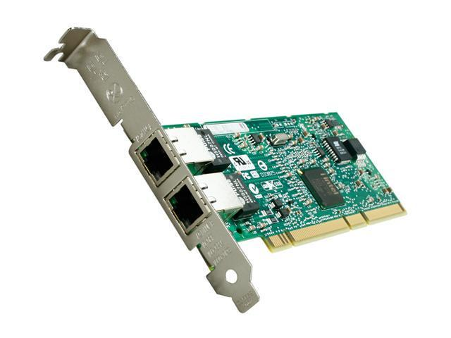

===
NIC
===

| The motherboard features a gigabit and a 100 Mb Ethernet ports. The second one is used as a service LAN only for the IRMC [#]_.
| 
| Since im planning on upgrading the server and internet speed I bought 2 PCI-X Intel® PRO/1000 MT Dual Port Server Adapter.

Features
========

+------------+--------------------+
| Feature    | Value              |
+============+====================+
| Controller | Intel 82546GB      |
+------------+--------------------+
| Speed      | Gigabit            |
+------------+--------------------+
| Ports      | 2 RJ45             |
+------------+--------------------+
| Slot       | PCI-X 32-or 64-bit |
+------------+--------------------+
| Release    | Q3'03              |
+------------+--------------------+

| 
| 
| 

.. rubric:: *Footnotes*

.. [#] Integrated Remote Management Console
