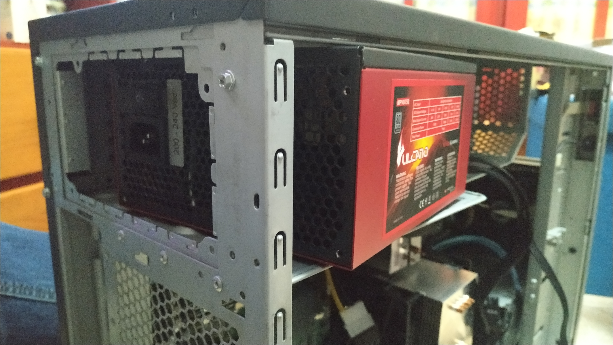

===
PSU
===

| The chosen Power Supply Unit is a **Tacens Vulcano 750W**.
| The only reason I chose it is because I upgraded my main PC and it was laying around with no use, being perfectly suitable for the MasterServer.
| 
| Before I bought the mentioned PSU for my PC (Corsair RM1000x), I used a 350W generic PSU to test the server, which one of the times while benchmarking started to smell like **burnt capacitor**.
| 
| A good quality PSU, along with cooling, are the keys to run a **stable** hardware system.
| 
| Both of them also affect the performance; If the system is not receiving stable and enough power or it's overheating, it can start either power or thermal throttling.
| 
| Every CPU, GPU and RAM since the Pentium 4 architecture have an incorporated thermal management, which means the system will automatically power off if theres overheating or bad power values, to avoid major disasters.

Specs
=====

+-----------------+------------------------+
| Form Factor     | ATX                    |
+=================+========================+
| Power           | 750W                   |
+-----------------+------------------------+
| 80+ Certificate | Silver                 |
+-----------------+------------------------+
| Cooling         | 140mm Fan              |
+-----------------+------------------------+
| Cabling         | 1 x 20+4pin            |
|                 | 1 x 4+4pin 12v7 x SATA |
|                 | 1 x FDD                |
|                 | 4 x 4pin Molex         |
|                 | 2 x 6+2pin PCI-E       |
+-----------------+------------------------+

Voltages
========

+--------------------+-----------------------------------+
| AC Input           |       200-240V 6,5A 50/60Hz       |
+====================+=======+=====+======+======+=======+
| DC Output Voltage  | +3,3V | +5V | +12V | -12V | +5Vsb |
+--------------------+-------+-----+------+------+-------+
| Max Output Current |  20A  | 20A | 59A  | 0,3A | 2,5A  |
+--------------------+-------+-----+------+------+-------+
| Combined Power     |     130W    | 708W | 3,6W | 12,5W |
+--------------------+-------------+------+------+-------+
| Total Power        |                750W               |
+--------------------+-----------------------------------+

| Voltages are one of the most important features of a power supply. It will determine if the PSU will be enough for the system or not.
| 
| An example was using the 750W PSU with my GTX 970 SLI and an overclocked Ryzen 7 2700.
| The combined system power consumption was lower than 750W, but whenever I ran a game or benchmark that used both the GPUs and CPU, the 970s wouldn't receive enough power from the 12V rail and would power throttle, reducing performance.
| 
| Anyway, when benchmarking only the CPU it would run flawless. That's because the 750W power supply couldn't deliver all the power it claims through the 12V rail due to it's poor design quality.
| 
| That's why some PSUs have more than a single 12V rail; 1 for the CPU and another for the GPUs, since both the CPU and GPU use 12V rails
| Even tho the Corsair PSU features a single shared 12V rail, only by itself provides the whole 1000W, adding to that the other rails extra power.
| Now im able to run the 970 SLI overclocked and stable.

