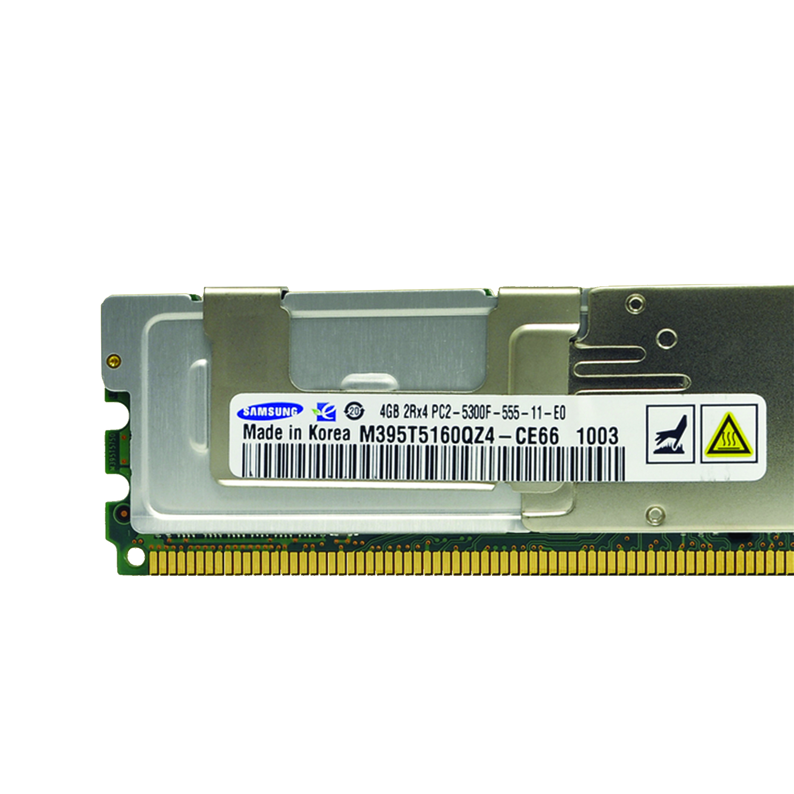

===
RAM
===

| The MasterServer features 24 GB of Samsung FDB-533/PC25300F FB-DDR2 ECC RAM. 

Features
========

+------------------------+-------------+
| Feature                | Value       |
+========================+=============+
| Size                   | 4 GB        |
+------------------------+-------------+
| Frequency              | 333 MHz *   |
+------------------------+-------------+
| Voltage                | 1,8V        |
+------------------------+-------------+
| JEDEC Timings          | 5-5-5-15-20 |
| (CL-tRCD-tRP-tRAS-tRC) |             |
+------------------------+-------------+
| Release                | 2008        |
+------------------------+-------------+

.. note::  Due to DDR, the effective RAM frequency is 667 MHz

-----
DIMMs
-----

| A **DIMM** is a Dual In-Line Memory Module.
| 
| Compared to its older version, SIMM, they have pins on both of their sides, pair by pair. Anyway, the DRAM chips technology is the same.

Traditional DIMMs
-----------------

| Traditional DIMM architectures use the **stub-bus** topology.
| 
| Each DIMM connects with the shared memory bus via parallel branches (stubs). The traces must be the **same length** (Traces between the MCH and the memory slots are usually circuitous) so electrical signals from the Memory Controller are able to reach the DIMMs at the same time.

| Each stub-bus connection creates resistance that degrades signal integrity and creates an electrical load on the bus.
| Adding more DIMMs result in an increase on the load, and higher data rates [#]_ support less loads per channel.

.. image:: media/ram8.png
   :width: 400px

Fully Buffered DIMMs
--------------------

| **FB-DIMMs** are Fully Buffered DIMMs, which means each DIMM has its own **buffer**. 
| They work in a different way compared to regular DIMMs and its specification was developed by the JEDEC [#]_.
| 
| A serial interface connected to the Memory Controller in a daisy chain [#]_ configuration that eliminates the parallel stub-bus topology and allows higher memory bandwidth and capacity.

| The **serial links** connect the MCH to the **Advanced Memory Buffer** or AMB, located in each memory stick creating a **point-to-point architecture**.
| 
| Outbound links trasmit commands and write data to the FB-DIMMs while inbound links transmit read data back to the MCH.

.. image:: media/ram10.jpg
   :width: 400px

.. note::  Due to production costs, power requirements and latency, FB-DIMMs have been replaced by the NUMA architecture

---
ECC
---

| **Error Correction Code** is a technology used in RAM or any kind of communications to detect an error and correct it. Other technologies like EDC [#]_ only detect when there's an error but don't fix it.

Basic ECC
---------

| Its parity checking detects only **single-bit** errors and does not correct multi-bit or memory errors. It was introduced circa 1993.

Advanced ECC
------------

| It's an improvement beyond the standard ECC introduced in 1996. It can correct **multi-bits** errors and avoid complete DRAM failures.

| A comparison of both technologies is shown below.

+-----------------+-------------+----------------------+
| Error Condition | ECC Outcome | Advanced ECC Outcome |
+=================+=============+======================+
| Single-bit      | Correct     | Correct              |
+-----------------+-------------+----------------------+
| Double-bit      | Detect      | Correct Or Detect    |
+-----------------+-------------+----------------------+
| DRAM Failure    | Detect      | Correct              |
+-----------------+-------------+----------------------+

----------
UMA & NUMA
----------

| In computing there are 2 major parallel architectures; Shared Memory Architecture and Distributed Memory Architecture

- **Shared Memory Architecture**; All processors share the same memory and treat it as a global address space, dealing with cache coherency and global memory address space . Its used on single PCs

- **Distributed Memory Architecture**; All processors have their own local memory without memory addresses mapping across processors. Its used with clusters

| There are 2 types of Shared Memory Architecture;

- **UMA** (Uniform Memory Access); Memory design used for SMP [#]_  systems where the memory access time depends on the bus or MCH

- **NUMA** (Non-Uniform Memory Access); Memory design used for multiCPU or SMP systems where the memory access time depends on the distance between the RAM and CPU

| UMA is used by SMP computers that have an **MCH**. The MCH manages the memory access and interconnects the RAM and CPU through a bus. That means the memory access time is determined by the FSB frequency and bandwidth and the MCH.
| 
| Meanwhile, NUMA is used by SMP computers that have the MCH in the **CPU dye**. The memory access time is determined by the distance between the CPU and the RAM and the interconnect network between each CPU.
| Intel uses QPI [#]_ and the newer UPI [#]_, while AMD uses HyperTransport

| I obtained the MasterServer architecture using the program **hwloc**.
| With the command ``lstopo topology.png`` I generated the output in an image. 
| Here there is a comparison between the MasterServer UMA architecture and a newer Xeon from the X5500 series NUMA architecture featuring QPI.

| And not only that, but also the new Ryzen Threadripper took NUMA a step further; Inside the CPU dye with the **chiplets architecture**.

| I see a huge potential implementing multiple CPUs under the same IHS [#]_ as the trend is to increase the number of cores.
| 
| 
| 

.. rubric:: *Footnotes*

.. [#] Usually measured as MHz
.. [#] Joint Electron Device Engineering Council, standard that ensures RAM compatibility within motherboards
.. [#] Wiring scheme in which multiple devices are wired togheter in a sequence or ring
.. [#] Error Detection Code
.. [#] Symmetric Multiprocessor
.. [#] QuickPath Interconnect
.. [#] UltraPath Inteconnect
.. [#] Integrated Heat Spreeder
