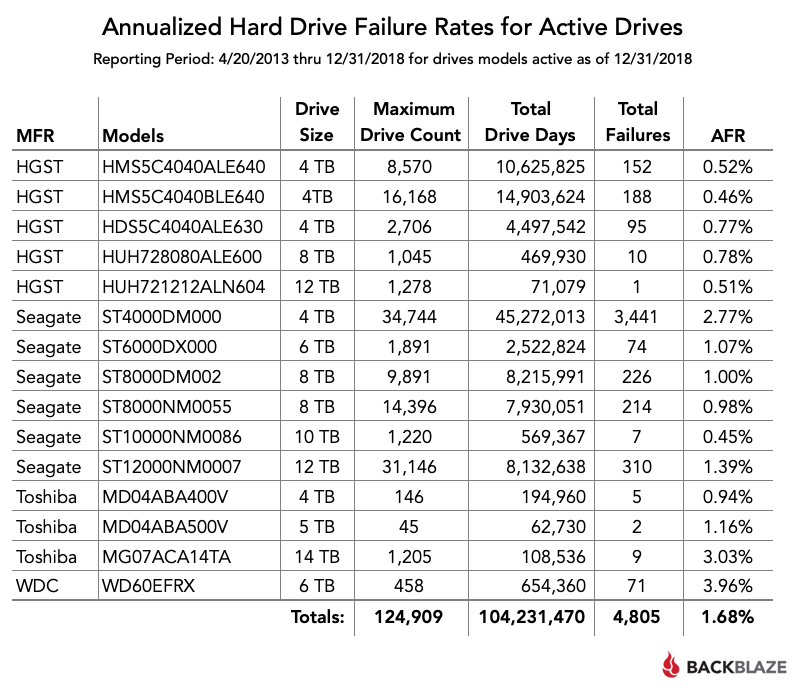

=======
Storage
=======

| The chosen storage is a KingSpec SATA 120GB, a JSYERA S100 120GB SSD drives and 3 SATA 2TB Hitachi drives.

Features
========

+------------------+------------------+
| Feature          | Value            |
+==================+==================+
| Storage          | 2 TB             |
+------------------+------------------+
| Rotational Speed | Rotational Speed |
+------------------+------------------+
| Data Buffer      | 32 MB            |
+------------------+------------------+
| Size             | 3,5”             |
+------------------+------------------+
| MTBF             | 1200000 H        |
+------------------+------------------+

Why Hitachi?
============
------------
Introduction
------------

| HGST (Hitachi Global Storage Technologies) mostly known as Hitachi, is a manufacturer of HDDs. It was founded in 2003 when Hitachi bough 70% of IBM HDD operations and founded HGST.
| They presented the brand with the following title.
| 
|     *Hitachi Establishes "Hitachi Global Storage Technologies"*
|     *Taking A Bold New Step for Storage Innovation with the most advanced technology, the most extensive product line, and the greatest global reach in the industry.*
| 
| In 2018 HGST was integrated in Western Digital due to a decission of the Chinese Ministry of Commerce.

--------------
Specifications
--------------

| HGST created 3 main storage lines;

- Ultrastar: Enterprise-class line of HDDs in 3.5 and 2.5-inch form factor with SCSI, Fibre Channel, SAS [#]_ , and SATA interfaces
- Deskstar: Desktop-class line in 3.5-inch form factor with SATA interfaces.
- Travelstar: Mobile-class line in 2.5-inch form factor with SATA interfaces.

| The most important thing is that HGST drives are the best when it comes to reliability, durability and MTBF [#]_ . Taking a look at the **Backblaze** [#]_ stats it can be seen that it's true.

Installation
============

| The Hitachi drives come with a regular 3,5" size and both SATA data and power connectors.
|
| The problem was connecting them to the MoBo [#]_.
| 
| At first I thought I would need to buy a **RAID** card to connect them since the seller sold apart the **LSI** RAID card, SAS HDDs and backplane.
|
| Anyway he told me that I would be able to plug them in the 2 SATA ports that are located in the motherboard.
|
| That's the first thing I tried, and it didnt work as I thought it would.
|
| I wasnt able to boot from any disk connected to those ports but they were detected if it booted from other source (like a DVD, PXE [#]_ or USB).
| That's because those SATA ports were designed as optical SATA ports with the idea in mind to use them to connect CD, DVD or SATA tape drives.
| 
| I had to find a way to connect regular SATA drives.
| 
| First of all I found out that the motherboard had an integrated RAID controller with a **SFF-8087** port (also known as internal **mini SAS**, don't mix it up with the **SFF-8088** which is the external mini SAS, neither **Infiniband** which is the **SFF-8470** and considered as an HCA [#]_).

| Then I learned that the **SAS standard** is compatible with SATA but not the other way around. That means that SATA controllers only work with SATA drives and SAS controllers work with both SAS and SATA drives.
|
| But still I had a problem, which was how would I connect SATA drives to a mini SAS port.
| The server originally came with a backplane to connect the SAS HDDs to the RAID card.
| 
| A **backplane** is just a circuit board with connectors in parallel with each others. Even tho there are active (with more ICs) and passive ones, they can't be confused with a MoBo or PCI card.
| 
| A MoBo or PCI card provide the ports, controllers and connections. **A backplane is just a board that provides a PCI card or MoBo with different or more ports where the final device is connected**, working as a bridge.

.. note::  With PCI I mean the cards that use the **PCI-SIG** standard, which includes PCI, PCI-X and PCIe cards

| The solution I found was buying a SFF-8087 to 4x SATA cable. Each SFF-8087 is able to handle 4 devices, or using server structure language, **targets**.

| The RAID controllers or cards can work in 2 modes; IR and IT mode.

- **Integrated Raid** means the controller is in charge of the disks and presents them to the OS as a RAID, JBOD [#]_ or Virtual Units [#]_ . Its the original mode of RAID cards.

- **Initiator Target** means the controller is not in charge of the disks, it just works as a *dumb* interface to connect the disks (both internally or externally) and let them in charge of the OS. Its the original mode of HBA [#]_ cards

| Using software RAID with a controller in RAID mode can cause problems such lower speeds, confusion between the RAID controller and the OS software RAID and failures when trying to fix a disk array.
|
| I used software RAID for some reasons that will be explained later.
| To use the on-board controller as IT I had to set the storage as AHCI instead of RAID in the BIOS
| 
| 
| 

.. rubric:: Footnotes

.. [#] Serial Attached SCSI
.. [#] Mean Time Between Failures
.. [#] One of the biggest cloud storage companies that shares real HDD stats as open source
.. [#] MotherBoard
.. [#] Host Channel Adapter
.. [#] Preboot Execution Environment
.. [#] Just A Bunch Of Disks
.. [#] Some RAID cards name the disks as virtual units
.. [#] Host Bus Adapter
