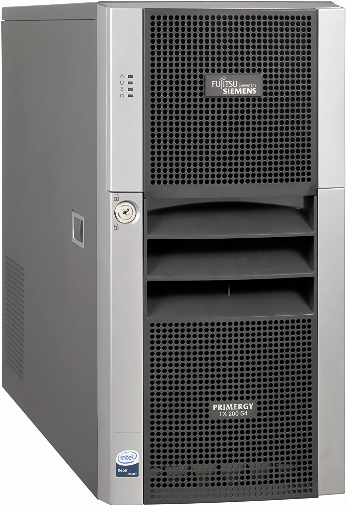

============
Server Build
============

| It's well known that server and enterprise computing hardware has different specs compared to desktop or home devices. That also affects its price, compatibility and uses.
| 
| I could have used a regular PC or even a powerful laptop, but the scope of this project was building and managing for the first time my own server at home, which is called homelab.
| The advantages of this is learning how to manage a server and its differences.
| 
| Anyone can use a virtual machine, but how about building your own server?

Requirements
============

| General requirements 

- Cheap
- Stable
- Powerful
- Capable to virtualize (VT-x instructions)
- Server architecture
- Tower case

| Specific minimun requirements

- Total price around 250$
- 8+ cores
- 12+ GB RAM
- Multiple network interfaces
- Fast & redundant storage

Choice
======

| First of all, I dont have any contacts with a supplyer or friend that could gift me a server that took off from production for free, so to aim for the cheapest price I had to use my buyer skills on the second hand hardware market, which supposes a challenge.
| 
| Anyone can buy an expensive and new server but I dont have all the money it costs, thats why I looked for an older one.
|
| The hardest step was deciding the socket and architecture it was going to be based in and the winner was the **LGA 771**, which is the server version of the Consumer **LGA 775** socket for Xeon CPUs and the first ever to use the  LGA [#]_ SMD [#]_ packaging type.
|
| The **Core microarchitecture** is a legend when it comes to hardware terms;

- Released in 2006.
- It's the socket with the longest life span ever, 7 years.
- FSB based.
- Capable of using DDR2 and DDR3.
- It still has a nice performance.
- LGA 771 Xeon to LGA 775 mod.
- Pencil mod.
- First unblocked/extreme CPUs to come to the market along with enthusiast gaming motherboards.

| Also, the first PC I used, modified and overclocked was based in the LGA 775 platform back from 2008, so it's going to have its proper tribute.
|
| The chosen base server is a **FUJITSU SIEMENS PRIMERGY TX200 S4**

| 
| 
| 

.. rubric:: *Footnotes*
.. [#] Land Grid Array
.. [#] Surface Mount Device

.. toctree::
   :hidden:
   :maxdepth: 1
   :caption: Contents

   Case/index
   Motherboard/index
   CPU/index
   RAM/index
   GPU/index
   NIC/index
   Storage/index
   Cooling/index
   PSU/index

