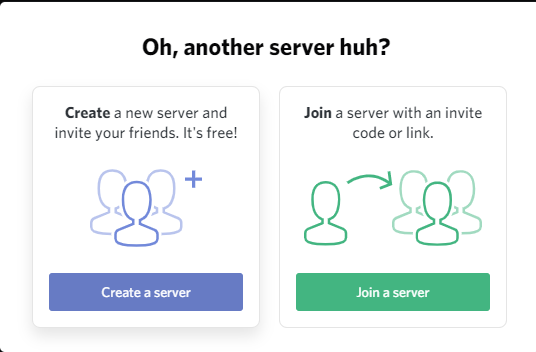
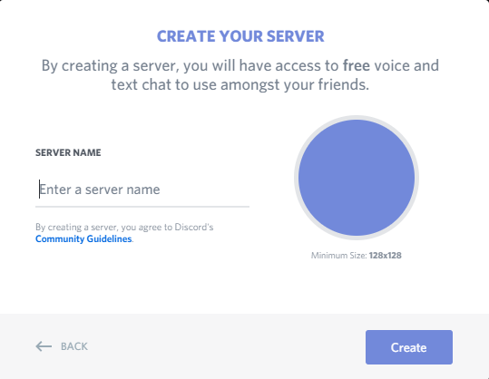
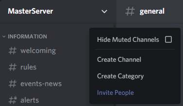
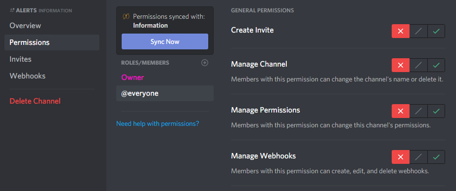
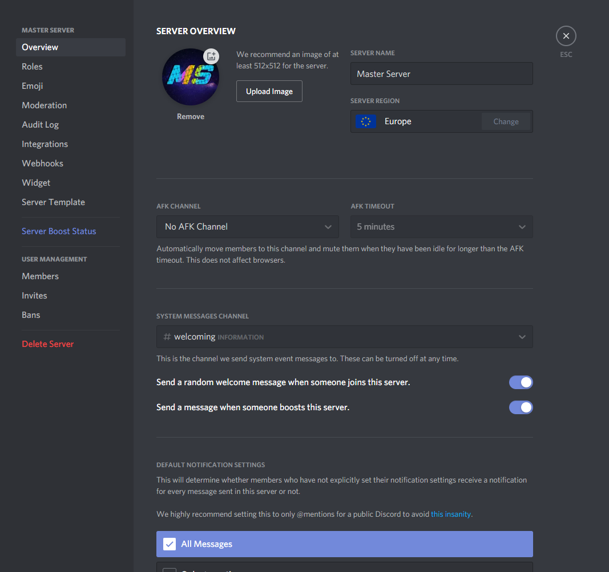
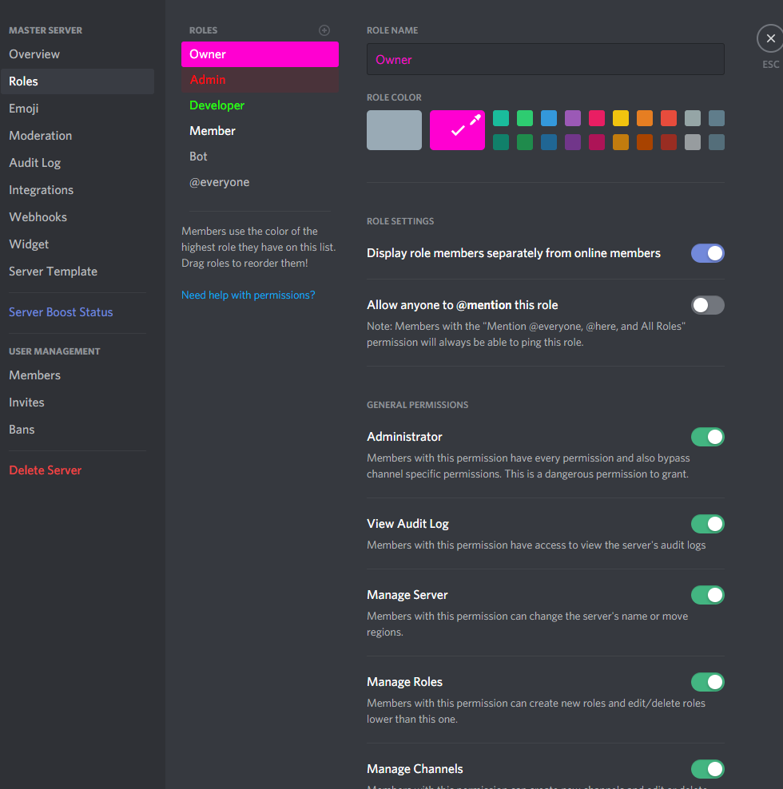
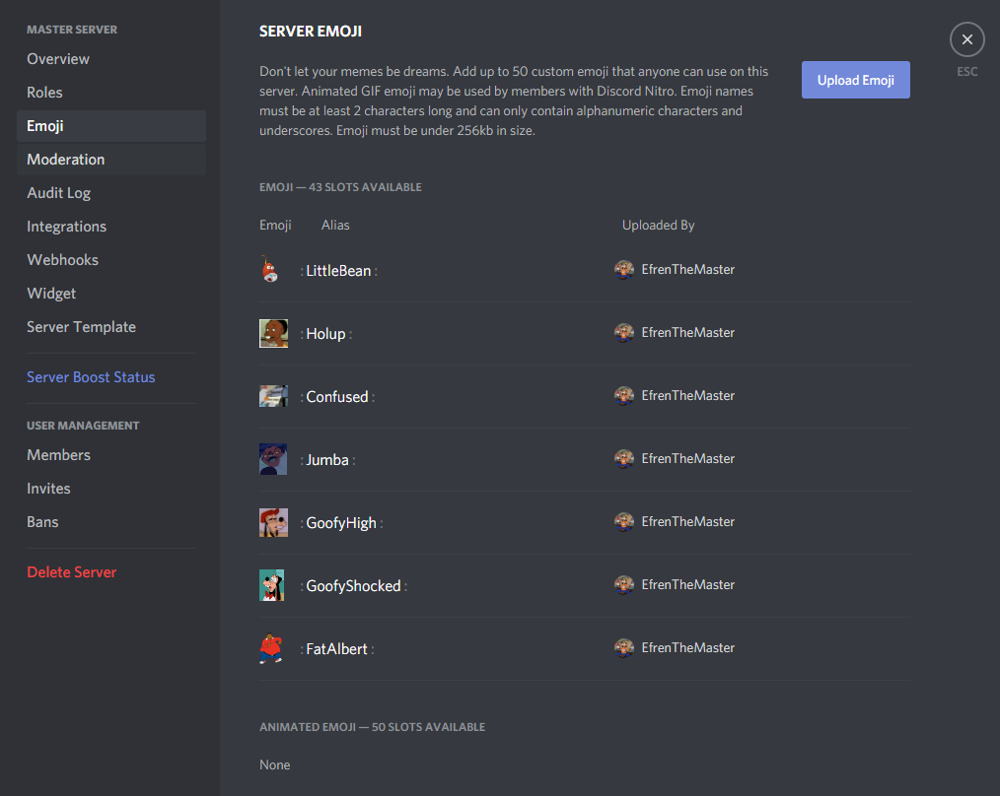
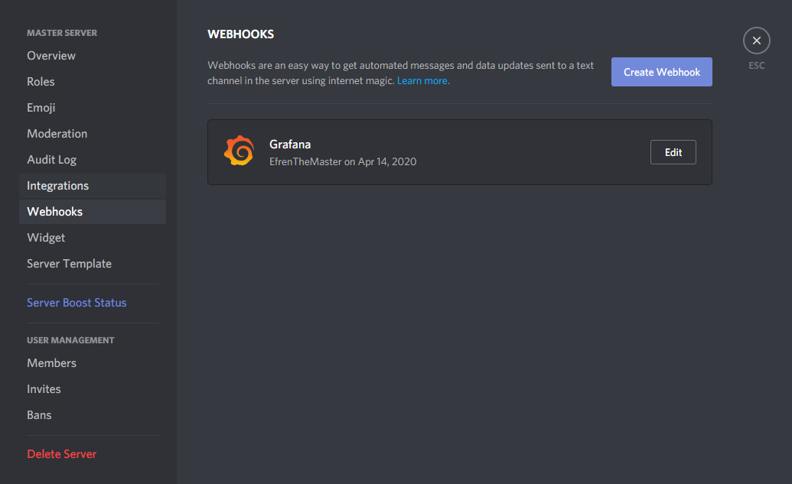
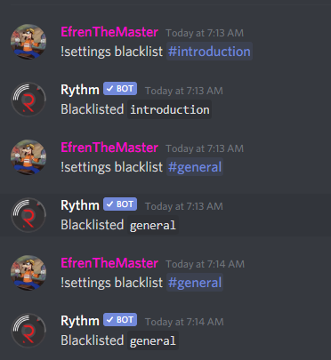
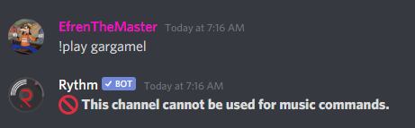

=======
Discord
=======

| **Discord** is a free VoIP program for Android, macOS, iOS, Linux and Windows.
| 
| At the date is one of the most used programs to talk and message. Lots of users dumped **Skype** and passed to Discord since it's way better
| 
| Some of the pros it features are the following.

- Nice performance
- Available for the main platforms
- Lightweight
- Barely uses network bandwidth
- Text, voice, images and files
- Better security than Skype
- Highly updated and supported
- Subscription program for extra features like no file size limit, extra emojies and being able to set a GIF profile picture

Channels
========

| Discord features 3 types of channels; DMs, group chats and servers.

- **Direct Messages** are private channels between only 2 users who can message and call.
- **Group chats** are channels with a 10 people limit where users can message, call, videocall and screenshare.
- **Servers** are structures of multiple voice and text channels. They don't have a user limit and they are hosted by Discord for free.

Deployment
==========

| First of all a Discord account is needed to create a server. Discord can be used directly on the webpage or installing the desktop program, being the second one the best option. It can be downloaded `here <https://discord.com/download>`__
| 
| To create the server click on the *Add a Server* button on the left slider, choose *Create a Server* again and finally give it a name and image and hit *Create*.

| Once it's created multiple channels and categories can be created by right clicking below the server name.

| Each channel has its own permissions.

| By left clicking on the server name and then *Server Options* lots of settings can be set.

--------
Overview
--------

| Here the main server settings are shown. The image and name can be changed, the region where the server is hosted so people in the server from the same region will have less latency.
| 
| Also an AFK [#]_ channel can be set so people who is inactive will be moved to it.
| 
| Finally a channel for welcoming people can be set so it wont bother on other channels.

-----
Roles
-----

| Roles are given to users so they can have different permissions. They can have any color and name with no limit.
| 
| There are lots of permissions but the most important ones are those related to management and permission to see or text in specific channels.

-----
Emoji
-----

| The charset used by the OS has already support for emojies, but also custom ones can be added for the server.

--------
Webhooks
--------

| Webhooks connect other programs to a channel in a Discord server. In this case I linked Grafana with a webook to an *Alerts* channel so when Grafana triggers an alert it will be notified in Discord.

----
Bots
----

| Discord has a huge amount of bots that can be invited to servers to add extra features. They appear in the server as a regular member.
| 
| The one I'm going to use is *Rythm*. To add it just go to its webpage `here <https://rythmbot.co/>`__ and click *Add to Discord*. Then log in and choose what server you want to invite it to.
| 
| Rythm is a bot that is able to join voice channels adding it through commands to play music. It supports **Youtube** but not Spotify. The basic commands are ``!play "song name"``, ``!skip``, ``!stop`` and ``!queue``.
| 
| To avoid people spamming bot commands in regular channels I created a specific one for that. Also I had to blacklist the rest of the channels so people wont be able to execute bot commands in them.
| That is done with the ``!settings blacklist #"channel name"``. After blacklisting a channel nobody will be able to execute Rythm commands there.

| 
| 
| 

.. rubric:: *Footnotes*

.. [#] Away From Keyboard

