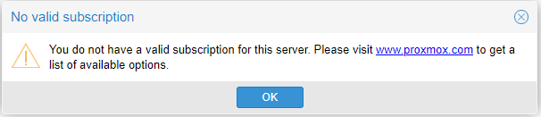

=============
Customization
=============

Subscription
============

| Since I'm not using a subscription (paid version with support) I have to change the repositories in the file */etc/apt/sources.list* and add the **PVE-no-subscription** one so I can download updates.
| The file looks like this.

.. code-block:: vim

   deb http://ftp.es.debian.org/debian buster main contrib

   deb http://ftp.es.debian.org/debian buster-updates main contrib

   deb http://download.proxmox.com/debian/pve buster pve-no-subscription

   deb http://security.debian.org buster/updates main contrib

| To remove the subscription message each time I log in the GUI saying that I dont have a subscription I commented the */etc/apt/sources.list.d/pve-enterprise.list* file

.. code-block:: vim

   # deb https://enterprise.proxmox.com/debian/pve buster pve-enterprise

| And modified the */usr/share/javascript/proxmox-widget-toolkit/proxmoxlib.js* file using the nano editor and searching for *data.status*.
| I had to modify this specific line changing the *if* condition so it never shows the message.

.. code-block:: javascript

   if (false) {
		       Ext.Msg.show({
			   title: gettext('No valid subscription'),
			   icon: Ext.Msg.WARNING,
			   message: Proxmox.Utils.getNoSubKeyHtml(data.url),
			   buttons: Ext.Msg.OK,
			   callback: function(btn) {
			       if (btn !== 'ok') {
				   return;
			       }
			       orig_cmd();
			   }
		       });
		   } else {
		       orig_cmd();
		   }

| To apply the changes I did ``service pveproxy restart``, downloaded the latest updates with ``apt update && apt dist-upgrade -y`` and got rid of the annoying message.

Personalization
===============

| To add some custom personalization I changed the Proxmox logo with one made by myself. All I had to do was replace the */usr/share/pve-manager/images/proxmox_logo.png* image with the one I wanted. The size must be 209 x 30 pixels.
| 
| To transfer the file I used **WinSCP** to SCP into the server and upload the image with the name *proxmox_logo.png*, so it replaces the default one.
| 
| The default Proxmox message when using the shell its pretty annoying so I wanted to replace it with something else that looked better.
| 
| I installed **neofetch**, **lolcat**, **figlet** and **ponysay** with the following commands;

.. code-block:: shell

   apt-get install ruby
   wget https://github.com/busyloop/lolcat/archive/master.zip
   unzip master.zip
   cd lolcat-master/bin
   gem install lolcat

   apt-get install figlet
   apt-get install neofetch

   wget http://www.vcheng.org/ponysay/ponysay_3.0.2-1_all.deb
   sudo dpkg -i ponysay_3.0.2-1_all.deb

| After installing the required packages I had to set it so everytime a new shell is open the command would be run.
| That can be done editing the *~/.bashrc* file and adding the following line.

.. code-block:: shell

   clear && ponysay -o -F rainbowdrag && figlet MasterServer |lolcat -a -d 1 -p 0.4 && neofetch |lolcat -a -d 2 -p 0.6

| The final result looks like this.

