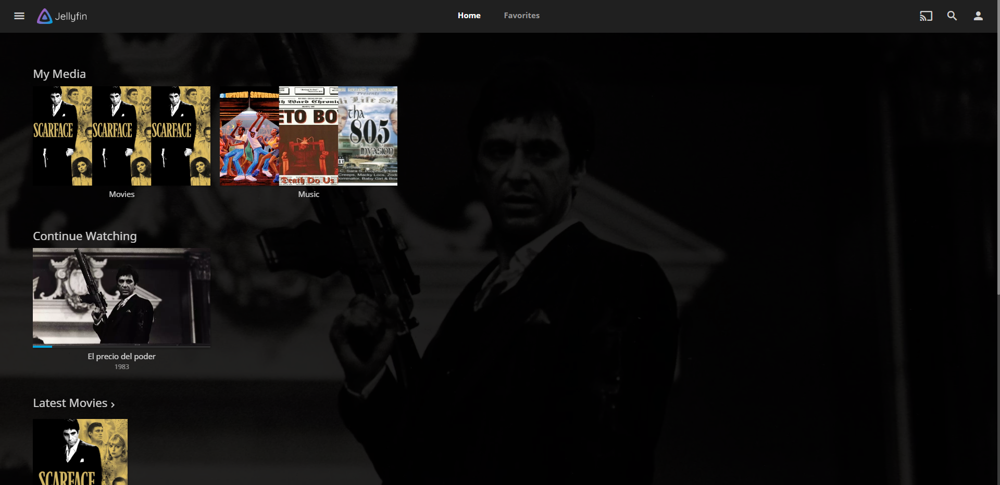

========
Jellyfin
========

| **Jellyfin** is a free media server that uses a web-based GUI for both users and management. It's totally free compared to competitors like PLEX or Netflix, that have premium features or a monthly subscription.
| It supports a lot of devices and it has a google drive app for mobile devices with the same name.
| 
| The most used way to watch TV or movies is plugging the coaxial cable that comes from the ISP to the TV, but since the coaxial era new technologies have appeared. Nowadays TV and movies can be watched just with internet connection through **IPTV**.

Deployment
==========

| I installed Jellyfin in a CentOS 8 container with the *media* mount point assigned.
| The first requirement was installing **ffmpeg**.

.. code-block:: bash

   dnf -y install https://download.fedoraproject.org/pub/epel/epel-release-latest-8.noarch.rpm
   dnf localinstall --nogpgcheck https://download1.rpmfusion.org/free/el/rpmfusion-free-release-8.noarch.rpm
   dnf install --nogpgcheck https://download1.rpmfusion.org/nonfree/el/rpmfusion-nonfree-release-8.noarch.rpm
   dnf install http://rpmfind.net/linux/epel/7/x86_64/Packages/s/SDL2-2.0.10-1.el7.x86_64.rpm
   dnf install ffmpeg
   dnf -y install ffmpeg-devel

| Then Jellyfin could be installed with the following commands.

.. code-block:: bash

   curl -o jellyfin.rpm https://repo.jellyfin.org/releases/server/centos/stable/jellyfin-10.5.5-1.el7.x86_64.rpm
   dnf install -y jellyfin.rpm
   service jellyfin start
   systemctl enable jellyfin

| Also I had to create a new Samba share in this container since Jellyfin can't access Samba shares in its latest version. The feature was removed some versions ago due to bugs.
| 
| The other way it could be done would be first mounting the Samba share in the Proxmox host and passing it as a mount point to the container, but that supposes a big dependency on the host. Unprivileged containers also dont allow using *fstab* so Samba shares can't be mounted in contaniers in an easy way.
| 
| I configured Samba as it follows.

.. code-block:: vim

   [global]
   workgroup = WORKGROUP
   server string = Samba Server %v
   netbios name = Media-Server
   security = user
   map to guest = never
   dns proxy = no

   [Media]
   path = /zpool/data/media
   valid users = @"group"
   browsable = yes
   writable = yes
   guest ok = no
   read only = no
   create mask = 1777
   directory mask = 1777

| Then I was able to access the web-based wizard typing the socket address in the browser. The default HTTP port for jellyfin is 8096 and the HTTPS is 8920.
| 
| First it will ask for a username and password.

.. image:: media/jellyfin2.png
   :width: 400px

| Then the libraries can be set up. I used *Media* as the root folder for all the libraries.

---------------
Media Libraries
---------------

| Jellyfin has a standard **naming convention** for each kind of library and element, so later they can be parsed from a database and asign them proper metadata. Thats done automatically if the name convention is done right.

Movies
------

| The movie I'm using as example is *Scarface*, released in 1983 in 1080p quality and mkv format.

1. Create the *Movies* folder inside *Media*
2. Create a folder with the movie name and release date, *Scarface (1983)*
3. Place the movie file inside the folder with its name and release date as well, *Scarface (1983).mkv*

Music
-----

| The music I'm going to use as an example is from the group *Geto Boys*, with the albums  *The Resurrection* and *We Can't Be Stopped* and multiple tracks in each one.

1. Create the *Music* folder inside *Media*
2. Create a folder with the artist name, *Geto Boys*
3. Create a folder inside with the album name, *We Can't Be Stopped*
4. Place all the tracks inside the folder, numbered starting from 1 with its name appended after, *06 Mind Playing Tricks On Me.mp3*

--------
Metadata
--------

| Multiple databases can be set to to find the **metadata** but the default ones work flawless. What I did was change the default metadata folder and leave the cache one as default.
| 
| Metadata means all the banners, pictures, descriptions and more for each element in the media server, so they can use a gentle piece of storage.

| The final result looks like this.

| An important feature is that the movie has different subtitles and audio tracks; English in Dolby 5.1 and Spanish in stereo. Those settings can also be changed before or during the movie.
