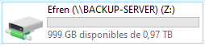

=====
Samba
=====

| **Samba** is a free software re-implementation of the **SMB** networking protocol which is used as a files and print server compatible with Windows and Unix OSs.

Deployment
==========

| The Samba server is going to be hosted in a CentOS 8 container with the corresponding **mount points**.
| 
| The reason why I used mount points is that limiting the shares size can't be done using Samba.
| The workaround I did was limiting the shares size with mount points and resize them from the Proxmox GUI depending on my needs. Also I can choose if they are going to be included when I do a backup of the container.
| First I had to create the ZFS datasets from the host with the following commands.

.. code-block:: bash

   mkdir /zpool/data
   mkdir /zpool/data/local
   mkdir /zpool/data/media
   mkdir /zpool/data/cloud
   zfs create /zpool/data
   zfs create /zpool/data/local
   zfs create /zpool/data/media
   zfs create /zpool/data/cloud

| For the Samba container I assigned the */zpool/data/local* dataset as the mount point *mp0* with an initial size of 1TB.

| When I go into the container I could check that the directory /zfs/data is available, plus the mount point can't even be deleted as root.

.. code-block:: bash

   [root@Samba zfs]# rm -rf data
   rm: cannot remove 'data/local': Device or resource busy

| The files server is going to have a share named *Efren* for me and another one called *General* for the rest of the users connected to my home network. Other users can only access the *General* share while I'm able to use both.
| 
| The directory structure I created inside the *local* mount point through the container was done with the following commands.

.. code-block:: bash

   mkdir /zfs/data/local/efren
   mkdir /zfs/data/local/general
   adduser "user"
   adduser "user2"
   passwd "user"
   passwd "user2"
   usermod -aG "group" "user"
   chmod -R 0770 /zfs/data/local
   chown -R root:”group” /zfs/local/general
   chown -R root:”user” /zfs/local/efren

| The group and owner must be set so any Samba user will be able to use the share; Samba and Unix perms are independent.
| I'm not going to name the user and groups for security purposes. Installing Samba was done through the next commands.

.. code-block:: bash

   dnf install samba samba-common
   mv /etc/samba/smb.conf /etc/samba/smb.conf.bak
   systemctl start smb
   systemctl enable smb
   systemctl start nmb
   systemctl enable nmb
   smbpasswd -a “user”
   smbpasswd -a “user2”

| Samba was installed and I set the password for both users. Then I configured it editing the */etc/samba/smb.conf* file.

.. code-block:: vim

   [global]
   workgroup = WORKGROUP
   server string = Samba Server %v
   netbios name = Backup-Server
   security = user
   map to guest = never
   dns proxy = no

   [Efren]
   path = /zfs/data/local/efren
   valid users = "user"
   browsable = yes
   writable = yes
   guest ok = no
   read only = no
   create mask = 1777
   directory mask = 1777

   [General]
   path = /zfs/data/local/general
   valid users = @"group"
   browsable = yes
   writable = yes
   guest ok = no
   read only = no
   create mask = 1777
   directory mask = 1777

| I checked that the users and ACLs [#]_ were right with *testparm* and *getfacl*.
| Finally I checked everything was working as expected from the MasterPC. To add the share I navigated into *System* using the file explorer and added a network resource clicking on the top tab.

| I entered the path and assigned it a drive letter.

| The share was mounted so now everytime I boot my PC it will be available.

| I checked that I was able to create files and folders and also that the share size could be seen right clicking on it and accessing its properties.

.. rubric:: *Footnotes*

.. [#] Access Control List
