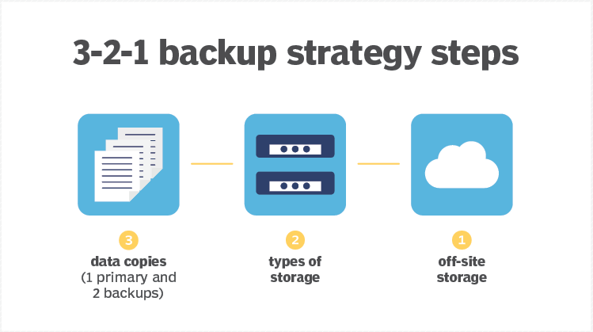
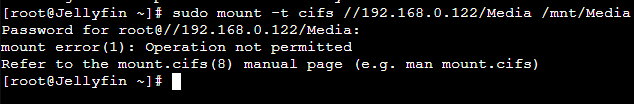
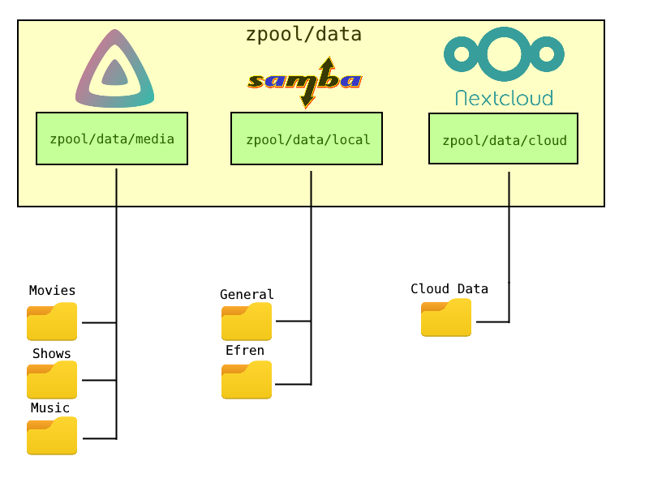

=====================
Media & Backup Server
=====================

| Having a backup of all the data is important at both consumer and enterprise level. At the moment the only source I had to backup my data and share it is the free 15GB of storage in Google Drive. As a system administrator never do that. That's why I'm following the simple **3-2-1 strategy**.

| In my case, the primary data sources are the MasterPC, my family PCs and all of our Android devices. 
| The types of storage and drives that I'm going to use as storage are the MasterServer HDDs, and only the most important data in Google Drive. As a secondary data source I will rely on DVDs for now until I find a better backup media.
| 
| I've been asked lots of times by family, friends, companions and even teachers to recover their data and having to make a backup since I had to reinstall their OS or change their storage hardware.
| Most of the times, just like HDDs, we have our data fragmented or spread in a lot of devices because one is not enough to backup all the data (e.g. I cant save the content of 2 4TB HDDs of used storage in the MasterPC to a single USB drive or Google Drive).
| 
| Having to save files at the working place to use them later at home is a daily basis for any worker or student. Also having to share large files or documents with other people. Most messaging programs or websites have a size limit.

Architecture
============

| The final solution to those needs is a NAS [#]_ integrated in the cloud.
| The most important fact was deciding where and how to install it. Usually a NAS is a separate device connected to the network with the only purpose of serving storage.
| 
| The cheapest NAS device I've seen in the market is at least 100$, like the Synology diskstation ds120j. It comes with a single HDD bay (HDD not included), a dual core 800 MHz CPU and 512 MB RAM.
| 
| Since I'm not spending 100$ on a weak and not upgradeable hardware, I'm going to run it in a CentOS container.
| 
| The first option I thought about was installing OpenMediaVault in a container with a workaround to get it to work as a service but it didn't work due to the unprivileged container perms.
| Also it's was not possible to mount a CIFS resource in an unprivileged container due to *fstab* limitations. The only way to do it would be mounting the CIFS resource in the Proxmox host and then pass it to a container as a mount point but I considered that as a big dependency on the host OS that I didn't want.

| The main media and backup server final architecture and datasets look like this.

.. rubric:: *Footnotes*
.. [#] Network Attached Storage

.. toctree::
   :caption: Contents
   :hidden:
   :maxdepth: 1

   Samba/index
   Jellyfin/index
   Nextcloud/index

