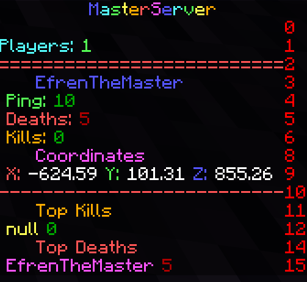

===============
Bedrock Edition
===============

| Minecraft Bedrock Edition is the Minecraft version for Windows 10, IOS, Android, PS4, Xbox One and Switch.
| 
| It's programmed in C++ and uses the Bedrock Engine to unify all the platforms
| Every player must have an **Xbox account** to be able to play online. The username in the Xbox account is the player in-game **tag**.

Bedrock Server Software
=======================

| Like the Java Edition, there are **forks** or modified minecraft servers for Bedrock Edition apart from the official one.
| 
| The improvements they offer are plugins support and better performance.
| I used *Nukkitx*, coded in Java, compatible with the latest Minecraft versions and also offers **nice performance**.

Deployment
==========

| The Nukkitx server is going to be hosted in a CentOS 8 container.
| Its only requirement is Java 8, which I installed with ``dnf install java-1.8.0-openjdk-headless.x86_64``.
| 
| The Nukkitx server file can be downloaded from **Jenkins** `here <https://ci.nukkitx.com/job/NukkitX/job/Nukkit/job/master/lastSuccessfulBuild/artifact/target/nukkit-1.0-SNAPSHOT.jar>`__ and to run the server just execute ``java -jar nukkit-1.0-SNAPSHOT.jar``.
| 
| It will generate automatically all the server files and folders. The most important config file is the *server.properties* that I edited like this.

.. code-block:: bash

   #Properties Config file
   #2020-05-20 03:03:33
   motd=⚡ §9M§ba§as§et§6e§cr§dS§9e§br§av§ee§6r ⚡
   sub-motd=⚡ §9M§ba§as§et§6e§cr§dS§9e§br§av§ee§6r ⚡
   server-port=19132
   server-ip=0.0.0.0
   view-distance=12
   white-list=off
   achievements=on
   announce-player-achievements=on
   spawn-protection=16
   max-players=20
   allow-flight=off
   spawn-animals=on
   spawn-mobs=on
   gamemode=0
   force-gamemode=off
   hardcore=off
   pvp=on
   difficulty=3
   generator-settings=
   level-name=world
   level-seed=
   level-type=DEFAULT
   allow-nether=on
   enable-query=on
   enable-rcon=off
   rcon.password=hYTliYzdmO
   auto-save=on
   force-resources=off
   xbox-auth=on

| The settings are pretty much the same as the Java version for PC. The main difference here is that *xbox-auth* must be turned on for people to play with their Xbox account and also the IP must be *0.0.0.0*. If it's set to the actual private IP it won't work at all.
| 
| After running the server for the first time it will fail since the EULA must be accepted. Change the *EULA=false* into *EULA=true* so the server can actually run.

-------
Plugins
-------

| Nukkitx supports its own plugins. All of them can be found `here <https://nukkitx.com/resources/categories/nukkit-plugins.1/>`__.

- **Player Analytics**; Uses a local MySQL database to store the server stats and display them in a web GUI
- **SimpleScoreboards**; Uses the ScoreboardAPI and PlaceholderAPI to create a customizable scoreboard
- KDR; Kills and deaths placeholders, dependency of SimpleScoreboards
- **MobPlugin**; Adds AI to mobs [#]_ , spawning and spawners
- EssentialsNK; Adds multiple managing and user commands like */home* or */warp*
- ServerMail; Adds mail commands to send messages to offline players so they can read them when they log back in

| Plugins are placed in the *plugins* folder inside the root server folder and used the next time the server is launched.
| I configured Player Analytics and SimpleScoreboards. The rest are good to go with the default configuration.

Player Analytics
----------------

| Player Analytics uses geolocations to view players info like the ping. Also, in the *server.properties* the IP is set to *0.0.0.0* so the *Alternative IP* string must be set to *true* and specify the web GUI address in the *Address:* string with the *IP:%port%* format. The edited *config.yml* file looks like this.

.. code-block:: vim

   Webserver:
       Port: 80
       Alternative_IP: true
           # %port% is replaced automatically with Webserver.Port
           Address: 192.168.0.113:%port%
       # InternalIP usually does not need to be changed, only change it if you know what you're doing!
       # 0.0.0.0 allocates Internal (local) IP automatically for the WebServer.
       Internal_IP: 0.0.0.0
       Security:
           SSL_certificate:
               KeyStore_path: Cert.jks
               Key_pass: default
               Store_pass: default
               Alias: alias
           # HTTPS is required for Login.
           Disable_authentication: false
           # Cross-Origin Resource Sharing (Requests from non-Plan web pages)
           # https://developer.mozilla.org/en-US/docs/Web/HTTP/CORS
           CORS:
               Allow_origin: "*"
       Disable_Webserver: false
       External_Webserver_address: https://www.example.address
   # -----------------------------------------------------
   Data_gathering:
       Geolocations: true
       # Please accept the EULA to download GeoLite2 IP-Country Database
       # https://www.maxmind.com/en/geolite2/eula
       Accept_GeoLite2_EULA: true
       Ping: true
       Disk_space: true
       Commands:
           Log_unknown: false
           Log_aliases_as_main_command: true

SimpleScoreboards
-----------------

| To change the default scoreboard just edit the *plugins/SimpleScoreboards/config.yml* file.
| 
| The scoreboard only allows **one title**.
| Text colors and formatting use the **Minecraft Formatting/Color** codes, which can be found `here <https://minecraft.gamepedia.com/Formatting_codes>`__.
| **Placeholders** can be used to output multiple variables in the scoreboard. A list can be found `here <https://nukkitx.com/resources/simplescoreboards.195/>`__.
| 
| The final *config.yml* file looks like this.

.. code-block:: vim

   # Config version, do not edit
   version: 2
   # How often scoreboard should be updated in ticks (20 ticks = 1 second)
   # 0 = disabled, ENABLE THIS IF YOU USE PLACEHOLDERS
   # With coordinates 10-20 recommended, with other placeholders 80-200
   update: 20
   # Use async task to update scoreboard
   # Less server load but may lead to errors
   async: true
   # Scoreboard title
   title: "§9M§ba§as§et§6e§cr§dS§9e§br§av§ee§6r"
   # Scoreboard lines
   # You can use § for colors and placeholders from PlaceholderAPI
   text:
     - ""
     - "§bPlayers: §a%server_online%"
     - "§c=========================="
     - "     §9%player%"
     - " §aPing: §2%player_ping%"
     - " §cDeaths: §4%kdr_deaths%"
     - " §6Kills: §2%kdr_kills%"
     - ""
     - "     §dCoordinates"
     - " §cX: §f%player_x% §aY: §f%player_y% §9Z: §f%player_z%"
     - "§c--------------------------"
     - "     §6Top Kills"
     - " §e%kdr_topkillsplayer% §2%kdr_topkills%"
     - ""
     - "     §cTop Deaths"
     - " §d%kdr_topdeathsplayer% §4%kdr_topdeaths%"
     - ""

| The result looks like this.

-----------
How To Play
-----------

Xbox One
--------

1. Go to *System*, then *Settings*, *Network Settings*, *Advanced Settings*, *DNS Settings*, *Manual*. When *Primary DNS* is prompted, type in *104.238.130.180*. For the second DNS you can use any you want, like *1.1.1.1*.
2. Launch Minecraft and Tap *Play*, go to the *Servers* tab and choose any server.
3. A new server list will be prompted. Tap *Connect to a Server* and enter *masterserver.serveminecraft.net* in the *Server Address* dialog box.

Nintendo Switch
---------------

1. Go to *System Settings* then *Internet Settings*. Choose your network and go to *DNS Settings*. Set it to *Manual* and type in the primary DNS *104.238.130.180*. For the secondary DNS you can use any you want, like *1.1.1.1*.
2. Then launch Minecraft and tap *Sign In With A Microsoft Account* and login with the Xbox account. Tap *Play*, go to the *Servers* tab and choose any server.
3. A new server list will be prompted. Tap *Connect to a Server* and enter *masterserver.serveminecraft.net* in the *Server Address* dialog box.

PS4
---

| PlayStation hasn't released public servers yet.
| One way to join another server is through friends; Someone you have as friends in your Xbox account plays on their world and allows other players to join it. The problem of this is that the owner must be online for other people to be playing. If the owner leaves the world, the rest of the people playing it will be kicked.
| It also allows joining LAN Bedrock servers, but not WAN ones.
| The easiest way to join a Bedrock Edition server from PS4 for now is launching a LAN PocketMine-MP server and then joining a WAN server.

1. Installing PocketMine-MP is easy as searching it in the PlayStore and installing it.
2. When it's installed just tap Start and in the server console do *op "playertag"*. That way operator permission will be granted to perform any command
3. Then do */gamemode creative* to be in creative mode and finally */transferserver masterserver.serveminecraft.net* to join the MasterServer

| 
| 
| 

.. rubric:: *Footnotes*
.. [#] Minecraft Monsters
