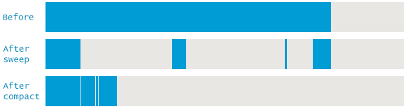
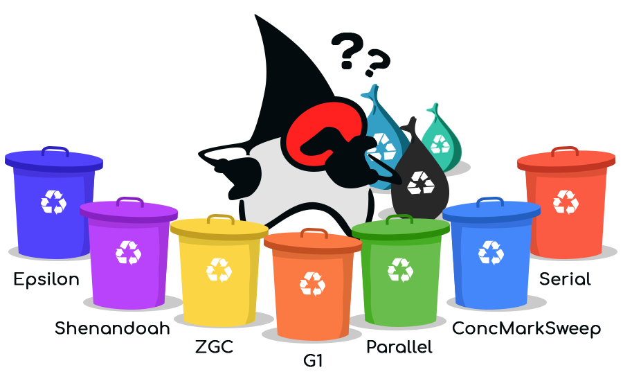
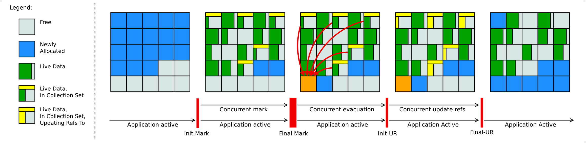

============
Java Edition
============

| Minecraft Java Edition is the original game launched in 2012 for PC.
| Both clients and servers use the **JVM architecture**.

Deployment
==========

| The Minecraft server is going to be deployed in a CentOS 8 container. The only requirement is installing **Java 8 JDK** with the following commands.

.. code-block:: bash

   dnf install java-1.8.0-openjdk-devel.x86_64

| Minecraft servers software come in different flavours, which is known as **forks** [#]_. 
| 
| The official Minecraft server software is called **Vanilla**. **CraftBukkit** is an slightly modified version of Vanilla that allows running **Bukkit** plugins.
| 
| Bukkit is an API [#]_ that allows programmers to make plugins for servers.
| 
| **Spigot** is a CraftBukkit fork that has lots of plugins available and also an API.
| 
| **PaperMC** is a high performance fork and an expanded API that extends and improves both Bukkit and Spigot. It's compatible with both Spigot and Bukkit plugins.
| 
| 
| I'm going to use the PaperMC 443 build for the 1.8.8 Minecraft version which can be downloaded `here <https://papermc.io/api/v1/paper/1.8.8/443/download>`__
| It will come in a *jar* file. To launch the server just execute ``java -jar paper-443.jar``.
| The Minecraft server comes with its own command interpreter to execute server commands. The first time it will say the EULA must be accepted, which can be done stopping the server typing ``stop`` and setting *EULA=true* in the *eula.txt* file.
| 
| The next time it's ran it will generate the server tree structure by itself.
| The most important files are the following.

- **Server.properties**; General server configurations
- Paper/bukkit/spigot.yml; Further server configurations
- Banned-ips/players.json; List of the banned players or IPs in JSON format
- Ops.json; Server operators list
- World; Contains all the world data, including players data IDed by their UUID [#]_
- **Plugins**; Contains all the plugins data and configuration files
- Logs; Contains a log of all the server events

| I put the *masterplugin.jar* file in the *plugins* folder.
| I added the server logo as a 64x64 px image named *server-icon.png*.
| I configured the *server.properties* file as it follows.

.. code-block:: vim

   #Minecraft server properties
   spawn-protection=0
   generator-settings=
   force-gamemode=false
   allow-nether=true
   gamemode=0
   broadcast-console-to-ops=true
   enable-query=false
   player-idle-timeout=0
   difficulty=3
   spawn-monsters=true
   op-permission-level=4
   resource-pack-hash=
   announce-player-achievements=true
   pvp=true
   snooper-enabled=true
   level-type=DEFAULT
   hardcore=false
   enable-command-block=true
   max-players=50
   network-compression-threshold=256
   max-world-size=29999984
   server-port=25565
   debug=false
   server-ip= IP
   spawn-npcs=true
   allow-flight=false
   level-name=world
   view-distance=12
   resource-pack=
   spawn-animals=true
   white-list=false
   generate-structures=true
   online-mode=true
   max-build-height=256
   level-seed=-7713256961730398108
   enable-rcon=false
   motd=\u00A7e\u00A7l                    \u26A1\u00A7c\u00A7l  M\u00A76\u00A7la\u00A7e\u00A7ls\u00A7a\u00A7lt\u00A7b\u00A7le\u00A7d\u00A7lr\u00A7c\u00A7l S\u00A76\u00A7le\u00A7e\u00A7lr\u00A7a\u00A7lv\u00A7b\u00A7le\u00A7d\u00A7lr  \u00A7e\u00A7l\u26A1\u00A7c\u00A7l                              \u2261\u00A76\u00A7l\u2261\u00A7e\u00A7l\u2261\u00A7a\u00A7l\u2261\u00A7b\u00A7l\u2261\u00A7d\u00A7l\u2261\u00A7c\u00A7l\u2261\u00A76\u00A7l\u2261\u00A7e\u00A7l\u2261\u00A7a\u00A7l\u2261\u00A7b\u00A7l\u2261\u00A7d\u00A7l\u2261\u00A7c\u00A7l\u2261\u00A76\u00A7l\u2261\u00A7e\u00A7l\u2261\u00A7a\u00A7l\u2261\u00A7b\u00A7l\u2261\u00A7d\u00A7l\u2261\u00A7c\u00A7l\u2261\u00A76\u00A7l\u2261\u00A7e\u00A7l\u2261\u00A7a\u00A7l\u2261\u00A7d\u00A7l\u2261

| The world is set to survival in hard difficulty, there's PVP [#]_, players won't be kicked for being AFK and the render distance is set to 12 chunks.
| The IP is not shown for security reasons and the used port is the default one.
| 
| Finally I created a script file called *masterserver.sh* that will execute the server with custom JVM Arguments. Knowing how a Java Virtual Machine works is a must.
| The script content is the following.

.. code-block:: vim

   java -server -d64 -Xmx6G -Xms6G -XX:+UseShenandoahGC -XX:+AlwaysPreTouch -XX:+UseLargePages -XX:+UseNUMA -XX:+DisableExplicitGC -XX:+UseCompressedOops -verbose:gc -jar paperclip.jar

JVM
===

| Java works with **Java Virtual Machines**.
| A Java Virtual Machine has **3** main memory structures.

- **Stack**; Each thread has its own stack memory zone.
- **Heap**; Common zone for all the threads which contains objects information.
- **Non-Heap**; Common zone for the application which contains classes information.

| The Stack is not going to be a subject of study due to the focus of this project.
| The most important subzones of the Non-Heap memory are the cache and the **PermGen**.

----
Heap
----

| Java uses originally a **generational memory management**.
| 
| Every object created in Java has a life cycle, that's because some of the objects will become unreferenced, useless during the program execution.
| If objects didn't have a life cycle all of them would stay alive forever taking infinite amount of memory and producing OutOfMemoryErrors.
| 
| Unreferenced or dead objects are called **garbage**, while referenced or alive objects are called as is.
| 
| Object creation is done through ``Object example= new Object();``

#. Young Generation

   * Eden Space; Initial memory pool where all new objects are first allocated
   * Survivor Space; Pool that contains objects that survived the GC of the Eden Space. There are 2 survivor spaces to avoid an extra step of compacting; Instead it uses the copy-mark algorithm

#. Old/Tenured Generation; Pool containing objects that have survived to GC in the survivor space. The age of the object (tenuring) needed to pass to the Tenured Generation can be changed manually or dynamically by the JVM

Garbage Collection Algorithms
-----------------------------

- **Mark-Sweep**; Removes unreferences objects to free space and keeps referenced ones. The memory allocator keeps references to freed space blocks where a new object can be allocated and has memory fragmentation. If an object that has to be allocated cant fit in the freed space blocks, it will have to take **new** large memory blocks.

- **Mark-Sweep-Compact**; After deleting unreferenced objects, compacts (moves and put them togheter) the referenced ones that are kept, which makes allocation easier, faster and optimizes memory usage.

- **Mark-Copy**; Instead of moving objects in the same memory region they are copied to a different one, allowing copying and marking simultaneously.

.. image:: media/markcopy.png
   :width: 400px

Garbage Collectors
------------------

| Garbage collectors use different algorithms to collect the garbage in 2 different operations.

- **Minor GC**; Collects garbage from the young generation.
- **Major GC**; Collects garbage from the old generation.

| Some of the most important GCs are the following.
| 

- Serial GC; Only works in a single thread, which is only advised for very small programs and low-end devices. Not relevant nowadays.

- Parallel GC

   * Uses mark-copy for the minor GC and mark-sweep-compact for the major GC.
   * Uses multiple threads to scan the heap.
   * Freezes the application when the heap is nearly full, which is called Stop The World. 

- Concurrent collector/CMS (Concurrent Mark Sweep)

   * Uses mark-copy in the Young Generation and mark-sweep in the Old Generation.
   * Uses multiple threads to scan the heap.
   * Minimizes pauses doing the GC concurrently [#]_

- G1 GC

   * Introduced in Java 7 to support larger heaps than 4GB.
   * Divides the heap into memory regions from 1 to 32MB by default, which can be changed depending on the size of the heap and flags.
   * Uses multiple threads to scan the heap for regions containing most garbage first, there comes the name Garbage First.
   * The memory is fragmented by default into regions so that's not something to worry about unlike the mark-sweep algorithm.
   * Compacts the heap on-the-go without STW.
   * Since Java 8u20 it can use strings deduplication.

.. image:: media/G12.png
   :width: 400px

- Shenandoah GC

| Shenandoah GC was developed by RedHat and it's available for OpenJDK 8+ and AdoptOpenJDK. It's not available for Oracle's JDK.
| 
| All the GCs have a pause when the minor GC is done. It's nothing compared to a major GC STW freeze, but minor GCs copy-mark algorithm translates into micro-stuttering or small performance spikes. 
| 
| Also, the Concurrent GC doesn't solve fragmentation due to the lack of compression in the major GC concurrent sweeping.
| In comparison, G1 also has a small pause when it does the compression on-the-go.
| 
| Shenandoa divides the heap in a smiliar way as G1, but unlike all the GCs seen, it's not generational.
| It has the following phases;

#. Init Mark; Initiates the marking.
#. Concurrent marking; Walks over the heap and marks alive and dead objects.
#. Final Mark; Finishes the Concurrent Marking by draining all pending marking/update queues and re-scans the regions.
#. Concurrent Cleanup; Frees up garbage regions with no alive objects at all.
#. Concurrent Evacuation; Copies alive objects from regions with some dead objects to other free regions.
#. Init Update Refs; Initiates the references update and makes sure the GC has finished evacuating.
#. Concurrent Update Refs; Walks over the heap and updates references to objects moved during the evacuation into references to the whole region that contained that object.
#. Final Update Refs; Finishes the Concurrent Update Refs by re-updating the regions and removing useless references.
#. Concurrent Cleanup; Reclaims regions that contained some alive and dead objects.

| 
| The main difference is that every part of the process is **concurrent**; Evacuation replaces compression and keeps the alive object accessible during the copy of the object to a new memory region, since it stays duplicated until its finally cleaned, which is a huge improvement.

Performance VS Throughput
-------------------------

- Performance means how quickly an application responds to an event. It's important for applications that focus on responsiveness like a game waiting times are not acceptable and it's important responding in short times, which means low latency.
- Throughput is the amount of work an application can do in a period of time. It's important for applications that dont care about waiting times and focus on performance over long periods of time, like batch applications or transactions.
- The Concurrent GC is optimized for short pauses with the cost of high CPU and RAM usage. It's focused on the performance.
- The Parallel GC is optimized for applications that can deal with waiting times, costing less CPU and RAM than the Concurrent GC. It's focused on the throughput.
- The G1 is optimized for large heaps and applications that focus on latency.
- The Shenandoa GC is optimized for even larger heaps and has both nice performance and throughput.

Flags
-----

| JVM options can be tuned with flags added to the ``java -jar`` command.
| Some important flags are the following
| 

- -XX:+UseSerialGC
- -XX:+UseParallelGC; Young generation uses multi-threaded GC, older a single thread
- -XX:+UseParallelOldGC; Both generations with multi-threaded GC
- -XX:+UseParNewGC; Young generation uses multi-threading
- -XX:+UseConcMarkSweepGC; Enables the CMS GC and ParNewGC by default
- -XX:+UseG1GC; Enables G1 GC
- -XX:+UseShenandoahGC; Enables Shenandoah GC
- -Xmx; Maximum heap size.
- -Xms; Initial heap size.
- -Xmn; Young generation heap size.
- -XX:+DisableExplicitGC; Ignores any *System.gc()* method invocations by an application, which means GC is not controlled by the application.
- -XX:+UseStringDeduplicationJVM; G1 GC identifies duplicated strings and make them point to the same internal *char* array to reduce the use of the heap.

-----------------
VisualVM & Jstatd
-----------------

| **VisualVM** is a JVM monitor and profiler.
| 
| It can also take memory and thread dumps and analyze them. It requires Java JDK and can be found in the Java *bin* folder. Anyway a newer version can be downloaded from `here <https://visualvm.github.io/>`__.
| 
| The current version of Java I'm using is OpenJDK 8u 242 devel.
| Until Java 8, Paralel GC is the default one. Onwards G1 GC is the default.
| 
| That can be checked executing ``java -XX:+PrintCommandLineFlags -version``.
| 
| Since I'm running headless [#]_, to use VisualVM I had to send the JVM statistics to my PC VisualVM.
| To allow the remote connections with VisualVM I created the *jstatd.all.policy* file  with the following content.

.. code-block:: vim

   grant codebase "file:${java.home}/../lib/tools.jar" {
         permission java.security.AllPermission;
         };

| Then I used **Jstatd** which is the Java statistics daemon to open it on the port 1199.
| That can be done executing ``jstatd -p 1199 -J-Djava.security.policy=jstatd.all.policy``.
| 
| Finally connect with VisualVM adding a remote host with the desired Ip and port.
| 
| In comparison to executing it locally, it lacks the **memory dumps** function and CPU usage monitor.
| Anyway, heap dumps can be done with the **jmap** tool and later analyzed with VisualVM.
| To visualize the GC work, the plugin **VisualGC** has to be added from the plugin manager tab.
| 
| 
| 

.. rubric:: *Footnotes*

.. [#] Copy of source code from one software package that a programmer develops independently, creating a distinct and separate piece of software.
.. [#] Application Programming Interface
.. [#] Universally Unique Identifier
.. [#] Player VS Player
.. [#] At the same time the application runs, during execution without freezing it.
.. [#] Without GUI or screen
