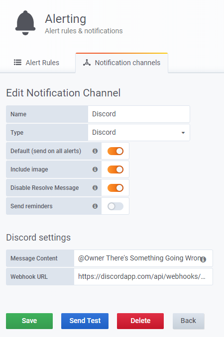

=======
Grafana
=======

| **Grafana** is an open source analytics & monitoring program that works with lots of databases.
| 
| Its main features are real-time monitoring and alerting through graphic panels and dashboards.

Deployment
==========

| I installed Grafana in a CentOS 8 container with the following commands.

.. code-block:: bash

   yum install wget
   yum install initscripts urw-fonts
   wget https://dl.grafana.com/oss/release/grafana-6.7.1-1.x86_64.rpm
   sudo yum install grafana-6.7.1-1.x86_64.rpm
   systemctl enable grafana-server.service
   grafana-server

| Its config file is located at */etc/grafana/grafana.ini*. The default configuration is enough because I'm going to do further changes in the GUI.
| Accessing the Grafana pannel is easy as typing the socket address in the browser with the port 3000 and login.

| Then it will appear a page with a web-based wizard.

| First thing to do is configure the data source clicking on the *Add source* button.

| Then select InfluxDB and configure it as it follows.

| If the configuration is well done the data source will be working.

| Finally create a new dashboard hovering on the *+* icon.

Dashboard
=========

| The dashboard I created features **54 different pannels**. Explaining them one by one would be useless so I'm just going to explain the basics.

--------
Settings
--------

| The dashboard settings can be accessed clicking in the gear placed on the top right corner of it.
| In the **general** tab the following features can be configured. 

| In the **variables** tab I set the *$server* variable to display the name of each Proxmox host.
| 
| In case the server is expanded that variable will be useful. The auto-refresh rate is set to the same value as the *$__interval* variable, which is going to determine how often is InfluxDB queried.

| Users can change the server and interval variables value through the dashboard, as well as the **refresh-rate** and **time range**.

------
Panels
------

| The Dashboards basic element are **panels**. Each panel is a graphic display of single or multiple metrics.
| 
| There are many ways to display them.

Queries
-------

| Displaying metrics is done by querying InfuxDB. Grafana features a query inspector which is handy to overview the measurements available and tags. Other than that I dont advice it for querying since it's made for people without database knowledge; The text edit mode lets me write the queries manually. It can be toggled clicking on the pencil icon above the query box.
| Each panel also can manage multiple queries, named starting from *A*
| 
| The whole stack is set to send data each 10 seconds which is a good value for a server like mine.
| 
| To control how often Grafana queries data to InfluxDB I used the *GROUP BY time()* clause. Also I set the clause value to the variable *$__interval* so people can change the time spacing for the queries starting from 10s with the interval dialog box, which must be the same as the refresh rate of the dashboard. That's a more intelligent way instead of setting a fixed interval when it comes to analyzing data over time ranges, which can be set in the time interval dialog box.
| 
| I always format it as time series since im working with time series data. I used the *alias by* parameter set to the variable default variable *$tag_feature* for multi-feature metrics, so when I group them the displayed name of each one will be the right one.

Visualization
-------------

| Depending on the kind of visualization used different features will be available. Taking a graph visualization as an example, I can display it in points, bars or lines and toggle the differents axes along with the measurement unit and precission that fits my needs.

.. image:: media/grafana23.png
   :width: 400px

| Also I can toggle legends and the way they are shown in the panel. Extra values like the max or current value can be also displayed on the legend.

| Thresholds and time regions can only be toggled if no alarms are set for the panel, which in this case I didnt use.

General
-------

| Here the title and repetition pattern can be specified. Also it can be set to transparent. I didnt use panel links since it's the only panel used.

Alert
-----

| This takes monitoring a step further. Alarms can only be set on *Graph* panels. Every alarm has its own name and custom notification. The triggering timing is done playing with the *evaluate every* and *for* parameters, the condition specifies the requirements that the graph must meet to trigger the alarm.
| 
| The *no data* and *error handling* parameters specify the alarm state that will be set when theres no data and when the alarm is triggered.
| 
| In this example, when the average CPU temperature goes above 85 degrees it will activate the trigger. If the CPU temperature stays above 85 ºC for at least 5 minutes, an alarm will be sent to the Discord server and displayed in the alarm panel of the dashboard.

| Alerts notification channels and rules configuration can be done accessing them from the left navigation bar. I set the notification channel to the Discord server through a webhook. It will include an image of the alarm as well.

