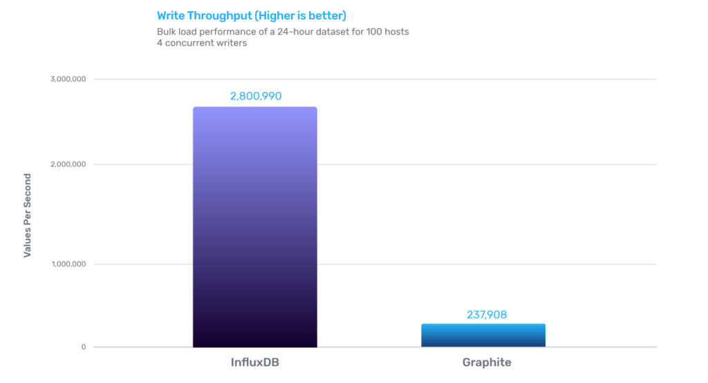
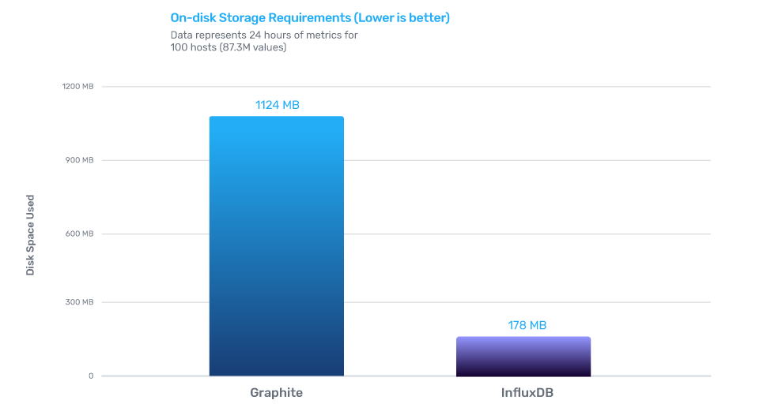
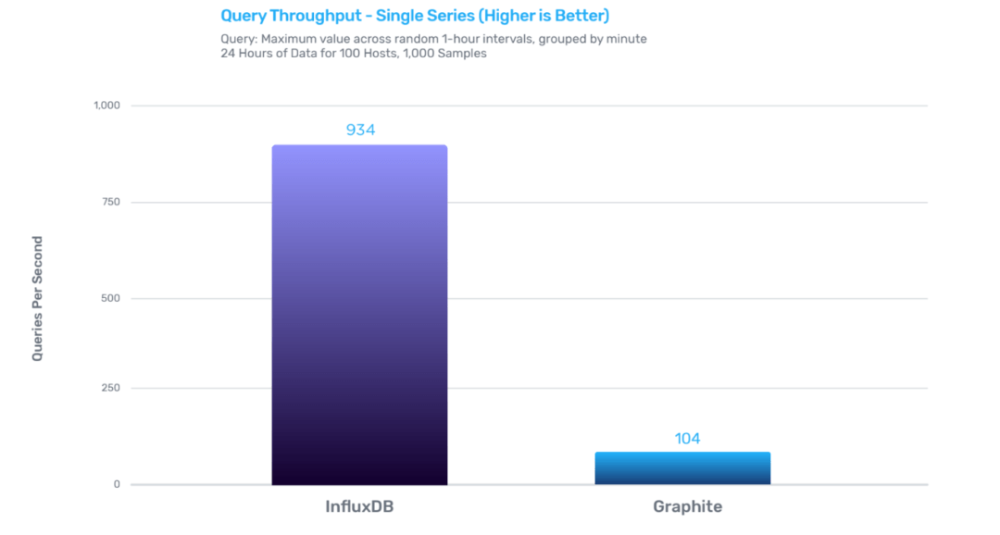
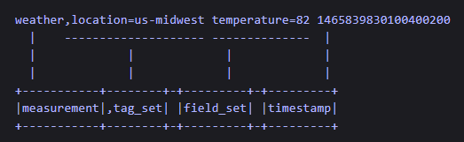

============
InfluxDB
============

-------------
Why InfluxDB?
-------------

| Proxmox only supports Graphite and InfluxDB as external metric servers.
| I looked up which one was better and had more performance and InfluxDB wrecked Graphite in every aspect, so it was the winner.

| InfluxDB is an open source, big data and NoSQL [#]_ database that allows for massive scalability, high availability, fast write, and fast read.
| 
| InfluxDB is based in the **line protocol format** which represents one data point in InfluxDB.

| It informs InfluxDB of the point’s measurement, tag set, field set, and timestamp.

+-------------+-------------------+-------------------------------------+-----------------------------------+
| Element     | Optional/Required | Description                         | Type                              |
+=============+===================+=====================================+===================================+
| Measurement | Required          | The measurement name.               | String                            |
|             |                   | Only one per point                  |                                   |
+-------------+-------------------+-------------------------------------+-----------------------------------+
| Tag Set     | Optional          | Tag key-value pairs for the point   | Strings                           |
+-------------+-------------------+-------------------------------------+-----------------------------------+
| Field Set   | Required          | Field key-value pairs for the point | Float, integer, string or Boolean |
+-------------+-------------------+-------------------------------------+-----------------------------------+
| Timestamp   | Optional          | Timestamp for the data point        | Unix nanosecond timestamp [#]_    |
+-------------+-------------------+-------------------------------------+-----------------------------------+

| It's important to know that the tags are indexed unlike the fields, so that makes them faster for querying.

----------
Deployment
----------

| I created a CentOS 8 container along with its users and sudo settings that I'm not going to reveal for security reasons.
| To install InfluxDB I executed the following commands.

.. code-block:: bash

   yum install wget
   wget https://dl.influxdata.com/influxdb/releases/influxdb-1.7.10.x86_64.rpm
   yum localinstall influxdb-1.7.10.x86_64.rpm
   influxd
   influx

| The influx daemon **influxd** will output all the database traffic and queries so the best is running it in a separate terminal from **influx**, which is the InfluxDB shell.

---------------
Database Design
---------------

.. code-block:: SQL

   > show databases
   name: databases
   name
   ----
   _internal
   proxmox
   telegraf
   >

-------
Proxmox
-------

Series
------

.. code-block:: vim

   > show series   
   ballooninfo,host=Documentation,nodename=MasterServer,object=qemu,vmid=114
   ballooninfo,host=Kali-Linux,nodename=MasterServer,object=qemu,vmid=108
   ballooninfo,host=Kali-Linux,nodename=masterserver,object=qemu,vmid=100
   ballooninfo,host=Tomcat-Ubuntu,nodename=MasterServer,object=qemu,vmid=109
   ballooninfo,host=Windows-LTSC-Security-Testing,nodename=MasterServer,object=qemu,vmid=109
   ballooninfo,host=mirror-benchmark,nodename=masterserver,object=qemu,vmid=100
   ballooninfo,host=zraid-benchmark,nodename=masterserver,object=qemu,vmid=101
   blockstat,host=Documentation,instance=efidisk0,nodename=MasterServer,object=qemu,vmid=114
   blockstat,host=Documentation,instance=pflash0,nodename=MasterServer,object=qemu,vmid=114
   blockstat,host=Documentation,instance=scsi0,nodename=MasterServer,object=qemu,vmid=114
   blockstat,host=Kali-Linux,instance=ide2,nodename=MasterServer,object=qemu,vmid=108
   blockstat,host=Kali-Linux,instance=ide2,nodename=masterserver,object=qemu,vmid=100
   blockstat,host=Kali-Linux,instance=scsi0,nodename=MasterServer,object=qemu,vmid=108
   blockstat,host=Kali-Linux,instance=scsi0,nodename=masterserver,object=qemu,vmid=100
   blockstat,host=MasterServer,object=nodes
   blockstat,host=Tomcat-Ubuntu,instance=efidisk0,nodename=MasterServer,object=qemu,vmid=109
   blockstat,host=Tomcat-Ubuntu,instance=ide2,nodename=MasterServer,object=qemu,vmid=109
   blockstat,host=Tomcat-Ubuntu,instance=pflash0,nodename=MasterServer,object=qemu,vmid=109
   blockstat,host=Tomcat-Ubuntu,instance=scsi0,nodename=MasterServer,object=qemu,vmid=109
   blockstat,host=Windows-LTSC-Security-Testing,instance=efidisk0,nodename=MasterServer,object=qemu,vmid=109
   blockstat,host=Windows-LTSC-Security-Testing,instance=ide0,nodename=MasterServer,object=qemu,vmid=109
   blockstat,host=Windows-LTSC-Security-Testing,instance=ide2,nodename=MasterServer,object=qemu,vmid=109
   blockstat,host=Windows-LTSC-Security-Testing,instance=pflash0,nodename=MasterServer,object=qemu,vmid=109
   blockstat,host=masterserver,object=nodes
   blockstat,host=mirror-benchmark,instance=efidisk0,nodename=masterserver,object=qemu,vmid=100
   blockstat,host=mirror-benchmark,instance=ide0,nodename=masterserver,object=qemu,vmid=100
   blockstat,host=mirror-benchmark,instance=ide2,nodename=masterserver,object=qemu,vmid=100
   blockstat,host=mirror-benchmark,instance=pflash0,nodename=masterserver,object=qemu,vmid=100
   blockstat,host=mirror-benchmark,instance=scsi0,nodename=masterserver,object=qemu,vmid=100
   blockstat,host=zraid-benchmark,instance=ide0,nodename=masterserver,object=qemu,vmid=101
   blockstat,host=zraid-benchmark,instance=scsi0,nodename=masterserver,object=qemu,vmid=101
   cpustat,host=MasterServer,object=nodes
   cpustat,host=masterserver,object=nodes
   memory,host=MasterServer,object=nodes
   memory,host=masterserver,object=nodes
   nics,host=Documentation,instance=tap114i0,nodename=MasterServer,object=qemu,vmid=114
   nics,host=Kali-Linux,instance=tap100i0,nodename=masterserver,object=qemu,vmid=100
   nics,host=Kali-Linux,instance=tap108i0,nodename=MasterServer,object=qemu,vmid=108
   nics,host=MasterServer,instance=enp11s0,object=nodes
   nics,host=MasterServer,instance=ens4f0,object=nodes
   nics,host=MasterServer,instance=ens4f1,object=nodes
   nics,host=MasterServer,instance=ens5f0,object=nodes
   nics,host=MasterServer,instance=ens5f1,object=nodes
   nics,host=MasterServer,instance=fwbr100i0,object=nodes
   nics,host=MasterServer,instance=fwbr101i0,object=nodes
   nics,host=MasterServer,instance=fwbr102i0,object=nodes
   nics,host=MasterServer,instance=fwbr103i0,object=nodes
   nics,host=MasterServer,instance=fwbr105i0,object=nodes
   nics,host=MasterServer,instance=fwbr108i0,object=nodes
   nics,host=MasterServer,instance=fwbr109i0,object=nodes
   nics,host=MasterServer,instance=fwbr110i0,object=nodes
   nics,host=MasterServer,instance=fwbr111i0,object=nodes
   nics,host=MasterServer,instance=fwbr112i0,object=nodes
   nics,host=MasterServer,instance=fwbr114i0,object=nodes
   nics,host=MasterServer,instance=fwln100i0,object=nodes
   nics,host=MasterServer,instance=fwln101i0,object=nodes
   nics,host=MasterServer,instance=fwln102i0,object=nodes
   nics,host=MasterServer,instance=fwln103i0,object=nodes
   nics,host=MasterServer,instance=fwln105i0,object=nodes
   nics,host=MasterServer,instance=fwln108i0,object=nodes
   nics,host=MasterServer,instance=fwln109i0,object=nodes
   nics,host=MasterServer,instance=fwln110i0,object=nodes
   nics,host=MasterServer,instance=fwln111i0,object=nodes
   nics,host=MasterServer,instance=fwln112i0,object=nodes
   nics,host=MasterServer,instance=fwln114i0,object=nodes
   nics,host=MasterServer,instance=fwpr100p0,object=nodes
   nics,host=MasterServer,instance=fwpr101p0,object=nodes
   nics,host=MasterServer,instance=fwpr102p0,object=nodes
   nics,host=MasterServer,instance=fwpr103p0,object=nodes
   nics,host=MasterServer,instance=fwpr105p0,object=nodes
   nics,host=MasterServer,instance=fwpr108p0,object=nodes
   nics,host=MasterServer,instance=fwpr109p0,object=nodes
   nics,host=MasterServer,instance=fwpr110p0,object=nodes
   nics,host=MasterServer,instance=fwpr111p0,object=nodes
   nics,host=MasterServer,instance=fwpr112p0,object=nodes
   nics,host=MasterServer,instance=fwpr114p0,object=nodes
   nics,host=MasterServer,instance=lo,object=nodes
   nics,host=MasterServer,instance=tap108i0,object=nodes
   nics,host=MasterServer,instance=tap109i0,object=nodes
   nics,host=MasterServer,instance=tap114i0,object=nodes
   nics,host=MasterServer,instance=veth100i0,object=nodes
   nics,host=MasterServer,instance=veth101i0,object=nodes
   nics,host=MasterServer,instance=veth102i0,object=nodes
   nics,host=MasterServer,instance=veth103i0,object=nodes
   nics,host=MasterServer,instance=veth105i0,object=nodes
   nics,host=MasterServer,instance=veth110i0,object=nodes
   nics,host=MasterServer,instance=veth111i0,object=nodes
   nics,host=MasterServer,instance=veth112i0,object=nodes
   nics,host=MasterServer,instance=vethSH31C3,object=nodes
   nics,host=MasterServer,instance=vmbr0,object=nodes
   nics,host=Tomcat-Ubuntu,instance=tap109i0,nodename=MasterServer,object=qemu,vmid=109
   nics,host=Windows-LTSC-Security-Testing,instance=tap109i0,nodename=MasterServer,object=qemu,vmid=109
   nics,host=masterserver,instance=enp11s0,object=nodes
   nics,host=masterserver,instance=ens4f0,object=nodes
   nics,host=masterserver,instance=ens4f1,object=nodes
   nics,host=masterserver,instance=ens5f0,object=nodes
   nics,host=masterserver,instance=ens5f1,object=nodes
   nics,host=masterserver,instance=fwbr100i0,object=nodes
   nics,host=masterserver,instance=fwbr101i0,object=nodes
   nics,host=masterserver,instance=fwbr102i0,object=nodes
   nics,host=masterserver,instance=fwbr103i0,object=nodes
   nics,host=masterserver,instance=fwbr104i0,object=nodes
   nics,host=masterserver,instance=fwbr105i0,object=nodes
   nics,host=masterserver,instance=fwbr106i0,object=nodes
   nics,host=masterserver,instance=fwbr107i0,object=nodes
   nics,host=masterserver,instance=fwln100i0,object=nodes
   nics,host=masterserver,instance=fwln101i0,object=nodes
   nics,host=masterserver,instance=fwln102i0,object=nodes
   nics,host=masterserver,instance=fwln103i0,object=nodes
   nics,host=masterserver,instance=fwln104i0,object=nodes
   nics,host=masterserver,instance=fwln105i0,object=nodes
   nics,host=masterserver,instance=fwln106i0,object=nodes
   nics,host=masterserver,instance=fwln107i0,object=nodes
   nics,host=masterserver,instance=fwpr100p0,object=nodes
   nics,host=masterserver,instance=fwpr101p0,object=nodes
   nics,host=masterserver,instance=fwpr102p0,object=nodes
   nics,host=masterserver,instance=fwpr103p0,object=nodes
   nics,host=masterserver,instance=fwpr104p0,object=nodes
   nics,host=masterserver,instance=fwpr105p0,object=nodes
   nics,host=masterserver,instance=fwpr106p0,object=nodes
   nics,host=masterserver,instance=fwpr107p0,object=nodes
   nics,host=masterserver,instance=lo,object=nodes
   nics,host=masterserver,instance=tap100i0,object=nodes
   nics,host=masterserver,instance=tap101i0,object=nodes
   nics,host=masterserver,instance=veth101i0,object=nodes
   nics,host=masterserver,instance=veth102i0,object=nodes
   nics,host=masterserver,instance=veth103i0,object=nodes
   nics,host=masterserver,instance=veth104i0,object=nodes
   nics,host=masterserver,instance=veth105i0,object=nodes
   nics,host=masterserver,instance=veth106i0,object=nodes
   nics,host=masterserver,instance=veth107i0,object=nodes
   nics,host=masterserver,instance=veth8B6VYV,object=nodes
   nics,host=masterserver,instance=vmbr0,object=nodes
   nics,host=mirror-benchmark,instance=tap100i0,nodename=masterserver,object=qemu,vmid=100
   nics,host=zraid-benchmark,instance=tap101i0,nodename=masterserver,object=qemu,vmid=101
   sensors,chip=coretemp-isa-0000,feature=core_0,host=MasterServer
   sensors,chip=coretemp-isa-0000,feature=core_0,host=masterserver
   sensors,chip=coretemp-isa-0000,feature=core_1,host=MasterServer
   sensors,chip=coretemp-isa-0000,feature=core_1,host=masterserver
   sensors,chip=coretemp-isa-0000,feature=core_2,host=MasterServer
   sensors,chip=coretemp-isa-0000,feature=core_2,host=masterserver
   sensors,chip=coretemp-isa-0000,feature=core_3,host=MasterServer
   sensors,chip=coretemp-isa-0000,feature=core_3,host=masterserver
   sensors,chip=coretemp-isa-0001,feature=core_0,host=MasterServer
   sensors,chip=coretemp-isa-0001,feature=core_0,host=masterserver
   sensors,chip=coretemp-isa-0001,feature=core_1,host=MasterServer
   sensors,chip=coretemp-isa-0001,feature=core_1,host=masterserver
   sensors,chip=coretemp-isa-0001,feature=core_2,host=MasterServer
   sensors,chip=coretemp-isa-0001,feature=core_2,host=masterserver
   sensors,chip=coretemp-isa-0001,feature=core_3,host=MasterServer
   sensors,chip=coretemp-isa-0001,feature=core_3,host=masterserver
   sensors,chip=i5k_amb-isa-0000,feature=ch._0_dimm_0,host=MasterServer
   sensors,chip=i5k_amb-isa-0000,feature=ch._0_dimm_0,host=masterserver
   sensors,chip=i5k_amb-isa-0000,feature=ch._0_dimm_1,host=MasterServer
   sensors,chip=i5k_amb-isa-0000,feature=ch._0_dimm_1,host=masterserver
   sensors,chip=i5k_amb-isa-0000,feature=ch._0_dimm_2,host=MasterServer
   sensors,chip=i5k_amb-isa-0000,feature=ch._0_dimm_2,host=masterserver
   sensors,chip=i5k_amb-isa-0000,feature=ch._1_dimm_0,host=MasterServer
   sensors,chip=i5k_amb-isa-0000,feature=ch._1_dimm_0,host=masterserver
   sensors,chip=i5k_amb-isa-0000,feature=ch._1_dimm_1,host=MasterServer
   sensors,chip=i5k_amb-isa-0000,feature=ch._1_dimm_1,host=masterserver
   sensors,chip=i5k_amb-isa-0000,feature=ch._1_dimm_2,host=MasterServer
   sensors,chip=i5k_amb-isa-0000,feature=ch._1_dimm_2,host=masterserver
   sensors,chip=nouveau-pci-0700,feature=fan1,host=MasterServer
   sensors,chip=nouveau-pci-0700,feature=gpu_core,host=MasterServer
   sensors,chip=nouveau-pci-0700,feature=temp1,host=MasterServer
   sensors,chip=smsc47m1-isa-0800,feature=fan1,host=masterserver
   sensors,chip=smsc47m1-isa-0800,feature=fan2,host=masterserver
   smart_attribute,capacity=120034123776,device=sda,enabled=Enabled,fail=-,flags=-O---K,host=MasterServer,id=181,model=P3-120,name=Program_Fail_Cnt_Total,serial_no=979101524764,wwn=2020202020202020
   smart_attribute,capacity=120034123776,device=sda,enabled=Enabled,fail=-,flags=-O---K,host=MasterServer,id=194,model=P3-120,name=Temperature_Celsius,serial_no=979101524764,wwn=2020202020202020
   smart_attribute,capacity=120034123776,device=sda,enabled=Enabled,fail=-,flags=-O--CK,host=MasterServer,id=12,model=P3-120,name=Power_Cycle_Count,serial_no=979101524764,wwn=2020202020202020
   smart_attribute,capacity=120034123776,device=sda,enabled=Enabled,fail=-,flags=-O--CK,host=MasterServer,id=161,model=P3-120,name=Unknown_Attribute,serial_no=979101524764,wwn=2020202020202020
   smart_attribute,capacity=120034123776,device=sda,enabled=Enabled,fail=-,flags=-O--CK,host=MasterServer,id=162,model=P3-120,name=Unknown_Attribute,serial_no=979101524764,wwn=2020202020202020
   smart_attribute,capacity=120034123776,device=sda,enabled=Enabled,fail=-,flags=-O--CK,host=MasterServer,id=163,model=P3-120,name=Unknown_Attribute,serial_no=979101524764,wwn=2020202020202020
   smart_attribute,capacity=120034123776,device=sda,enabled=Enabled,fail=-,flags=-O--CK,host=MasterServer,id=164,model=P3-120,name=Unknown_Attribute,serial_no=979101524764,wwn=2020202020202020
   smart_attribute,capacity=120034123776,device=sda,enabled=Enabled,fail=-,flags=-O--CK,host=MasterServer,id=166,model=P3-120,name=Unknown_Attribute,serial_no=979101524764,wwn=2020202020202020
   smart_attribute,capacity=120034123776,device=sda,enabled=Enabled,fail=-,flags=-O--CK,host=MasterServer,id=167,model=P3-120,name=Unknown_Attribute,serial_no=979101524764,wwn=2020202020202020
   smart_attribute,capacity=120034123776,device=sda,enabled=Enabled,fail=-,flags=-O--CK,host=MasterServer,id=168,model=P3-120,name=Unknown_Attribute,serial_no=979101524764,wwn=2020202020202020
   smart_attribute,capacity=120034123776,device=sda,enabled=Enabled,fail=-,flags=-O--CK,host=MasterServer,id=169,model=P3-120,name=Unknown_Attribute,serial_no=979101524764,wwn=2020202020202020
   smart_attribute,capacity=120034123776,device=sda,enabled=Enabled,fail=-,flags=-O--CK,host=MasterServer,id=171,model=P3-120,name=Unknown_Attribute,serial_no=979101524764,wwn=2020202020202020
   smart_attribute,capacity=120034123776,device=sda,enabled=Enabled,fail=-,flags=-O--CK,host=MasterServer,id=172,model=P3-120,name=Unknown_Attribute,serial_no=979101524764,wwn=2020202020202020
   smart_attribute,capacity=120034123776,device=sda,enabled=Enabled,fail=-,flags=-O--CK,host=MasterServer,id=174,model=P3-120,name=Unknown_Attribute,serial_no=979101524764,wwn=2020202020202020
   smart_attribute,capacity=120034123776,device=sda,enabled=Enabled,fail=-,flags=-O--CK,host=MasterServer,id=175,model=P3-120,name=Program_Fail_Count_Chip,serial_no=979101524764,wwn=2020202020202020
   smart_attribute,capacity=120034123776,device=sda,enabled=Enabled,fail=-,flags=-O--CK,host=MasterServer,id=187,model=P3-120,name=Reported_Uncorrect,serial_no=979101524764,wwn=2020202020202020
   smart_attribute,capacity=120034123776,device=sda,enabled=Enabled,fail=-,flags=-O--CK,host=MasterServer,id=196,model=P3-120,name=Reallocated_Event_Count,serial_no=979101524764,wwn=2020202020202020
   smart_attribute,capacity=120034123776,device=sda,enabled=Enabled,fail=-,flags=-O--CK,host=MasterServer,id=199,model=P3-120,name=UDMA_CRC_Error_Count,serial_no=979101524764,wwn=2020202020202020
   smart_attribute,capacity=120034123776,device=sda,enabled=Enabled,fail=-,flags=-O--CK,host=MasterServer,id=206,model=P3-120,name=Unknown_SSD_Attribute,serial_no=979101524764,wwn=2020202020202020
   smart_attribute,capacity=120034123776,device=sda,enabled=Enabled,fail=-,flags=-O--CK,host=MasterServer,id=207,model=P3-120,name=Unknown_SSD_Attribute,serial_no=979101524764,wwn=2020202020202020
   smart_attribute,capacity=120034123776,device=sda,enabled=Enabled,fail=-,flags=-O--CK,host=MasterServer,id=232,model=P3-120,name=Available_Reservd_Space,serial_no=979101524764,wwn=2020202020202020
   smart_attribute,capacity=120034123776,device=sda,enabled=Enabled,fail=-,flags=-O--CK,host=MasterServer,id=241,model=P3-120,name=Total_LBAs_Written,serial_no=979101524764,wwn=2020202020202020
   smart_attribute,capacity=120034123776,device=sda,enabled=Enabled,fail=-,flags=-O--CK,host=MasterServer,id=242,model=P3-120,name=Total_LBAs_Read,serial_no=979101524764,wwn=2020202020202020
   smart_attribute,capacity=120034123776,device=sda,enabled=Enabled,fail=-,flags=-O--CK,host=MasterServer,id=249,model=P3-120,name=Unknown_Attribute,serial_no=979101524764,wwn=2020202020202020
   smart_attribute,capacity=120034123776,device=sda,enabled=Enabled,fail=-,flags=-O--CK,host=MasterServer,id=250,model=P3-120,name=Read_Error_Retry_Rate,serial_no=979101524764,wwn=2020202020202020
   smart_attribute,capacity=120034123776,device=sda,enabled=Enabled,fail=-,flags=-O--CK,host=MasterServer,id=9,model=P3-120,name=Power_On_Hours,serial_no=979101524764,wwn=2020202020202020
   smart_attribute,capacity=120034123776,device=sda,enabled=Enabled,fail=-,flags=-O-RCK,host=MasterServer,id=195,model=P3-120,name=Hardware_ECC_Recovered,serial_no=979101524764,wwn=2020202020202020
   smart_attribute,capacity=120034123776,device=sda,enabled=Enabled,fail=-,flags=PO--CK,host=MasterServer,id=5,model=P3-120,name=Reallocated_Sector_Ct,serial_no=979101524764,wwn=2020202020202020
   smart_attribute,capacity=120034123776,device=sda,enabled=Enabled,fail=-,flags=POSR-K,host=MasterServer,id=1,model=P3-120,name=Raw_Read_Error_Rate,serial_no=979101524764,wwn=2020202020202020
   smart_attribute,capacity=128035676160,device=sdb,enabled=Enabled,fail=-,flags=----CK,host=MasterServer,id=241,model=kingSSD-S100128,name=Total_LBAs_Written,serial_no=AA00000221
   smart_attribute,capacity=128035676160,device=sdb,enabled=Enabled,fail=-,flags=----CK,host=MasterServer,id=242,model=kingSSD-S100128,name=Total_LBAs_Read,serial_no=AA00000221
   smart_attribute,capacity=128035676160,device=sdb,enabled=Enabled,fail=-,flags=-O---K,host=MasterServer,id=194,model=kingSSD-S100128,name=Temperature_Celsius,serial_no=AA00000221
   smart_attribute,capacity=128035676160,device=sdb,enabled=Enabled,fail=-,flags=-O--CK,host=MasterServer,id=1,model=kingSSD-S100128,name=Raw_Read_Error_Rate,serial_no=AA00000221
   smart_attribute,capacity=128035676160,device=sdb,enabled=Enabled,fail=-,flags=-O--CK,host=MasterServer,id=12,model=kingSSD-S100128,name=Power_Cycle_Count,serial_no=AA00000221
   smart_attribute,capacity=128035676160,device=sdb,enabled=Enabled,fail=-,flags=-O--CK,host=MasterServer,id=160,model=kingSSD-S100128,name=Unknown_Attribute,serial_no=AA00000221
   smart_attribute,capacity=128035676160,device=sdb,enabled=Enabled,fail=-,flags=-O--CK,host=MasterServer,id=163,model=kingSSD-S100128,name=Unknown_Attribute,serial_no=AA00000221
   smart_attribute,capacity=128035676160,device=sdb,enabled=Enabled,fail=-,flags=-O--CK,host=MasterServer,id=164,model=kingSSD-S100128,name=Unknown_Attribute,serial_no=AA00000221
   smart_attribute,capacity=128035676160,device=sdb,enabled=Enabled,fail=-,flags=-O--CK,host=MasterServer,id=165,model=kingSSD-S100128,name=Unknown_Attribute,serial_no=AA00000221
   smart_attribute,capacity=128035676160,device=sdb,enabled=Enabled,fail=-,flags=-O--CK,host=MasterServer,id=166,model=kingSSD-S100128,name=Unknown_Attribute,serial_no=AA00000221
   smart_attribute,capacity=128035676160,device=sdb,enabled=Enabled,fail=-,flags=-O--CK,host=MasterServer,id=167,model=kingSSD-S100128,name=Unknown_Attribute,serial_no=AA00000221
   smart_attribute,capacity=128035676160,device=sdb,enabled=Enabled,fail=-,flags=-O--CK,host=MasterServer,id=168,model=kingSSD-S100128,name=Unknown_Attribute,serial_no=AA00000221
   smart_attribute,capacity=128035676160,device=sdb,enabled=Enabled,fail=-,flags=-O--CK,host=MasterServer,id=169,model=kingSSD-S100128,name=Unknown_Attribute,serial_no=AA00000221
   smart_attribute,capacity=128035676160,device=sdb,enabled=Enabled,fail=-,flags=-O--CK,host=MasterServer,id=175,model=kingSSD-S100128,name=Program_Fail_Count_Chip,serial_no=AA00000221
   smart_attribute,capacity=128035676160,device=sdb,enabled=Enabled,fail=-,flags=-O--CK,host=MasterServer,id=176,model=kingSSD-S100128,name=Erase_Fail_Count_Chip,serial_no=AA00000221
   smart_attribute,capacity=128035676160,device=sdb,enabled=Enabled,fail=-,flags=-O--CK,host=MasterServer,id=177,model=kingSSD-S100128,name=Wear_Leveling_Count,serial_no=AA00000221
   smart_attribute,capacity=128035676160,device=sdb,enabled=Enabled,fail=-,flags=-O--CK,host=MasterServer,id=178,model=kingSSD-S100128,name=Used_Rsvd_Blk_Cnt_Chip,serial_no=AA00000221
   smart_attribute,capacity=128035676160,device=sdb,enabled=Enabled,fail=-,flags=-O--CK,host=MasterServer,id=181,model=kingSSD-S100128,name=Program_Fail_Cnt_Total,serial_no=AA00000221
   smart_attribute,capacity=128035676160,device=sdb,enabled=Enabled,fail=-,flags=-O--CK,host=MasterServer,id=182,model=kingSSD-S100128,name=Erase_Fail_Count_Total,serial_no=AA00000221
   smart_attribute,capacity=128035676160,device=sdb,enabled=Enabled,fail=-,flags=-O--CK,host=MasterServer,id=192,model=kingSSD-S100128,name=Power-Off_Retract_Count,serial_no=AA00000221
   smart_attribute,capacity=128035676160,device=sdb,enabled=Enabled,fail=-,flags=-O--CK,host=MasterServer,id=195,model=kingSSD-S100128,name=Hardware_ECC_Recovered,serial_no=AA00000221
   smart_attribute,capacity=128035676160,device=sdb,enabled=Enabled,fail=-,flags=-O--CK,host=MasterServer,id=196,model=kingSSD-S100128,name=Reallocated_Event_Count,serial_no=AA00000221
   smart_attribute,capacity=128035676160,device=sdb,enabled=Enabled,fail=-,flags=-O--CK,host=MasterServer,id=197,model=kingSSD-S100128,name=Current_Pending_Sector,serial_no=AA00000221
   smart_attribute,capacity=128035676160,device=sdb,enabled=Enabled,fail=-,flags=-O--CK,host=MasterServer,id=198,model=kingSSD-S100128,name=Offline_Uncorrectable,serial_no=AA00000221
   smart_attribute,capacity=128035676160,device=sdb,enabled=Enabled,fail=-,flags=-O--CK,host=MasterServer,id=199,model=kingSSD-S100128,name=UDMA_CRC_Error_Count,serial_no=AA00000221
   smart_attribute,capacity=128035676160,device=sdb,enabled=Enabled,fail=-,flags=-O--CK,host=MasterServer,id=232,model=kingSSD-S100128,name=Available_Reservd_Space,serial_no=AA00000221
   smart_attribute,capacity=128035676160,device=sdb,enabled=Enabled,fail=-,flags=-O--CK,host=MasterServer,id=245,model=kingSSD-S100128,name=Unknown_Attribute,serial_no=AA00000221
   smart_attribute,capacity=128035676160,device=sdb,enabled=Enabled,fail=-,flags=-O--CK,host=MasterServer,id=5,model=kingSSD-S100128,name=Reallocated_Sector_Ct,serial_no=AA00000221
   smart_attribute,capacity=128035676160,device=sdb,enabled=Enabled,fail=-,flags=-O--CK,host=MasterServer,id=9,model=kingSSD-S100128,name=Power_On_Hours,serial_no=AA00000221
   smart_attribute,capacity=128035676160,device=sdb,enabled=Enabled,fail=-,flags=PO--CK,host=MasterServer,id=161,model=kingSSD-S100128,name=Unknown_Attribute,serial_no=AA00000221
   smart_attribute,capacity=2000398934016,device=sdc,enabled=Enabled,fail=-,flags=---R--,host=MasterServer,id=198,model=HUA722020ALA330\ \ \ \ \ \ 59Y5483\ 42C0416IBMV,name=Offline_Uncorrectable,serial_no=JK11B1BFHYG71F,wwn=5000cca229db7bac
   smart_attribute,capacity=2000398934016,device=sdc,enabled=Enabled,fail=-,flags=-O----,host=MasterServer,id=194,model=HUA722020ALA330\ \ \ \ \ \ 59Y5483\ 42C0416IBMV,name=Temperature_Celsius,serial_no=JK11B1BFHYG71F,wwn=5000cca229db7bac
   smart_attribute,capacity=2000398934016,device=sdc,enabled=Enabled,fail=-,flags=-O----,host=MasterServer,id=220,model=HUA722020ALA330\ \ \ \ \ \ 59Y5483\ 42C0416IBMV,name=Disk_Shift,serial_no=JK11B1BFHYG71F,wwn=5000cca229db7bac
   smart_attribute,capacity=2000398934016,device=sdc,enabled=Enabled,fail=-,flags=-O---K,host=MasterServer,id=197,model=HUA722020ALA330\ \ \ \ \ \ 59Y5483\ 42C0416IBMV,name=Current_Pending_Sector,serial_no=JK11B1BFHYG71F,wwn=5000cca229db7bac
   smart_attribute,capacity=2000398934016,device=sdc,enabled=Enabled,fail=-,flags=-O--C-,host=MasterServer,id=193,model=HUA722020ALA330\ \ \ \ \ \ 59Y5483\ 42C0416IBMV,name=Load_Cycle_Count,serial_no=JK11B1BFHYG71F,wwn=5000cca229db7bac
   smart_attribute,capacity=2000398934016,device=sdc,enabled=Enabled,fail=-,flags=-O--C-,host=MasterServer,id=4,model=HUA722020ALA330\ \ \ \ \ \ 59Y5483\ 42C0416IBMV,name=Start_Stop_Count,serial_no=JK11B1BFHYG71F,wwn=5000cca229db7bac
   smart_attribute,capacity=2000398934016,device=sdc,enabled=Enabled,fail=-,flags=-O--C-,host=MasterServer,id=9,model=HUA722020ALA330\ \ \ \ \ \ 59Y5483\ 42C0416IBMV,name=Power_On_Hours,serial_no=JK11B1BFHYG71F,wwn=5000cca229db7bac
   smart_attribute,capacity=2000398934016,device=sdc,enabled=Enabled,fail=-,flags=-O--CK,host=MasterServer,id=12,model=HUA722020ALA330\ \ \ \ \ \ 59Y5483\ 42C0416IBMV,name=Power_Cycle_Count,serial_no=JK11B1BFHYG71F,wwn=5000cca229db7bac
   smart_attribute,capacity=2000398934016,device=sdc,enabled=Enabled,fail=-,flags=-O--CK,host=MasterServer,id=187,model=HUA722020ALA330\ \ \ \ \ \ 59Y5483\ 42C0416IBMV,name=Reported_Uncorrect,serial_no=JK11B1BFHYG71F,wwn=5000cca229db7bac
   smart_attribute,capacity=2000398934016,device=sdc,enabled=Enabled,fail=-,flags=-O--CK,host=MasterServer,id=192,model=HUA722020ALA330\ \ \ \ \ \ 59Y5483\ 42C0416IBMV,name=Power-Off_Retract_Count,serial_no=JK11B1BFHYG71F,wwn=5000cca229db7bac
   smart_attribute,capacity=2000398934016,device=sdc,enabled=Enabled,fail=-,flags=-O--CK,host=MasterServer,id=196,model=HUA722020ALA330\ \ \ \ \ \ 59Y5483\ 42C0416IBMV,name=Reallocated_Event_Count,serial_no=JK11B1BFHYG71F,wwn=5000cca229db7bac
   smart_attribute,capacity=2000398934016,device=sdc,enabled=Enabled,fail=-,flags=-O--CK,host=MasterServer,id=200,model=HUA722020ALA330\ \ \ \ \ \ 59Y5483\ 42C0416IBMV,name=Multi_Zone_Error_Rate,serial_no=JK11B1BFHYG71F,wwn=5000cca229db7bac
   smart_attribute,capacity=2000398934016,device=sdc,enabled=Enabled,fail=-,flags=-O-R--,host=MasterServer,id=199,model=HUA722020ALA330\ \ \ \ \ \ 59Y5483\ 42C0416IBMV,name=UDMA_CRC_Error_Count,serial_no=JK11B1BFHYG71F,wwn=5000cca229db7bac
   smart_attribute,capacity=2000398934016,device=sdc,enabled=Enabled,fail=-,flags=-O-R--,host=MasterServer,id=201,model=HUA722020ALA330\ \ \ \ \ \ 59Y5483\ 42C0416IBMV,name=Soft_Read_Error_Rate,serial_no=JK11B1BFHYG71F,wwn=5000cca229db7bac
   smart_attribute,capacity=2000398934016,device=sdc,enabled=Enabled,fail=-,flags=-O-R--,host=MasterServer,id=202,model=HUA722020ALA330\ \ \ \ \ \ 59Y5483\ 42C0416IBMV,name=Data_Address_Mark_Errs,serial_no=JK11B1BFHYG71F,wwn=5000cca229db7bac
   smart_attribute,capacity=2000398934016,device=sdc,enabled=Enabled,fail=-,flags=P-S---,host=MasterServer,id=2,model=HUA722020ALA330\ \ \ \ \ \ 59Y5483\ 42C0416IBMV,name=Throughput_Performance,serial_no=JK11B1BFHYG71F,wwn=5000cca229db7bac
   smart_attribute,capacity=2000398934016,device=sdc,enabled=Enabled,fail=-,flags=P-S---,host=MasterServer,id=8,model=HUA722020ALA330\ \ \ \ \ \ 59Y5483\ 42C0416IBMV,name=Seek_Time_Performance,serial_no=JK11B1BFHYG71F,wwn=5000cca229db7bac
   smart_attribute,capacity=2000398934016,device=sdc,enabled=Enabled,fail=-,flags=PO--C-,host=MasterServer,id=10,model=HUA722020ALA330\ \ \ \ \ \ 59Y5483\ 42C0416IBMV,name=Spin_Retry_Count,serial_no=JK11B1BFHYG71F,wwn=5000cca229db7bac
   smart_attribute,capacity=2000398934016,device=sdc,enabled=Enabled,fail=-,flags=PO--CK,host=MasterServer,id=5,model=HUA722020ALA330\ \ \ \ \ \ 59Y5483\ 42C0416IBMV,name=Reallocated_Sector_Ct,serial_no=JK11B1BFHYG71F,wwn=5000cca229db7bac
   smart_attribute,capacity=2000398934016,device=sdc,enabled=Enabled,fail=-,flags=PO-R--,host=MasterServer,id=1,model=HUA722020ALA330\ \ \ \ \ \ 59Y5483\ 42C0416IBMV,name=Raw_Read_Error_Rate,serial_no=JK11B1BFHYG71F,wwn=5000cca229db7bac
   smart_attribute,capacity=2000398934016,device=sdc,enabled=Enabled,fail=-,flags=PO-R--,host=MasterServer,id=7,model=HUA722020ALA330\ \ \ \ \ \ 59Y5483\ 42C0416IBMV,name=Seek_Error_Rate,serial_no=JK11B1BFHYG71F,wwn=5000cca229db7bac
   smart_attribute,capacity=2000398934016,device=sdc,enabled=Enabled,fail=-,flags=POS---,host=MasterServer,id=3,model=HUA722020ALA330\ \ \ \ \ \ 59Y5483\ 42C0416IBMV,name=Spin_Up_Time,serial_no=JK11B1BFHYG71F,wwn=5000cca229db7bac
   smart_attribute,capacity=2000398934016,device=sdd,enabled=Enabled,fail=-,flags=---R--,host=MasterServer,id=198,model=HUA722020ALA330\ \ \ \ \ \ 59Y5483\ 42C0416IBMV,name=Offline_Uncorrectable,serial_no=JK11B1BFHYM4YF,wwn=5000cca229db8e30
   smart_attribute,capacity=2000398934016,device=sdd,enabled=Enabled,fail=-,flags=-O----,host=MasterServer,id=194,model=HUA722020ALA330\ \ \ \ \ \ 59Y5483\ 42C0416IBMV,name=Temperature_Celsius,serial_no=JK11B1BFHYM4YF,wwn=5000cca229db8e30
   smart_attribute,capacity=2000398934016,device=sdd,enabled=Enabled,fail=-,flags=-O----,host=MasterServer,id=220,model=HUA722020ALA330\ \ \ \ \ \ 59Y5483\ 42C0416IBMV,name=Disk_Shift,serial_no=JK11B1BFHYM4YF,wwn=5000cca229db8e30
   smart_attribute,capacity=2000398934016,device=sdd,enabled=Enabled,fail=-,flags=-O---K,host=MasterServer,id=197,model=HUA722020ALA330\ \ \ \ \ \ 59Y5483\ 42C0416IBMV,name=Current_Pending_Sector,serial_no=JK11B1BFHYM4YF,wwn=5000cca229db8e30
   smart_attribute,capacity=2000398934016,device=sdd,enabled=Enabled,fail=-,flags=-O--C-,host=MasterServer,id=193,model=HUA722020ALA330\ \ \ \ \ \ 59Y5483\ 42C0416IBMV,name=Load_Cycle_Count,serial_no=JK11B1BFHYM4YF,wwn=5000cca229db8e30
   smart_attribute,capacity=2000398934016,device=sdd,enabled=Enabled,fail=-,flags=-O--C-,host=MasterServer,id=4,model=HUA722020ALA330\ \ \ \ \ \ 59Y5483\ 42C0416IBMV,name=Start_Stop_Count,serial_no=JK11B1BFHYM4YF,wwn=5000cca229db8e30
   smart_attribute,capacity=2000398934016,device=sdd,enabled=Enabled,fail=-,flags=-O--C-,host=MasterServer,id=9,model=HUA722020ALA330\ \ \ \ \ \ 59Y5483\ 42C0416IBMV,name=Power_On_Hours,serial_no=JK11B1BFHYM4YF,wwn=5000cca229db8e30
   smart_attribute,capacity=2000398934016,device=sdd,enabled=Enabled,fail=-,flags=-O--CK,host=MasterServer,id=12,model=HUA722020ALA330\ \ \ \ \ \ 59Y5483\ 42C0416IBMV,name=Power_Cycle_Count,serial_no=JK11B1BFHYM4YF,wwn=5000cca229db8e30
   smart_attribute,capacity=2000398934016,device=sdd,enabled=Enabled,fail=-,flags=-O--CK,host=MasterServer,id=187,model=HUA722020ALA330\ \ \ \ \ \ 59Y5483\ 42C0416IBMV,name=Reported_Uncorrect,serial_no=JK11B1BFHYM4YF,wwn=5000cca229db8e30
   smart_attribute,capacity=2000398934016,device=sdd,enabled=Enabled,fail=-,flags=-O--CK,host=MasterServer,id=192,model=HUA722020ALA330\ \ \ \ \ \ 59Y5483\ 42C0416IBMV,name=Power-Off_Retract_Count,serial_no=JK11B1BFHYM4YF,wwn=5000cca229db8e30
   smart_attribute,capacity=2000398934016,device=sdd,enabled=Enabled,fail=-,flags=-O--CK,host=MasterServer,id=196,model=HUA722020ALA330\ \ \ \ \ \ 59Y5483\ 42C0416IBMV,name=Reallocated_Event_Count,serial_no=JK11B1BFHYM4YF,wwn=5000cca229db8e30
   smart_attribute,capacity=2000398934016,device=sdd,enabled=Enabled,fail=-,flags=-O--CK,host=MasterServer,id=200,model=HUA722020ALA330\ \ \ \ \ \ 59Y5483\ 42C0416IBMV,name=Multi_Zone_Error_Rate,serial_no=JK11B1BFHYM4YF,wwn=5000cca229db8e30
   smart_attribute,capacity=2000398934016,device=sdd,enabled=Enabled,fail=-,flags=-O-R--,host=MasterServer,id=199,model=HUA722020ALA330\ \ \ \ \ \ 59Y5483\ 42C0416IBMV,name=UDMA_CRC_Error_Count,serial_no=JK11B1BFHYM4YF,wwn=5000cca229db8e30
   smart_attribute,capacity=2000398934016,device=sdd,enabled=Enabled,fail=-,flags=-O-R--,host=MasterServer,id=201,model=HUA722020ALA330\ \ \ \ \ \ 59Y5483\ 42C0416IBMV,name=Soft_Read_Error_Rate,serial_no=JK11B1BFHYM4YF,wwn=5000cca229db8e30
   smart_attribute,capacity=2000398934016,device=sdd,enabled=Enabled,fail=-,flags=-O-R--,host=MasterServer,id=202,model=HUA722020ALA330\ \ \ \ \ \ 59Y5483\ 42C0416IBMV,name=Data_Address_Mark_Errs,serial_no=JK11B1BFHYM4YF,wwn=5000cca229db8e30
   smart_attribute,capacity=2000398934016,device=sdd,enabled=Enabled,fail=-,flags=P-S---,host=MasterServer,id=2,model=HUA722020ALA330\ \ \ \ \ \ 59Y5483\ 42C0416IBMV,name=Throughput_Performance,serial_no=JK11B1BFHYM4YF,wwn=5000cca229db8e30
   smart_attribute,capacity=2000398934016,device=sdd,enabled=Enabled,fail=-,flags=P-S---,host=MasterServer,id=8,model=HUA722020ALA330\ \ \ \ \ \ 59Y5483\ 42C0416IBMV,name=Seek_Time_Performance,serial_no=JK11B1BFHYM4YF,wwn=5000cca229db8e30
   smart_attribute,capacity=2000398934016,device=sdd,enabled=Enabled,fail=-,flags=PO--C-,host=MasterServer,id=10,model=HUA722020ALA330\ \ \ \ \ \ 59Y5483\ 42C0416IBMV,name=Spin_Retry_Count,serial_no=JK11B1BFHYM4YF,wwn=5000cca229db8e30
   smart_attribute,capacity=2000398934016,device=sdd,enabled=Enabled,fail=-,flags=PO--CK,host=MasterServer,id=5,model=HUA722020ALA330\ \ \ \ \ \ 59Y5483\ 42C0416IBMV,name=Reallocated_Sector_Ct,serial_no=JK11B1BFHYM4YF,wwn=5000cca229db8e30
   smart_attribute,capacity=2000398934016,device=sdd,enabled=Enabled,fail=-,flags=PO-R--,host=MasterServer,id=1,model=HUA722020ALA330\ \ \ \ \ \ 59Y5483\ 42C0416IBMV,name=Raw_Read_Error_Rate,serial_no=JK11B1BFHYM4YF,wwn=5000cca229db8e30
   smart_attribute,capacity=2000398934016,device=sdd,enabled=Enabled,fail=-,flags=PO-R--,host=MasterServer,id=7,model=HUA722020ALA330\ \ \ \ \ \ 59Y5483\ 42C0416IBMV,name=Seek_Error_Rate,serial_no=JK11B1BFHYM4YF,wwn=5000cca229db8e30
   smart_attribute,capacity=2000398934016,device=sdd,enabled=Enabled,fail=-,flags=POS---,host=MasterServer,id=3,model=HUA722020ALA330\ \ \ \ \ \ 59Y5483\ 42C0416IBMV,name=Spin_Up_Time,serial_no=JK11B1BFHYM4YF,wwn=5000cca229db8e30
   smart_attribute,capacity=2000398934016,device=sde,enabled=Enabled,fail=-,flags=---R--,host=MasterServer,id=198,model=HUA722020ALA330\ \ \ \ \ \ 59Y5483\ 42C0416IBMV,name=Offline_Uncorrectable,serial_no=JK11B1BFHYX0SF,wwn=5000cca229dbaf77
   smart_attribute,capacity=2000398934016,device=sde,enabled=Enabled,fail=-,flags=-O----,host=MasterServer,id=194,model=HUA722020ALA330\ \ \ \ \ \ 59Y5483\ 42C0416IBMV,name=Temperature_Celsius,serial_no=JK11B1BFHYX0SF,wwn=5000cca229dbaf77
   smart_attribute,capacity=2000398934016,device=sde,enabled=Enabled,fail=-,flags=-O----,host=MasterServer,id=220,model=HUA722020ALA330\ \ \ \ \ \ 59Y5483\ 42C0416IBMV,name=Disk_Shift,serial_no=JK11B1BFHYX0SF,wwn=5000cca229dbaf77
   smart_attribute,capacity=2000398934016,device=sde,enabled=Enabled,fail=-,flags=-O---K,host=MasterServer,id=197,model=HUA722020ALA330\ \ \ \ \ \ 59Y5483\ 42C0416IBMV,name=Current_Pending_Sector,serial_no=JK11B1BFHYX0SF,wwn=5000cca229dbaf77
   smart_attribute,capacity=2000398934016,device=sde,enabled=Enabled,fail=-,flags=-O--C-,host=MasterServer,id=193,model=HUA722020ALA330\ \ \ \ \ \ 59Y5483\ 42C0416IBMV,name=Load_Cycle_Count,serial_no=JK11B1BFHYX0SF,wwn=5000cca229dbaf77
   smart_attribute,capacity=2000398934016,device=sde,enabled=Enabled,fail=-,flags=-O--C-,host=MasterServer,id=4,model=HUA722020ALA330\ \ \ \ \ \ 59Y5483\ 42C0416IBMV,name=Start_Stop_Count,serial_no=JK11B1BFHYX0SF,wwn=5000cca229dbaf77
   smart_attribute,capacity=2000398934016,device=sde,enabled=Enabled,fail=-,flags=-O--C-,host=MasterServer,id=9,model=HUA722020ALA330\ \ \ \ \ \ 59Y5483\ 42C0416IBMV,name=Power_On_Hours,serial_no=JK11B1BFHYX0SF,wwn=5000cca229dbaf77
   smart_attribute,capacity=2000398934016,device=sde,enabled=Enabled,fail=-,flags=-O--CK,host=MasterServer,id=12,model=HUA722020ALA330\ \ \ \ \ \ 59Y5483\ 42C0416IBMV,name=Power_Cycle_Count,serial_no=JK11B1BFHYX0SF,wwn=5000cca229dbaf77
   smart_attribute,capacity=2000398934016,device=sde,enabled=Enabled,fail=-,flags=-O--CK,host=MasterServer,id=187,model=HUA722020ALA330\ \ \ \ \ \ 59Y5483\ 42C0416IBMV,name=Reported_Uncorrect,serial_no=JK11B1BFHYX0SF,wwn=5000cca229dbaf77
   smart_attribute,capacity=2000398934016,device=sde,enabled=Enabled,fail=-,flags=-O--CK,host=MasterServer,id=192,model=HUA722020ALA330\ \ \ \ \ \ 59Y5483\ 42C0416IBMV,name=Power-Off_Retract_Count,serial_no=JK11B1BFHYX0SF,wwn=5000cca229dbaf77
   smart_attribute,capacity=2000398934016,device=sde,enabled=Enabled,fail=-,flags=-O--CK,host=MasterServer,id=196,model=HUA722020ALA330\ \ \ \ \ \ 59Y5483\ 42C0416IBMV,name=Reallocated_Event_Count,serial_no=JK11B1BFHYX0SF,wwn=5000cca229dbaf77
   smart_attribute,capacity=2000398934016,device=sde,enabled=Enabled,fail=-,flags=-O--CK,host=MasterServer,id=200,model=HUA722020ALA330\ \ \ \ \ \ 59Y5483\ 42C0416IBMV,name=Multi_Zone_Error_Rate,serial_no=JK11B1BFHYX0SF,wwn=5000cca229dbaf77
   smart_attribute,capacity=2000398934016,device=sde,enabled=Enabled,fail=-,flags=-O-R--,host=MasterServer,id=199,model=HUA722020ALA330\ \ \ \ \ \ 59Y5483\ 42C0416IBMV,name=UDMA_CRC_Error_Count,serial_no=JK11B1BFHYX0SF,wwn=5000cca229dbaf77
   smart_attribute,capacity=2000398934016,device=sde,enabled=Enabled,fail=-,flags=-O-R--,host=MasterServer,id=201,model=HUA722020ALA330\ \ \ \ \ \ 59Y5483\ 42C0416IBMV,name=Soft_Read_Error_Rate,serial_no=JK11B1BFHYX0SF,wwn=5000cca229dbaf77
   smart_attribute,capacity=2000398934016,device=sde,enabled=Enabled,fail=-,flags=-O-R--,host=MasterServer,id=202,model=HUA722020ALA330\ \ \ \ \ \ 59Y5483\ 42C0416IBMV,name=Data_Address_Mark_Errs,serial_no=JK11B1BFHYX0SF,wwn=5000cca229dbaf77
   smart_attribute,capacity=2000398934016,device=sde,enabled=Enabled,fail=-,flags=P-S---,host=MasterServer,id=2,model=HUA722020ALA330\ \ \ \ \ \ 59Y5483\ 42C0416IBMV,name=Throughput_Performance,serial_no=JK11B1BFHYX0SF,wwn=5000cca229dbaf77
   smart_attribute,capacity=2000398934016,device=sde,enabled=Enabled,fail=-,flags=P-S---,host=MasterServer,id=8,model=HUA722020ALA330\ \ \ \ \ \ 59Y5483\ 42C0416IBMV,name=Seek_Time_Performance,serial_no=JK11B1BFHYX0SF,wwn=5000cca229dbaf77
   smart_attribute,capacity=2000398934016,device=sde,enabled=Enabled,fail=-,flags=PO--C-,host=MasterServer,id=10,model=HUA722020ALA330\ \ \ \ \ \ 59Y5483\ 42C0416IBMV,name=Spin_Retry_Count,serial_no=JK11B1BFHYX0SF,wwn=5000cca229dbaf77
   smart_attribute,capacity=2000398934016,device=sde,enabled=Enabled,fail=-,flags=PO--CK,host=MasterServer,id=5,model=HUA722020ALA330\ \ \ \ \ \ 59Y5483\ 42C0416IBMV,name=Reallocated_Sector_Ct,serial_no=JK11B1BFHYX0SF,wwn=5000cca229dbaf77
   smart_attribute,capacity=2000398934016,device=sde,enabled=Enabled,fail=-,flags=PO-R--,host=MasterServer,id=1,model=HUA722020ALA330\ \ \ \ \ \ 59Y5483\ 42C0416IBMV,name=Raw_Read_Error_Rate,serial_no=JK11B1BFHYX0SF,wwn=5000cca229dbaf77
   smart_attribute,capacity=2000398934016,device=sde,enabled=Enabled,fail=-,flags=PO-R--,host=MasterServer,id=7,model=HUA722020ALA330\ \ \ \ \ \ 59Y5483\ 42C0416IBMV,name=Seek_Error_Rate,serial_no=JK11B1BFHYX0SF,wwn=5000cca229dbaf77
   smart_attribute,capacity=2000398934016,device=sde,enabled=Enabled,fail=-,flags=POS---,host=MasterServer,id=3,model=HUA722020ALA330\ \ \ \ \ \ 59Y5483\ 42C0416IBMV,name=Spin_Up_Time,serial_no=JK11B1BFHYX0SF,wwn=5000cca229dbaf77
   smart_attribute,device=sda,host=MasterServer,id=194,name=Temperature_Celsius
   smart_attribute,device=sdc,host=MasterServer,id=194,name=Temperature_Celsius
   smart_device,capacity=120034123776,device=sda,enabled=Enabled,host=MasterServer,model=P3-120,serial_no=979101524764,wwn=2020202020202020
   smart_device,capacity=128035676160,device=sdb,enabled=Enabled,host=MasterServer,model=kingSSD-S100128,serial_no=AA00000221
   smart_device,capacity=2000398934016,device=sdc,enabled=Enabled,host=MasterServer,model=HUA722020ALA330\ \ \ \ \ \ 59Y5483\ 42C0416IBMV,serial_no=JK11B1BFHYG71F,wwn=5000cca229db7bac
   smart_device,capacity=2000398934016,device=sdd,enabled=Enabled,host=MasterServer,model=HUA722020ALA330\ \ \ \ \ \ 59Y5483\ 42C0416IBMV,serial_no=JK11B1BFHYM4YF,wwn=5000cca229db8e30
   smart_device,capacity=2000398934016,device=sde,enabled=Enabled,host=MasterServer,model=HUA722020ALA330\ \ \ \ \ \ 59Y5483\ 42C0416IBMV,serial_no=JK11B1BFHYX0SF,wwn=5000cca229dbaf77
   smart_device,device=sda,host=MasterServer
   smart_device,device=sda,host=masterserver
   smart_device,device=sdb,host=MasterServer
   smart_device,device=sdb,host=masterserver
   smart_device,device=sdc,host=MasterServer
   smart_device,device=sdc,host=masterserver
   smart_device,device=sdd,host=MasterServer
   smart_device,device=sdd,host=masterserver
   smart_device,device=sde,host=MasterServer
   smart_device,device=sde,host=masterserver
   system,host=Backups,nodename=MasterServer,object=storages,type=dir
   system,host=CT100,nodename=MasterServer,object=lxc,vmid=100
   system,host=CT101,nodename=MasterServer,object=lxc,vmid=101
   system,host=CT101,nodename=masterserver,object=lxc,vmid=101
   system,host=CT104,nodename=masterserver,object=lxc,vmid=104
   system,host=CT105,nodename=MasterServer,object=lxc,vmid=105
   system,host=CT105,nodename=masterserver,object=lxc,vmid=105
   system,host=CT106,nodename=masterserver,object=lxc,vmid=106
   system,host=CT107,nodename=masterserver,object=lxc,vmid=107
   system,host=Container-Templates,nodename=MasterServer,object=storages,type=dir
   system,host=Containers,nodename=MasterServer,object=storages,type=zfspool
   system,host=Debian,nodename=MasterServer,object=lxc,vmid=105
   system,host=Documentation,nodename=MasterServer,object=qemu,vmid=114
   system,host=Grafana,nodename=MasterServer,object=lxc,vmid=103
   system,host=InfluxDB,nodename=MasterServer,object=lxc,vmid=102
   system,host=Iso-Images,nodename=MasterServer,object=storages,type=dir
   system,host=Jellyfin,nodename=MasterServer,object=lxc,vmid=111
   system,host=Kali-Linux,nodename=MasterServer,object=qemu,vmid=108
   system,host=Kali-Linux,nodename=masterserver,object=qemu,vmid=100
   system,host=MasterServer,object=nodes
   system,host=Minecraft-1.15.2,nodename=MasterServer,object=lxc,vmid=107
   system,host=Minecraft-1.8.9-Paper,nodename=MasterServer,object=lxc,vmid=104
   system,host=Minecraft-Bedrock,nodename=MasterServer,object=lxc,vmid=106
   system,host=NextCloud,nodename=MasterServer,object=lxc,vmid=113
   system,host=PostgreSQL,nodename=MasterServer,object=lxc,vmid=101
   system,host=Samba,nodename=MasterServer,object=lxc,vmid=110
   system,host=Tomcat,nodename=MasterServer,object=lxc,vmid=100
   system,host=Tomcat,nodename=MasterServer,object=lxc,vmid=101
   system,host=Tomcat-Ubuntu,nodename=MasterServer,object=qemu,vmid=109
   system,host=Virtual-Machines,nodename=MasterServer,object=storages,type=zfspool
   system,host=Windows-LTSC-Security-Testing,nodename=MasterServer,object=qemu,vmid=109
   system,host=backups,nodename=masterserver,object=storages,type=dir
   system,host=containerdata,nodename=masterserver,object=storages,type=zfspool
   system,host=containertemplates,nodename=masterserver,object=storages,type=dir
   system,host=fastcontainerdata,nodename=masterserver,object=storages,type=zfspool
   system,host=fastvirtualmachinedata,nodename=masterserver,object=storages,type=zfspool
   system,host=grafana,nodename=masterserver,object=lxc,vmid=103
   system,host=influxdb,nodename=masterserver,object=lxc,vmid=102
   system,host=isoimages,nodename=masterserver,object=storages,type=dir
   system,host=laravel,nodename=masterserver,object=lxc,vmid=105
   system,host=masterserver,object=nodes
   system,host=minecraft-1.15.2-paper,nodename=masterserver,object=lxc,vmid=107
   system,host=minecraft-1.8.9-paper,nodename=masterserver,object=lxc,vmid=104
   system,host=minecraft-bedrock,nodename=masterserver,object=lxc,vmid=106
   system,host=mirror-benchmark,nodename=masterserver,object=qemu,vmid=100
   system,host=nginx,nodename=MasterServer,object=lxc,vmid=112
   system,host=snapshots,nodename=masterserver,object=storages,type=dir
   system,host=virtualmachinedata,nodename=masterserver,object=storages,type=zfspool
   system,host=zraid-benchmark,nodename=masterserver,object=qemu,vmid=101
   temp,host=masterserver,sensor=coretemp_core0_crit
   temp,host=masterserver,sensor=coretemp_core0_critalarm
   temp,host=masterserver,sensor=coretemp_core0_input
   temp,host=masterserver,sensor=coretemp_core0_max
   temp,host=masterserver,sensor=coretemp_core1_crit
   temp,host=masterserver,sensor=coretemp_core1_critalarm
   temp,host=masterserver,sensor=coretemp_core1_input
   temp,host=masterserver,sensor=coretemp_core1_max
   temp,host=masterserver,sensor=coretemp_core2_crit
   temp,host=masterserver,sensor=coretemp_core2_critalarm
   temp,host=masterserver,sensor=coretemp_core2_input
   temp,host=masterserver,sensor=coretemp_core2_max
   temp,host=masterserver,sensor=coretemp_core3_crit
   temp,host=masterserver,sensor=coretemp_core3_critalarm
   temp,host=masterserver,sensor=coretemp_core3_input
   temp,host=masterserver,sensor=coretemp_core3_max
   zfs,host=MasterServer,pools=rpool::zpool
   zfs_pool,host=MasterServer,pool=rpool
   zfs_pool,host=MasterServer,pool=zpool
   >

Measurements
------------

.. code-block:: SQL

   > show measurements
   name: measurements
   name
   ----
   ballooninfo
   blockstat
   cpustat
   memory
   nics
   sensors
   smart_attribute
   smart_device
   system
   temp
   zfs
   zfs_pool
   > 

Tag Keys
--------

.. code-block:: SQL

   > show tag keys
   name: ballooninfo
   tagKey
   ------
   host
   nodename
   object
   vmid

   name: blockstat
   tagKey
   ------
   host
   instance
   nodename
   object
   vmid

   name: cpustat
   tagKey
   ------
   host
   object

   name: memory
   tagKey
   ------
   host
   object

   name: nics
   tagKey
   ------
   host
   instance
   nodename
   object
   vmid

   name: sensors
   tagKey
   ------
   chip
   feature
   host

   name: smart_attribute
   tagKey
   ------
   capacity
   device
   enabled
   fail
   flags
   host
   id
   model
   name
   serial_no
   wwn

   name: smart_device
   tagKey
   ------
   capacity
   device
   enabled
   host
   model
   serial_no
   wwn

   name: system
   tagKey
   ------
   host
   nodename
   object
   type
   vmid

   name: temp
   tagKey
   ------
   host
   sensor

   name: zfs
   tagKey
   ------
   host
   pools

   name: zfs_pool
   tagKey
   ------
   host
   pool
   > 

Field Keys
----------

.. code-block:: SQL

   > show field keys
   name: ballooninfo
   fieldKey          fieldType
   --------          ---------
   actual            float
   free_mem          float
   last_update       float
   major_page_faults float
   max_mem           float
   mem_swapped_in    float
   mem_swapped_out   float
   minor_page_faults float
   total_mem         float

   name: blockstat
   fieldKey                 fieldType
   --------                 ---------
   bavail                   float
   bfree                    float
   blocks                   float
   failed_flush_operations  float
   failed_rd_operations     float
   failed_wr_operations     float
   favail                   float
   ffree                    float
   files                    float
   flush_operations         float
   flush_total_time_ns      float
   fper                     float
   fused                    float
   idle_time_ns             float
   invalid_flush_operations float
   invalid_rd_operations    float
   invalid_wr_operations    float
   per                      float
   rd_bytes                 float
   rd_merged                float
   rd_operations            float
   rd_total_time_ns         float
   su_bavail                float
   su_blocks                float
   su_favail                float
   su_files                 float
   used                     float
   user_bavail              float
   user_blocks              float
   user_favail              float
   user_files               float
   user_fused               float
   user_used                float
   wr_bytes                 float
   wr_highest_offset        float
   wr_merged                float
   wr_operations            float
   wr_total_time_ns         float

   name: cpustat
   fieldKey fieldType
   -------- ---------
   avg1     float
   avg15    float
   avg5     float
   cpu      float
   cpus     float
   ctime    float
   idle     float
   iowait   float
   nice     float
   sum      float
   system   float
   used     float
   user     float
   wait     float

   name: memory
   fieldKey  fieldType
   --------  ---------
   memfree   float
   memshared float
   memtotal  float
   memused   float
   swapfree  float
   swaptotal float
   swapused  float

   name: nics
   fieldKey fieldType
   -------- ---------
   netin    float
   netout   float
   receive  float
   transmit float

   name: sensors
   fieldKey            fieldType
   --------            ---------
   fan_alarm           float
   fan_div             float
   fan_input           float
   fan_min             float
   in_input            float
   in_max              float
   in_min              float
   temp_alarm          float
   temp_crit           float
   temp_crit_alarm     float
   temp_crit_hyst      float
   temp_emergency      float
   temp_emergency_hyst float
   temp_input          float
   temp_max            float
   temp_max_hyst       float
   temp_min            float

   name: smart_attribute
   fieldKey    fieldType
   --------    ---------
   exit_status integer
   raw_value   integer
   threshold   integer
   value       integer
   worst       integer

   name: smart_device
   fieldKey        fieldType
   --------        ---------
   exit_status     integer
   health_ok       boolean
   read_error_rate integer
   seek_error_rate integer
   temp_c          integer
   udma_crc_errors integer

   name: system
   fieldKey    fieldType
   --------    ---------
   active      float
   avail       float
   balloon     float
   balloon_min float
   content     string
   cpu         float
   cpus        float
   disk        float
   diskread    float
   diskwrite   float
   enabled     float
   freemem     float
   lock        string
   maxdisk     float
   maxmem      float
   maxswap     float
   mem         float
   name        string
   netin       float
   netout      float
   pid         float
   qmpstatus   string
   shared      float
   shares      float
   status      string
   swap        float
   total       float
   type        string
   uptime      float
   used        float
   vmid        float

   name: temp
   fieldKey fieldType
   -------- ---------
   temp     float

   name: zfs
   fieldKey                                fieldType
   --------                                ---------
   abdstats_linear_cnt                     integer
   abdstats_linear_data_size               integer
   abdstats_scatter_chunk_waste            integer
   abdstats_scatter_cnt                    integer
   abdstats_scatter_data_size              integer
   abdstats_scatter_order_0                integer
   abdstats_scatter_order_1                integer
   abdstats_scatter_order_10               integer
   abdstats_scatter_order_2                integer
   abdstats_scatter_order_3                integer
   abdstats_scatter_order_4                integer
   abdstats_scatter_order_5                integer
   abdstats_scatter_order_6                integer
   abdstats_scatter_order_7                integer
   abdstats_scatter_order_8                integer
   abdstats_scatter_order_9                integer
   abdstats_scatter_page_alloc_retry       integer
   abdstats_scatter_page_multi_chunk       integer
   abdstats_scatter_page_multi_zone        integer
   abdstats_scatter_sg_table_retry         integer
   abdstats_struct_size                    integer
   arcstats_access_skip                    integer
   arcstats_anon_evictable_data            integer
   arcstats_anon_evictable_metadata        integer
   arcstats_anon_size                      integer
   arcstats_arc_dnode_limit                integer
   arcstats_arc_loaned_bytes               integer
   arcstats_arc_meta_limit                 integer
   arcstats_arc_meta_max                   integer
   arcstats_arc_meta_min                   integer
   arcstats_arc_meta_used                  integer
   arcstats_arc_need_free                  integer
   arcstats_arc_no_grow                    integer
   arcstats_arc_prune                      integer
   arcstats_arc_raw_size                   integer
   arcstats_arc_sys_free                   integer
   arcstats_arc_tempreserve                integer
   arcstats_async_upgrade_sync             integer
   arcstats_bonus_size                     integer
   arcstats_c                              integer
   arcstats_c_max                          integer
   arcstats_c_min                          integer
   arcstats_compressed_size                integer
   arcstats_data_size                      integer
   arcstats_dbuf_size                      integer
   arcstats_deleted                        integer
   arcstats_demand_data_hits               integer
   arcstats_demand_data_misses             integer
   arcstats_demand_hit_predictive_prefetch integer
   arcstats_demand_hit_prescient_prefetch  integer
   arcstats_demand_metadata_hits           integer
   arcstats_demand_metadata_misses         integer
   arcstats_dnode_size                     integer
   arcstats_evict_l2_cached                integer
   arcstats_evict_l2_eligible              integer
   arcstats_evict_l2_ineligible            integer
   arcstats_evict_l2_skip                  integer
   arcstats_evict_not_enough               integer
   arcstats_evict_skip                     integer
   arcstats_hash_chain_max                 integer
   arcstats_hash_chains                    integer
   arcstats_hash_collisions                integer
   arcstats_hash_elements                  integer
   arcstats_hash_elements_max              integer
   arcstats_hdr_size                       integer
   arcstats_hits                           integer
   arcstats_l2_abort_lowmem                integer
   arcstats_l2_asize                       integer
   arcstats_l2_cksum_bad                   integer
   arcstats_l2_evict_l1cached              integer
   arcstats_l2_evict_lock_retry            integer
   arcstats_l2_evict_reading               integer
   arcstats_l2_feeds                       integer
   arcstats_l2_free_on_write               integer
   arcstats_l2_hdr_size                    integer
   arcstats_l2_hits                        integer
   arcstats_l2_io_error                    integer
   arcstats_l2_misses                      integer
   arcstats_l2_read_bytes                  integer
   arcstats_l2_rw_clash                    integer
   arcstats_l2_size                        integer
   arcstats_l2_write_bytes                 integer
   arcstats_l2_writes_done                 integer
   arcstats_l2_writes_error                integer
   arcstats_l2_writes_lock_retry           integer
   arcstats_l2_writes_sent                 integer
   arcstats_memory_all_bytes               integer
   arcstats_memory_available_bytes         integer
   arcstats_memory_direct_count            integer
   arcstats_memory_free_bytes              integer
   arcstats_memory_indirect_count          integer
   arcstats_memory_throttle_count          integer
   arcstats_metadata_size                  integer
   arcstats_mfu_evictable_data             integer
   arcstats_mfu_evictable_metadata         integer
   arcstats_mfu_ghost_evictable_data       integer
   arcstats_mfu_ghost_evictable_metadata   integer
   arcstats_mfu_ghost_hits                 integer
   arcstats_mfu_ghost_size                 integer
   arcstats_mfu_hits                       integer
   arcstats_mfu_size                       integer
   arcstats_misses                         integer
   arcstats_mru_evictable_data             integer
   arcstats_mru_evictable_metadata         integer
   arcstats_mru_ghost_evictable_data       integer
   arcstats_mru_ghost_evictable_metadata   integer
   arcstats_mru_ghost_hits                 integer
   arcstats_mru_ghost_size                 integer
   arcstats_mru_hits                       integer
   arcstats_mru_size                       integer
   arcstats_mutex_miss                     integer
   arcstats_overhead_size                  integer
   arcstats_p                              integer
   arcstats_prefetch_data_hits             integer
   arcstats_prefetch_data_misses           integer
   arcstats_prefetch_metadata_hits         integer
   arcstats_prefetch_metadata_misses       integer
   arcstats_size                           integer
   arcstats_uncompressed_size              integer
   dmu_tx_assigned                         integer
   dmu_tx_delay                            integer
   dmu_tx_dirty_delay                      integer
   dmu_tx_dirty_frees_delay                integer
   dmu_tx_dirty_over_max                   integer
   dmu_tx_dirty_throttle                   integer
   dmu_tx_error                            integer
   dmu_tx_group                            integer
   dmu_tx_memory_reclaim                   integer
   dmu_tx_memory_reserve                   integer
   dmu_tx_quota                            integer
   dmu_tx_suspended                        integer
   dnode_alloc_next_block                  integer
   dnode_alloc_next_chunk                  integer
   dnode_alloc_race                        integer
   dnode_allocate                          integer
   dnode_buf_evict                         integer
   dnode_free_interior_lock_retry          integer
   dnode_hold_alloc_hits                   integer
   dnode_hold_alloc_interior               integer
   dnode_hold_alloc_lock_misses            integer
   dnode_hold_alloc_lock_retry             integer
   dnode_hold_alloc_misses                 integer
   dnode_hold_alloc_type_none              integer
   dnode_hold_dbuf_hold                    integer
   dnode_hold_dbuf_read                    integer
   dnode_hold_free_hits                    integer
   dnode_hold_free_lock_misses             integer
   dnode_hold_free_lock_retry              integer
   dnode_hold_free_misses                  integer
   dnode_hold_free_overflow                integer
   dnode_hold_free_refcount                integer
   dnode_move_active                       integer
   dnode_move_handle                       integer
   dnode_move_invalid                      integer
   dnode_move_recheck1                     integer
   dnode_move_recheck2                     integer
   dnode_move_rwlock                       integer
   dnode_move_special                      integer
   dnode_reallocate                        integer
   fm_erpt-dropped                         integer
   fm_erpt-set-failed                      integer
   fm_fmri-set-failed                      integer
   fm_payload-set-failed                   integer
   vdev_mirror_stats_non_rotating_linear   integer
   vdev_mirror_stats_non_rotating_seek     integer
   vdev_mirror_stats_preferred_found       integer
   vdev_mirror_stats_preferred_not_found   integer
   vdev_mirror_stats_rotating_linear       integer
   vdev_mirror_stats_rotating_offset       integer
   vdev_mirror_stats_rotating_seek         integer
   zfetchstats_hits                        integer
   zfetchstats_max_streams                 integer
   zfetchstats_misses                      integer
   zil_commit_count                        integer
   zil_commit_writer_count                 integer
   zil_itx_copied_bytes                    integer
   zil_itx_copied_count                    integer
   zil_itx_count                           integer
   zil_itx_indirect_bytes                  integer
   zil_itx_indirect_count                  integer
   zil_itx_metaslab_normal_bytes           integer
   zil_itx_metaslab_normal_count           integer
   zil_itx_metaslab_slog_bytes             integer
   zil_itx_metaslab_slog_count             integer
   zil_itx_needcopy_bytes                  integer
   zil_itx_needcopy_count                  integer

   name: zfs_pool
   fieldKey fieldType
   -------- ---------
   nread    integer
   nwritten integer
   rcnt     integer
   reads    integer
   rlentime integer
   rtime    integer
   rupdate  integer
   wcnt     integer
   wlentime integer
   writes   integer
   wtime    integer
   wupdate  integer
   > 

--------
Telegraf
--------

Series
------

.. code-block:: SQL

   > show series
   key
   ---
   smart_device,device=sda,host=masterserver
   smart_device,device=sdb,host=masterserver
   smart_device,device=sdc,host=masterserver
   smart_device,device=sdd,host=masterserver
   smart_device,device=sde,host=masterserver
   temp,host=masterserver,sensor=coretemp_core0_crit
   temp,host=masterserver,sensor=coretemp_core0_critalarm
   temp,host=masterserver,sensor=coretemp_core0_input
   temp,host=masterserver,sensor=coretemp_core0_max
   temp,host=masterserver,sensor=coretemp_core1_crit
   temp,host=masterserver,sensor=coretemp_core1_critalarm
   temp,host=masterserver,sensor=coretemp_core1_input
   temp,host=masterserver,sensor=coretemp_core1_max
   temp,host=masterserver,sensor=coretemp_core2_crit
   temp,host=masterserver,sensor=coretemp_core2_critalarm
   temp,host=masterserver,sensor=coretemp_core2_input
   temp,host=masterserver,sensor=coretemp_core2_max
   temp,host=masterserver,sensor=coretemp_core3_crit
   temp,host=masterserver,sensor=coretemp_core3_critalarm
   temp,host=masterserver,sensor=coretemp_core3_input
   temp,host=masterserver,sensor=coretemp_core3_max
   >

Measurements
------------

.. code-block:: SQL

   > show measurements
   name: measurements
   name
   ----
   smart_device
   temp
   > 

Tag Keys
--------

.. code-block:: SQL

   > show tag keys
   name: smart_device
   tagKey
   ------
   device
   host

   name: temp
   tagKey
   ------
   host
   sensor
   >

Field Keys
----------

.. code-block:: SQL

   > show field keys
   name: smart_device
   fieldKey    fieldType
   --------    ---------
   exit_status integer

   name: temp
   fieldKey fieldType
   -------- ---------
   temp     float
   > 

.. rubric:: *Footnotes*

.. [#] Not Only SQL
.. [#] A.K.A Unix Epoch
