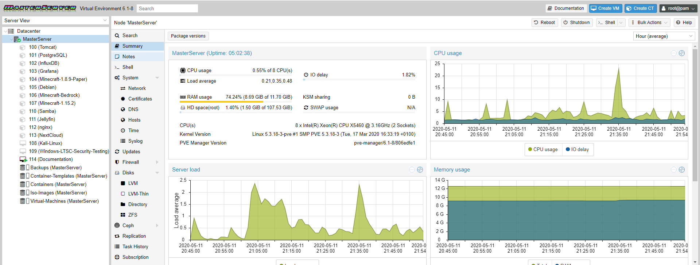
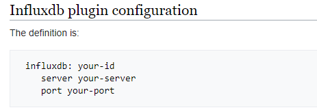
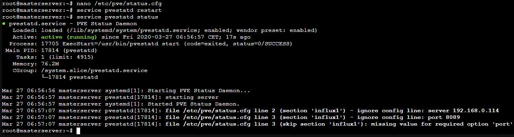
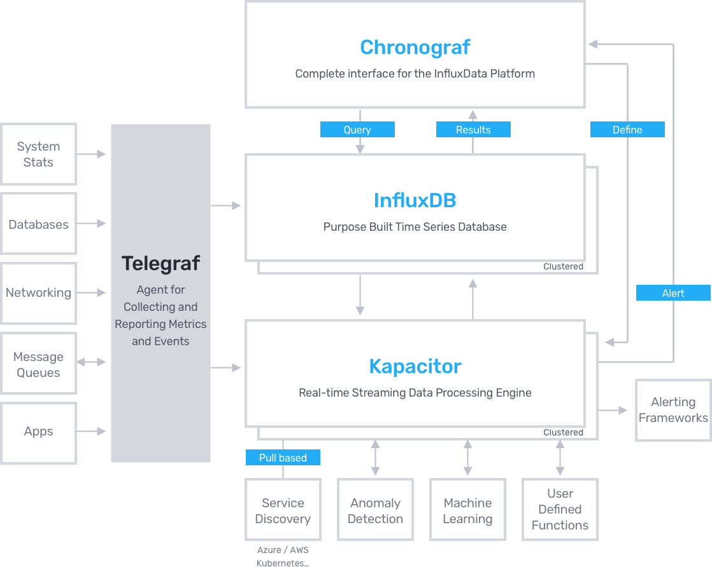
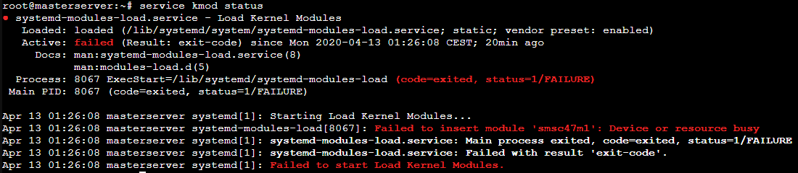
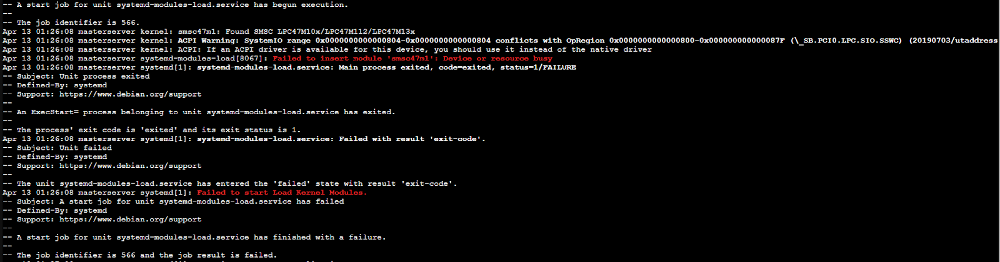
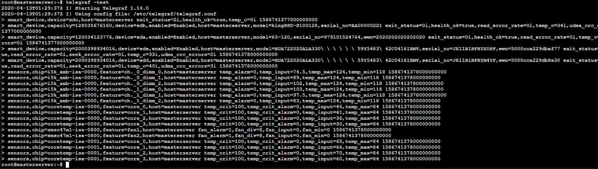

===================
Telegraf & PVEStatd
===================

| Proxmox already integrates an stats collector that displays statistics in the Proxmox GUI, so I only have to send those stats to a database to later display them in Grafana.
| Those metrics are not totally complete since they lack in temperature, fan RPMs, disks and a few more statistics that I like. Those are also collected by Telegraf

Deployment
==========

--------
PVEStatd
--------

| **PVEStatd** is the Proxmox service that manages all the statistics not only of each node or server, but also the whole datacenter.
| 
| Since I don't want anyone to be aware of the complex structure or give access to the Proxmox manager, I'm sending those stats to the InfluxDB server so I can manage them by myself.

| The Proxmox manual (only written in english and not translated) says to edit the */etc/pve/status.cfg* file and add the InfluxDB definition as it follows.

| After restarting the service I checked the InfluxDB database and saw if there was any new data arriving. Nothing happened, so I checked the pvestatd status.
| 
| The service was running and the status was active. Anyway, reading it's output I saw all the 3 lines in the config file were being ignored for some reason.

| I concluded that the problem was residing in the config file, so I tried with different spacing in the arguments.
| 
| It ended up being that the problem. In the manual they used spaces instead of tabs and thats wrong!.
| Using tabs worked perfectly and I started receiving data in InfluxDB!
| 
| Im not the only one who ran into that problem. There are several `unsolved threads <https://forum.proxmox.com/tags/influxdb/>`__ in the Proxmox forum related to that bug.
| 
| The final *status.cfg* file looks like this;

.. code-block:: vim

   influxdb: MasterServer
	   server 192.168.0.114
	   port 8089

--------
Telegraf
--------

| Proxmox pvestatd offers tons of data but I digged if I could get more.
| 
| Telegraf is a stats data collector developed by the same team as InfluxDB. Proxmox lacks when it comes to giving temperature stats and I consider them of vital importance.

| I installed Telegraf in the Proxmox host OS since it's based on Debian.

.. code-block:: bash

   wget https://dl.influxdata.com/telegraf/releases telegraf_1.14.0-1_amd64.deb
   dpkg -i telegraf_1.14.0-1_amd64.deb

| The way Telegraf works is through plugins. Those plugins collect outputs from different system files or programs.
| 
| It's important to know that it's not able to interact with hardware at low level, simply collects data from different sources specified by the plugins.
| 
| The plugins that I used can be found `here <https://docs.influxdata.com/telegraf/v1.14/plugins/plugin-list/>`__ and are the following;

- **S.M.A.R.T** [#]_ ; Collects metrics using the command ``smartctl``.
- **ZFS**; Collects metrics from the ZFS filesystems found in the */proc/spl/kstat/zfs* folder and using the commands ``sysctl`` and ``zpool``.
- **Sensors**; Collects metrics using the command ``sensors``.

| There were 2 plugins that I first tried and removed them because they didnt fit my needs and likings; The Temp plugin which only gave temperatures from a single CPU and hddtemp that was redundant since S.M.A.R.T already gives the drives temperature.
| 
| Smartctl and ZFS are already installed by default in Proxmox.

lm-sensors
----------

| To install **lm-sensors** I simply did ``apt-get install lm-sensors``.
| To configure it just execute ``sensors-detect``. Its a wizard [#]_ that will ask what kind of devices to detect. I answered yes to all of them so everything will be autodetected.
| After finishing the detection it will add the corresponding kernel modules to the */etc/modules* file.
| Here can be seen the ones it detected.

.. code-block:: vim

   # /etc/modules: kernel modules to load at boot time.
   #
   # This file contains the names of kernel modules that should be loaded
   # at boot time, one per line. Lines beginning with "#" are ignored.
   vfio
   vfio_iommu_type1
   vfio_pci
   vfio_virqfd

   # Generated by sensors-detect on Mon Apr 13 00:38:00 2020
   # Chip drivers
   coretemp
   15k_amb
   smsc47ml

| The problem was the sensor **smsc47m1** was not showing up so I manually tried loading the kernel module manually with ``modprobe smsc47m1`` and got the error.

.. code-block:: bash

   root@masterserver:~# modprobe smsc47m1
   modprobe: ERROR: could not insert 'smsc47m1': Device or resource busy

| With **modinfo** I could get more info about the kernel module.

.. code-block:: bash

   root@MasterServer:~# modinfo smsc47m1
   filename:       /lib/modules/5.3.18-3-pve/kernel/drivers/hwmon/smsc47m1.ko
   license:        GPL
   description:    SMSC LPC47M1xx fan sensors driver
   author:         Mark D. Studebaker <mdsxyz123@yahoo.com>
   srcversion:     72B57F526144C4C9D4EA53F
   depends:        
   retpoline:      Y
   intree:         Y
   name:           smsc47m1
   vermagic:       5.3.18-3-pve SMP mod_unload modversions 
   parm:           force_id:Override the detected device ID (ushort)

| Checking the status of **kmod** and executing ``journalct -xe`` I got more info.

| Even tho I had the **HWInfo** report I decided to double check the Super I/O controller was the correct one for the loaded kernel module. I installed **superiotool** with ``apt-get``.

.. code-block:: bash

   root@MasterServer:~# superiotool
   superiotool r6637
   Found SMSC LPC47M10x/112/13x (id=0x59, rev=0x00) at 0x2e

| In fact the module detected the right Super I/O so it was something different.
| After digging a while I discovered the problem was the ACPI [#]_, an open standard that replaces PnP, APM and MPS. It also includes lots of features such as Global and Sleep states and CPU, Devices and Performance states (Gx,Cx,Dx,Px, where x is a number).
| 
| To let the driver have access to the ACPI I had to edit the **GRUB** configuration file.
| I tried looking for */boot/grub/menu.lst* but didnt find the file which is supposed to have all the GRUB configs.
| After looking it up I found out that for **GRUB2** the config file is *grub.conf* instead of *menu.lst*.
| Anyway that file didnt have the configuration I looked for which instead was the */etc/default/grub* file I was looking for because it didnt have the *GRUB_CMDLINE_LINUX=’’* string.
| The file content ended like this.

.. code-block:: vim

   # If you change this file, run 'update-grub' afterwards to update
   # /boot/grub/grub.cfg.
   # For full documentation of the options in this file, see:
   #   info -f grub -n 'Simple configuration'

   GRUB_DEFAULT=0
   GRUB_TIMEOUT=5
   GRUB_DISTRIBUTOR="Proxmox Virtual Environment"
   GRUB_CMDLINE_LINUX_DEFAULT="quiet"
   GRUB_CMDLINE_LINUX="root=ZFS=rpool/ROOT/pve-1 boot=zfs acpi_enforce_resources=lax"

   # Disable os-prober, it might add menu entries for each guest
   GRUB_DISABLE_OS_PROBER=true

   # Uncomment to enable BadRAM filtering, modify to suit your needs
   # This works with Linux (no patch required) and with any kernel that obtains
   # the memory map information from GRUB (GNU Mach, kernel of FreeBSD ...)
   #GRUB_BADRAM="0x01234567,0xfefefefe,0x89abcdef,0xefefefef"

   # Uncomment to disable graphical terminal (grub-pc only)
   #GRUB_TERMINAL=console

   # The resolution used on graphical terminal
   # note that you can use only modes which your graphic card supports via VBE
   # you can see them in real GRUB with the command `vbeinfo'
   #GRUB_GFXMODE=640x480

   # Uncomment if you don't want GRUB to pass "root=UUID=xxx" parameter to Linux
   #GRUB_DISABLE_LINUX_UUID=true

   # Disable generation of recovery mode menu entries
   GRUB_DISABLE_RECOVERY="true"

   # Uncomment to get a beep at grub start
   #GRUB_INIT_TUNE="480 440 1"

| After editing it I did ``update-grub`` to apply the changes and restarted the MasterServer.
| It worked as it should and executing ``sensors`` displayed all the info.

.. code-block:: bash

   root@MasterServer:~# sensors
   coretemp-isa-0001
   Adapter: ISA adapter
   Core 0:       +61.0°C  (high = +84.0°C, crit = +100.0°C)
   Core 1:       +57.0°C  (high = +84.0°C, crit = +100.0°C)
   Core 2:       +51.0°C  (high = +84.0°C, crit = +100.0°C)
   Core 3:       +45.0°C  (high = +84.0°C, crit = +100.0°C)

   i5k_amb-isa-0000
   Adapter: ISA adapter
   Ch. 0 DIMM 0:  +88.5°C  (low  = +118.0°C, high = +124.0°C)
   Ch. 0 DIMM 1: +101.0°C  (low  = +118.0°C, high = +124.0°C)
   Ch. 0 DIMM 2: +111.5°C  (low  = +118.0°C, high = +124.0°C)
   Ch. 1 DIMM 0: +113.5°C  (low  = +118.0°C, high = +124.0°C)
   Ch. 1 DIMM 1: +107.0°C  (low  = +118.0°C, high = +124.0°C)
   Ch. 1 DIMM 2:  +88.0°C  (low  = +118.0°C, high = +124.0°C)

   nouveau-pci-0700
   Adapter: PCI adapter
   GPU core:     +0.88 V  (min =  +0.84 V, max =  +1.16 V)
   fan1:        1560 RPM
   temp1:        +33.0°C  (high = +95.0°C, hyst =  +3.0°C)
                          (crit = +105.0°C, hyst =  +5.0°C)
                          (emerg = +135.0°C, hyst =  +5.0°C)

   coretemp-isa-0000
   Adapter: ISA adapter
   Core 0:       +45.0°C  (high = +84.0°C, crit = +100.0°C)
   Core 1:       +41.0°C  (high = +84.0°C, crit = +100.0°C)
   Core 2:       +37.0°C  (high = +84.0°C, crit = +100.0°C)
   Core 3:       +33.0°C  (high = +84.0°C, crit = +100.0°C)

Setup
-----

| Telegraf includes a command to easily create a config file with the desired plugins. In */etc/telegraf* I executed the following commands.

.. code-block:: bash

   service telegraf stop
   ./telegraf -sample-config -input-filter temp:smart:sensors:zfs -output-filter influxdb >telegraf.conf
   mv telegraf.conf /etc/telegraf/telegraf.conf
   service telegraf start

| This way the plugins default configuration is added to the config file. Anyway we can get each plugin configuration from github `here <https://github.com/influxdata/telegraf/tree/release-1.14/plugins/inputs>`_ and add it to the config file.
| 
| The original file is too long to be showed here so I just put the parts that I modified after generating the config file.

.. code-block:: vim

   ###############################################################################
   #                            OUTPUT PLUGINS                                   #
   ###############################################################################

   # Configuration for sending metrics to InfluxDB
   [[outputs.influxdb]]
     ## The full HTTP or UDP URL for your InfluxDB instance.
     ##
     ## Multiple URLs can be specified for a single cluster, only ONE of the
     ## urls will be written to each interval.
     # urls = ["unix:///var/run/influxdb.sock"]
     urls = ["udp://192.168.0.114:8089"]
     # urls = ["http://192.168.0.114:8086"]

     ## The target database for metrics; will be created as needed.
     ## For UDP url endpoint database needs to be configured on server side.
      database = "telegraf"

   ###############################################################################
   #                            INPUT PLUGINS                                    #
   ###############################################################################

   # Read metrics from storage devices supporting S.M.A.R.T.
   [[inputs.smart]]
     ## Optionally specify the path to the smartctl executable
     # path = "/usr/bin/smartctl"

     ## On most platforms smartctl requires root access.
     ## Setting 'use_sudo' to true will make use of sudo to run smartctl.
     ## Sudo must be configured to to allow the telegraf user to run smartctl
     ## without a password.
   use_sudo = true

     ## Skip checking disks in this power mode. Defaults to
     ## "standby" to not wake up disks that have stoped rotating.
     ## See --nocheck in the man pages for smartctl.
     ## smartctl version 5.41 and 5.42 have faulty detection of
     ## power mode and might require changing this value to
     ## "never" depending on your disks.
     # nocheck = "standby"

     ## Gather all returned S.M.A.R.T. attribute metrics and the detailed
     ## information from each drive into the 'smart_attribute' measurement.
   attributes = true

     ## Optionally specify devices to exclude from reporting.
     # excludes = [ "/dev/pass6" ]

     ## Optionally specify devices and device type, if unset
     ## a scan (smartctl --scan) for S.M.A.R.T. devices will
     ## done and all found will be included except for the
     ## excluded in excludes.
     # devices = [ "/dev/ada0 -d atacam" ]

     ## Timeout for the smartctl command to complete.
     # timeout = "30s"

   # Monitor sensors, requires lm-sensors package
   [[inputs.sensors]]
     ## Remove numbers from field names.
     ## If true, a field name like 'temp1_input' will be changed to 'temp_input'.
     # remove_numbers = true

     ## Timeout is the maximum amount of time that the sensors command can run.
     # timeout = "5s"

   [[inputs.zfs]]
     ## ZFS kstat path. Ignored on FreeBSD
     ## If not specified, then default is:
     # kstatPath = "/proc/spl/kstat/zfs"

     ## By default, telegraf gather all zfs stats
     ## Override the stats list using the kstatMetrics array:
     ## For FreeBSD, the default is:
     # kstatMetrics = ["arcstats", "zfetchstats", "vdev_cache_stats"]
  ## For Linux, the default is:
  # kstatMetrics = ["abdstats", "arcstats", "dnodestats", "dbufcachestats",
  #     "dmu_tx", "fm", "vdev_mirror_stats", "zfetchstats", "zil"]

  ## By default, don't gather zpool stats
  poolMetrics = true

| I used the **UDP** protocol to send data to the *telegraf* database in InfluxDB. For smartctl, enabled *use sudo* and *attributes settings* so it can output advanced metrics like the temperature. Finally for ZFS enabled *poolMetrics* so it can give the status of pools and other advanced metrics.
| 
| Finally I checked that telegraf was outputting the correct metrics and they were arriving to the database.

.. rubric:: *Footnotes*

.. [#] Self-Monitoring Analysis & Reporting Technology
.. [#] Setup asistance presented to the user in dialog boxes
.. [#] Advanced Configuration & Power Interface
