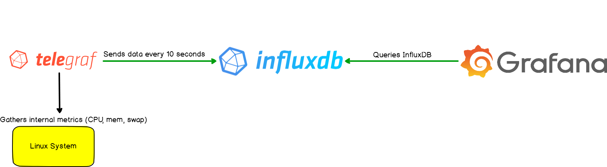

============
Stats Server
============

Statistic analysis
==================

| **Statistic analysis** is the treatment of data collected through an amount of time with research, monitorization, prediction and error detection purposes. 
| Computers can measure variables in a way it would be impossible for humans thanks to sensors.

| A traditional statistical analisis requires 6 main steps.

1. **Data**
2. **Variables**
3. **Estimation**
4. **Statistics**
5. **Testing**
6. **Analisis & Representation**

----
Data
----

| There are 2 main data types.

- **Cross-Sectional Data**; Collection of observations for multiple individuals at a single point in time (time stamp).
- **Time Series Data**; Collection of observations for a single individual at different time intervals.

| Combining both another type can be obtained;

- **Panel/Longitudinal Data**; Collection of observations for multiple individuals at multiple time intervals.

| The requirements to obtain Panel Data are the following.

- Every individual time intervals are measured for the same amount of time.
- Every individual have the same time spacing between each sample [#]_ .

| Considering *X* as the subject under analysis, *i* as an individual and *t* as a point in time, given a constant value to X.

- In Cross-Sectional Data, *i* is a variable and *t* is a constant
- In Time Series Data, *t* is variable and *i* is a constant
- In Panel Data, *t* and *i* are variables

| Depending on the data we can obtain different results;

- Comparing the behaviour of multiple individuals over a single point in time. Predict based on multiple individuals (individuals have differences and similarities between each others which makes **relations**).
- Comparing the behaviour of a single individual over multiple points in time. Predict based on older results.
- Comparing the behaviour of multiple individuals over multiple points in time. Predict based on multiple individuals and older results.

---------
Variables
---------

| There are 2 types.

- **Qualitative**; Descriptions expressed as words. Values without any precission or range and unknown before the study.
- **Quantitative**; Measures expressed as numbers. Values with a defined precission and range and known before the study.

| We can obtain also different results.

- **Structured**; Used to obtain high-precission values.
- **Unstructured**; Used to discover people opinions or thoughts over a subject.

----------
Estimation
----------

| It's a complex part of statistics based on margins of error and the level of confidence. Since im working with a computer, the margins of error depend on the sensors, precission of the programs that give the metrics and the Unix epoch time precission. The level of confidence is considered plenty.

----------
Statistics
----------

| It's the part that consists in processing the obtained data applying mathematical functions in order to obtain descriptive results.

-------------------------
Analysis & Representation
-------------------------

| It's the part that a person analyzes the given results to come to a conclusion and show them as a graphic or table in the most suitable and explanatory way.

Deployment
==========

| The statistics stack architecture I created is composed of 3 main technologies.

- **Telegraf & PVEStatd**; Data collector
- **InfluxDB**; Time-series database
- **Grafana**; Graphic metrics visualizer

| Compared with a traditional statistical analysis.

1. Data; Telegraf & PVEStatd
2. Variables; Quantitative focused to structured results
3. Estimation; As explained before
4. Statistics; InfluxDB
5. Testing; Applied before and during production
6. Analisis & Representation; Grafana

| The **statistics stack** will be deployed in 2 LXCs and the host machine. Security here is not an important fact because im only going to treat with the MasterServer stats, which means data is not sensible at all.

.. toctree::
   :maxdepth: 1
   :hidden:
   :caption: Contents:

   Telegraf & PVEStatd/index
   InfluxDB/index
   Grafana/index

.. rubric:: *Footnotes*

.. [#] Single data measure of a single individual at a single point in time
