=========
VM VS LXC
=========

| Proxmox is based in virtualization and containerization of OSs, services and programs.
| 
| The main difference between VMs and LXCs is that virtual machines rely on a different and fully isolated OS with a **different kernel**, while containers use the **host OS kernel** to run services or programs.
| 
| For that reason Proxmox only provides Linux Containers; Windows containers wouldn't make any sense since its hybrid kernel is completely different from the Unix monolithic one.

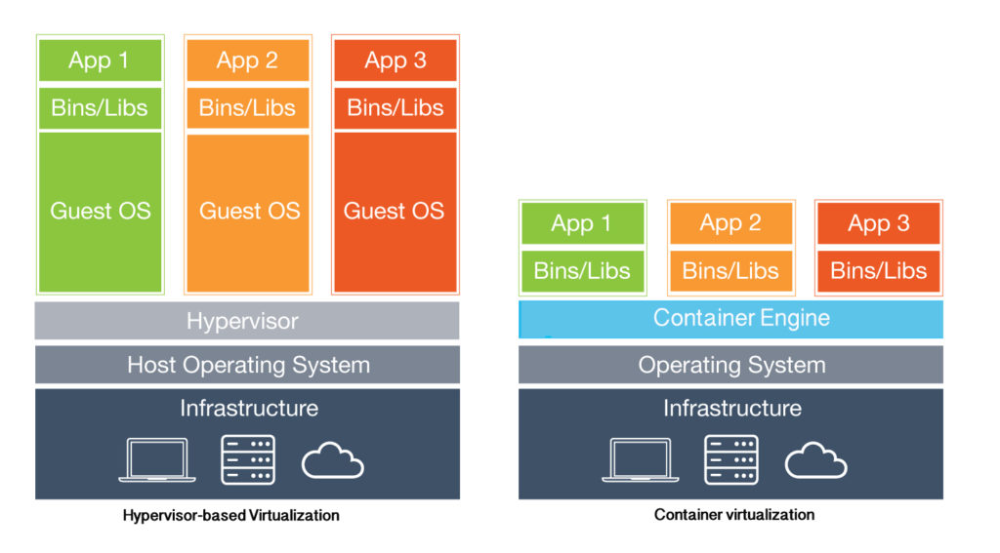

| A comparison of their most important differences is shown in this table.

+----------------------+---------------------------------------------------------------+---------------------------------------------+
|                      | VMs                                                           | LXC Containers                              |
+======================+===============================================================+=============================================+
| Performance          | Depends on emulated, paravirtualizated or passthrough devices | Native, best performance                    |
+----------------------+---------------------------------------------------------------+---------------------------------------------+
| Isolation & Security | Total                                                         | Slightly lower, through the use of programs |
+----------------------+---------------------------------------------------------------+---------------------------------------------+
| Weight               | Heavy                                                         | Light                                       |
+----------------------+---------------------------------------------------------------+---------------------------------------------+
| Interface            | GUI/TUI                                                       | Only TUI                                    |
+----------------------+---------------------------------------------------------------+---------------------------------------------+
| Creation             | ISO/IMG, slow                                                 | LXC Templates, blazing fast                 |
+----------------------+---------------------------------------------------------------+---------------------------------------------+

---------
LXC Types
---------

| Containers are slightly less isolated than virtual machines since they use the host OS kernel. To solve that problem there are 2 kinds of containers;

- **Privileged Containers**; The container user ID is the same as the host machine, so they lack in security and an advanced user could do a privilege escalation and root into the host system.
- **Unprivileged Containers**; The container user ID is mapped to a different host machine user. It will appear as we are root in the container but if we check it from the host machine, the container will be run by a totally different user, so it's isolated using **cgroups**. Also some of the host programs or services cannot be accessed from the container thanks to **AppArmor**.

| In this example, the container user is *root* but it's a completely different user from the host machine root user.
| The container root user is **mapped** to the ID 100000 in the host machine, totally different from the host machine root user ID.

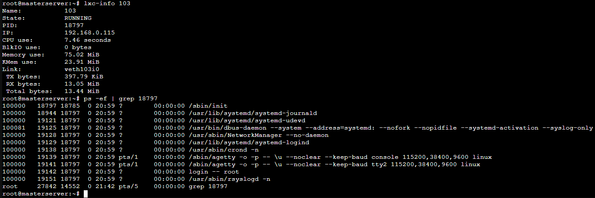

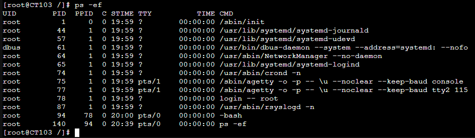

--------------
LXC Deployment
--------------

| First I downloaded the OS template for the first time accessing the content section in the *containerTemplates* storage. A template is only needed to download **once**.

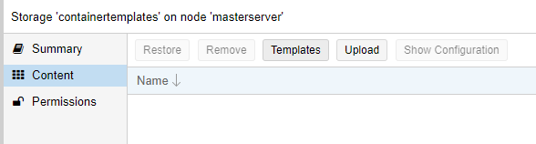

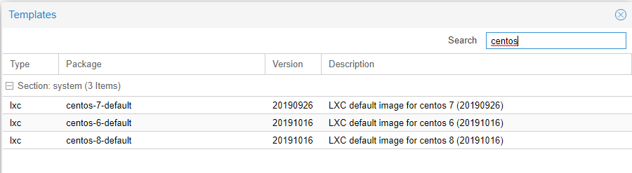

| After downloading the template then click on *Create LXC*.
| The container ID can't be repeated and it will be asigned automatically. | By default the container will be unprivileged. We must give it a hostname and a root password

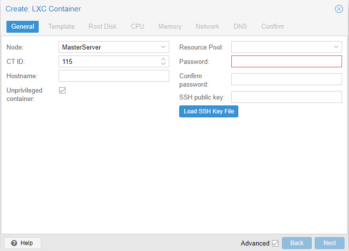

| Then choose the containers templates storage and select the downloaded one.

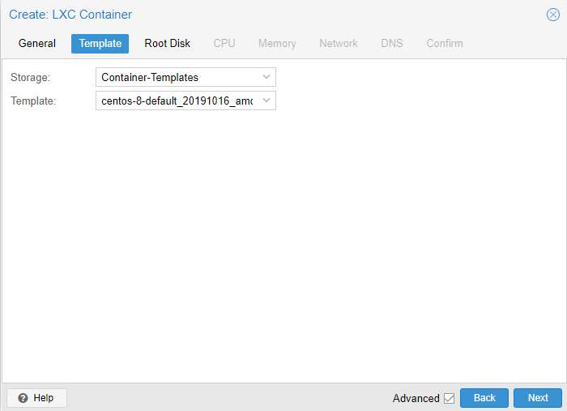

| Choose where to store the LXC data, its disk size and some optional preferences like ACLs or mount options.

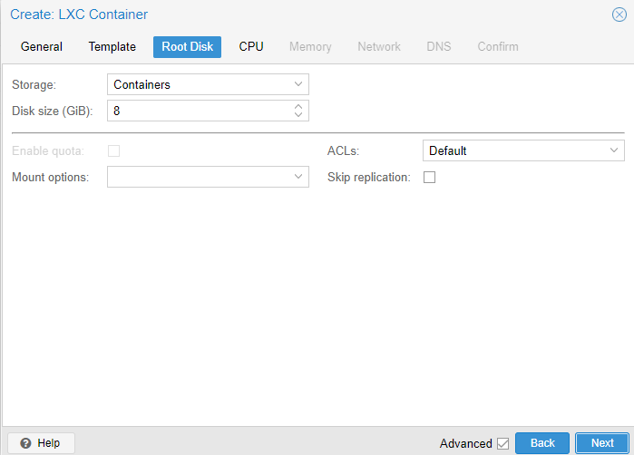

| Assign the number of CPU cores and its limit or units.

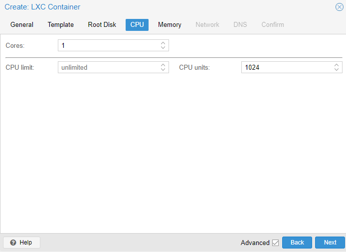

| Type the amount of RAM and Swap in MiB [#]_

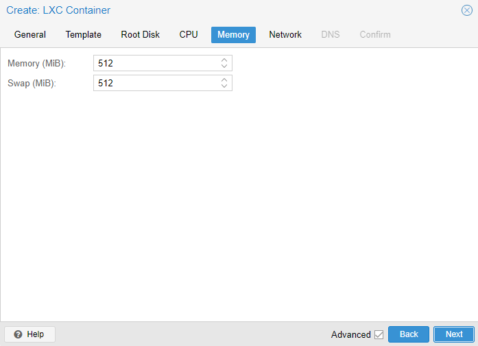

| Network settings and interfaces. The IPV4 must be in the IP/CIDR format

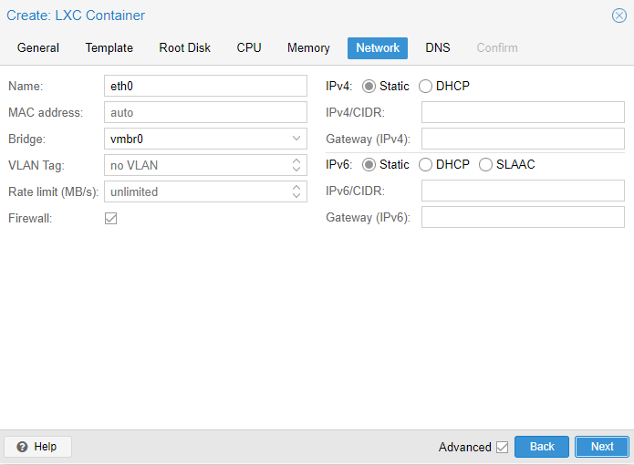

| And finally the DNS options, default will use the host settings.

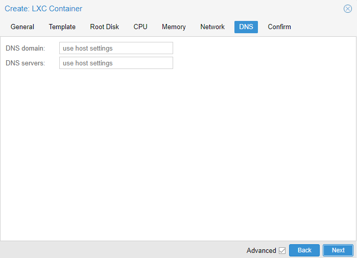

| The created container can be accessed through the container shell or either through the host with ``pct enter "id"``

---------
Chosen OS
---------

| The main thing im looking for is performance. A GUI is the last thing I would want in this case, it would be only good for a noob.
| I looked for the most suitable server OS and after discarding other possibilities, the main contestants were **Debian** and **CentOS**. The reasons why I chose CentOS over any other OS are the following.

- Released and supported by the Red Hat company
- Updates contain bug fixes
- Supported as server OS by most vendors
- 10 year life cycle
- Small default repositories provided by CentOS
- Does not have an upgrade path

| Compared to Debian;

- Released and supported by the community
- In stable versions bug fixes will not be applied unless they are server or security relevant
- Some packages are quite outdated
- 3 year life cycle. If the community has resources a LTS version will be offered afterwards
- Big default repositories provided by Debian
- Has a good upgrade path

| I also never used CentOS before so it was good learning how to use it.

----------
VM Devices
----------

| Since virtual machines dont share the host OS kernel, they can't access hardware directly as a container would do. There are 3 kind of devices for VMs; **Emulated**, **paravirtualized** and **passthrough**.

+-----------------+------------------------------------+--------------------------------------------+
|                 | Advantages                         | Disadvantages                              |
+=================+====================================+============================================+
| Emulated        | Widest hardware compatibility      |                                            |
|                 | Easy to set up                     | Worst performance                          |
|                 | Totally Portable images            |                                            |
+-----------------+------------------------------------+--------------------------------------------+
| Paravirtualized | Direct hardware access is possible | Complex driver architecture                |
|                 | Good image portability             | Compatibility limited by the vendors       |
+-----------------+------------------------------------+--------------------------------------------+
| PassThrough     | Total Native performance           | Hardware-specific images                   |
|                 |                                    | Hard Configuration And IOMMU Required      |
+-----------------+------------------------------------+--------------------------------------------+

Emulated & Paravirtualized
--------------------------

| Emulated devices are created by software that translates the original hardware instructions into other devices ones. For example, emulating a CGA [#]_ video card with a VGA one.
| 
| Paravirtualized devices are a modified version of the original hardware. The host grants special access to some aspects of the original hardware through drivers.

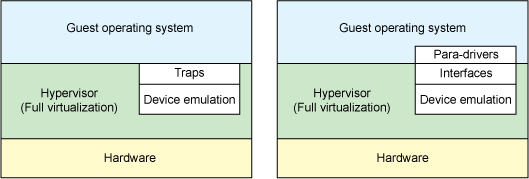

PassThrough
-----------

| Passthrough is the best method but requires further configuration and deep hardware knowledge.
| 
| The key component is the **IOMMU**. To explain what the IOMMU is, first there must be explained what a **MMU**, **DMA** and memory addresses are.

Memory Addresses
----------------

| RAM is divided in addresses.
| Physical addresses refer to hardware addresses of **physical memory** meanwhile virtual addresses refer to the virtual store **viewed by the process**.

- Virtual addresses might be the same as physical addresses.
- Virtual addresses might be different, in which case virtual addresses must be mapped into physical addresses **by the MMU**.
- Virtual space is limited by the size of virtual addresses, not physical addresses.
- Virtual space and physical memory space are independent.

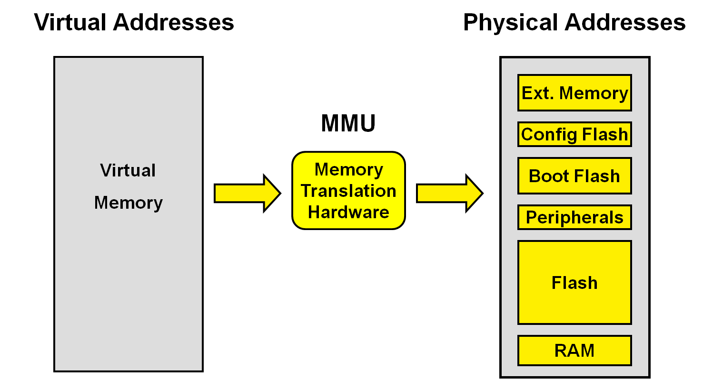

DMA
---

| Direct Memory Access is a feature of computer systems that allows hardware subsystems [#]_ to access RAM without having to depend on the CPU.
| 
| That means when the CPU is doing a IO operation, instead of being fully occupied during the operation and unable to do other work, it just initiates the transfer being available to do other operations. When the operation is done it receives an interrupt from the DMAC [#]_ .

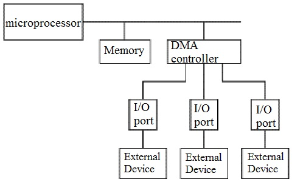

| The **DMAC** used to be in a separate packaging but now it's integrated in the chipset. A famous example is the **Intel 8237**

MMU & IOMMU
-----------

| The Memory Management Unit is a hardware IC [#]_ having all memory references passed through itself that translates virtual memory addresses to physical addresses.

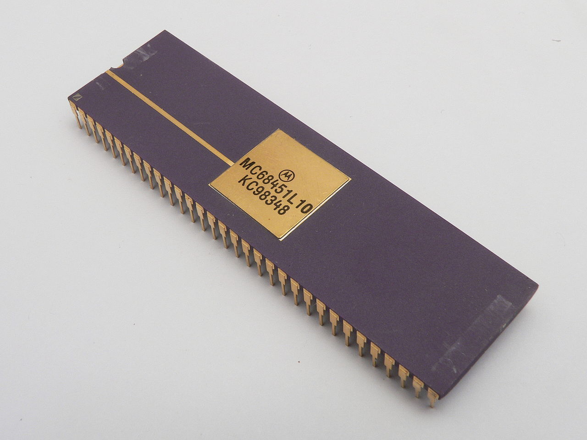

| The virtual addresses of the MMU are in the CPU view.

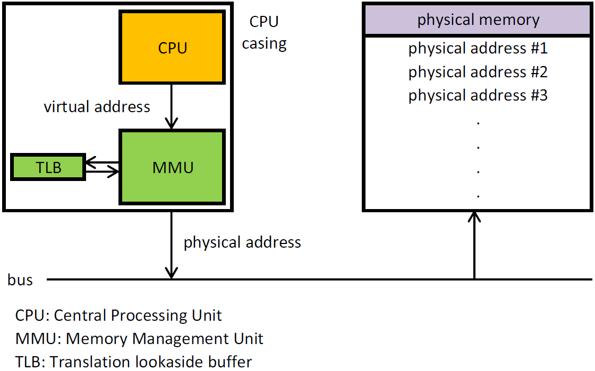

| The IOMMU is a type of MMU used by a device to translate I/O Virtual Addresses (IOVA) into physical addresses.

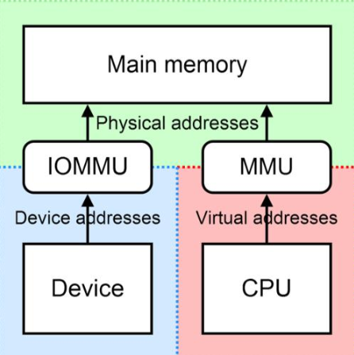

| IOMMU is used for direct device assignment in VMs. The driver for an assigned device runs in the VM to which it is assigned and is allowed to interact directly with the device hardware with minimal or no VMM involvement. 
| 
| Both AMD and Intel use the same IOMMU concept but the naming is different. Even intel refers as **VT-d** as IOMMU as seen in the article `Intel's Virtualization for Directed I/O (a.k.a IOMMU) <https://software.intel.com/content/www/us/en/develop/blogs/intels-virtualization-for-directed-io-aka-iommu-part-1.html>`_

+----------------------------+--------+------------+
|                            | AMD    | Intel      |
+============================+========+============+
| x86 Virtualization         | AMD-V  | Intel VT-x |
+----------------------------+--------+------------+
| I/O Devices Virtualization | AMD-Vi | Intel VT-d |
+----------------------------+--------+------------+

| VT-d has the following features:

- **DMA remapping**; Address translations for DMA from device.

- **Interrupt remapping**; Isolation and routing of interrupts from devices and external interrupt controllers to appropriate VMs.

- **Interrupt posting**; Direct delivery of virtual interrupts from devfices and external interrupt controllers to virtual processors.

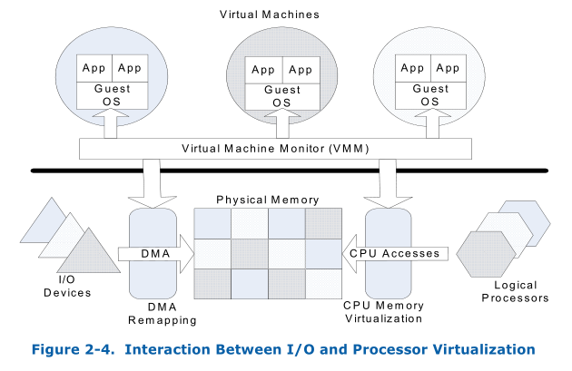

How To Enable VT-d
------------------

| First we need to know if the CPU and motherboard support VT-d. For Intel we can go on the CPU specs and see if it's supported.
| On the left, Intel E5502 featuring VT-d. On the right, X5460 without any information about VT-d. In that case I checked by myself wether it had VT-d capabilities or not.

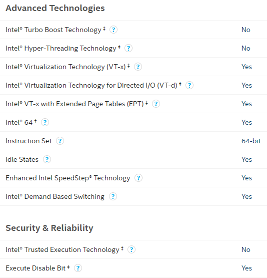

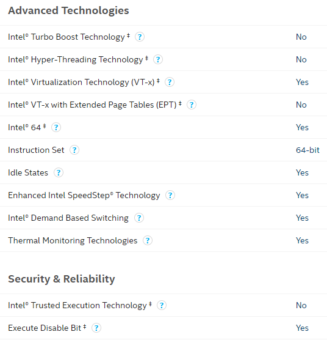

| First I edited the */etc/default/grub* file and turned the parameter *GRUB_CMDLINE_LINUX_DEFAULT="quiet"* into *GRUB_CMDLINE_LINUX_DEFAULT="quiet intel_iommu=on"*.

.. code-block:: vim

   # If you change this file, run 'update-grub' afterwards to update
   # /boot/grub/grub.cfg.
   # For full documentation of the options in this file, see:
   #   info -f grub -n 'Simple configuration'

   GRUB_DEFAULT=0
   GRUB_TIMEOUT=5
   GRUB_DISTRIBUTOR="Proxmox Virtual Environment"
   GRUB_CMDLINE_LINUX_DEFAULT="quiet"
   GRUB_CMDLINE_LINUX="root=ZFS=rpool/ROOT/pve-1 boot=zfs"

   # Disable os-prober, it might add menu entries for each guest
   GRUB_DISABLE_OS_PROBER=true

   # Uncomment to enable BadRAM filtering, modify to suit your needs
   # This works with Linux (no patch required) and with any kernel that obtains
   # the memory map information from GRUB (GNU Mach, kernel of FreeBSD ...)
   #GRUB_BADRAM="0x01234567,0xfefefefe,0x89abcdef,0xefefefef"

   # Uncomment to disable graphical terminal (grub-pc only)
   #GRUB_TERMINAL=console

   # The resolution used on graphical terminal
   # note that you can use only modes which your graphic card supports via VBE
   # you can see them in real GRUB with the command `vbeinfo'
   #GRUB_GFXMODE=640x480

   # Uncomment if you don't want GRUB to pass "root=UUID=xxx" parameter to Linux
   #GRUB_DISABLE_LINUX_UUID=true

   # Disable generation of recovery mode menu entries
   GRUB_DISABLE_RECOVERY="true"

   # Uncomment to get a beep at grub start
   #GRUB_INIT_TUNE="480 440 1"

| Then run ``update-grub`` so the changes are applied.   
| Add the following modules in */etc/modules*.

- vfio
- vfio_iommu_type1
- vfio_pci
- vfio_virqfd

| Execute ``update-initramfs -u -k all``.

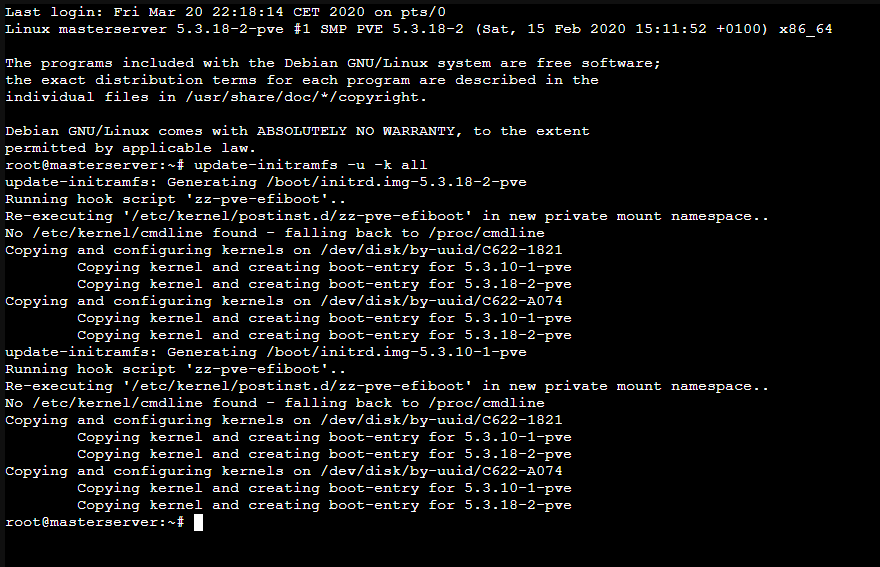

| Finally reboot the MasterServer and run ``dmesg | grep -e DMAR -e IOMMU``.

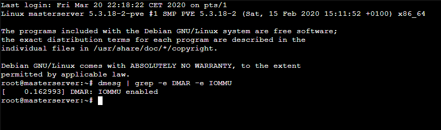

| The output of the command says that IOMMU is enabled but if I try to check the IOMMU groups with ``find /sys/kernel/iommu_groups/ -type l`` nothing shows up. That means that IOMMU is enabled but the hardware does not have an IOMMU.

-------------
VM Deployment
-------------

| To create a VM simply click on the *Create VM* button.
| First give it a name and choose wheter or not it will boot after Proxmox is booted.

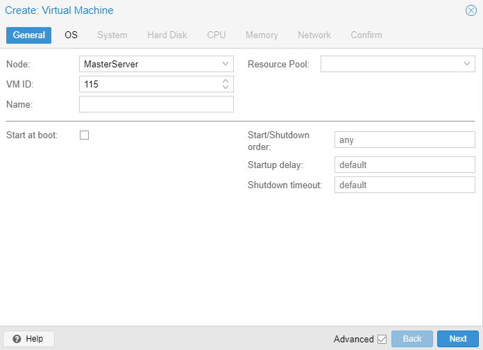

| Then choose the OS and the source image, along with the OS type and version.

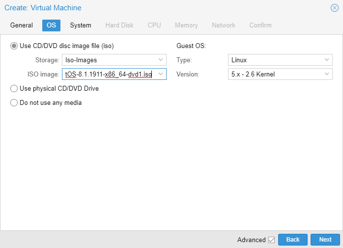

| In system choose the GPU, SCSI controller, BIOS or UEFI and the machine chipset. **Quemu agent** can be enabled for extra features.

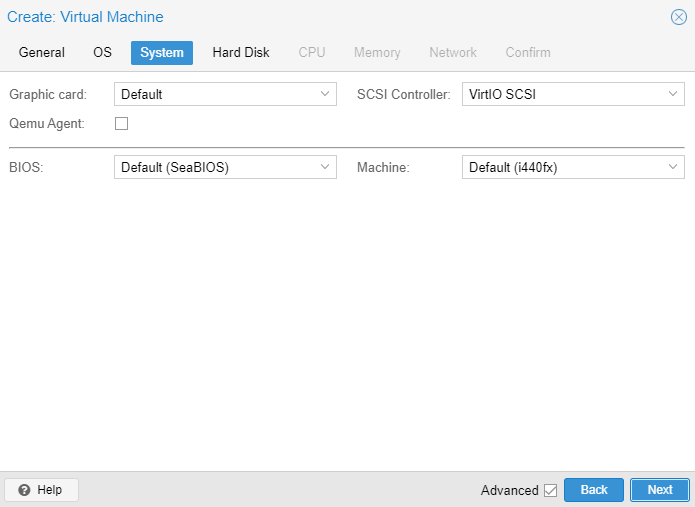

| Then choose the bus and device number, type of cache, discard (TRIM), the storage where the VM is going to be stored and its disk size. Also SSD emulation in case we are using an SSD as host hardware.
| 
| IO thread is an option that allows to have less SCSI devices but increases its performance most of the times. Also we can include or exclude the VM in backup and replication jobs. Setting a read and write limit is optional.

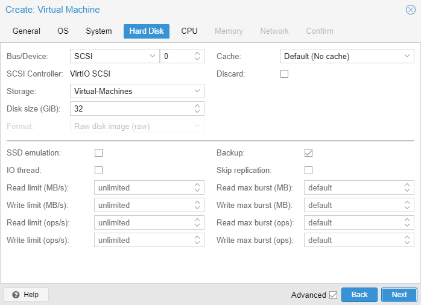

| In the CPU section choose the amount of sockets and cores. The VCPUs value will be set automatically. NUMA can be enabled or disabled. Extra CPU flags can be toggled.

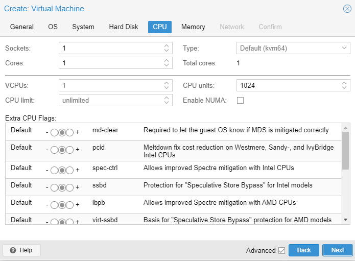

| In the Memory section type the amount of RAM and minimun memory used by the VM. The **ballooning device** is a VirtIO device that shares memory pages with the same content among similar VMs so the amount of RAM used is lower. It's something similar to deduplication.

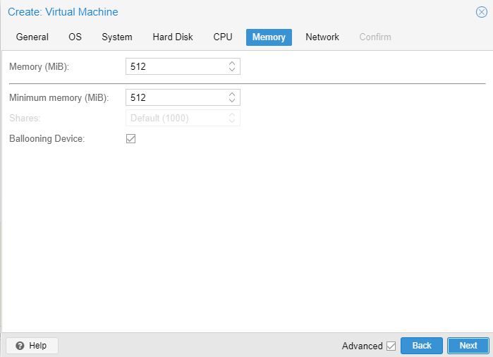

| Finally choose the network settings. The interface can be VirtIO or emulated.

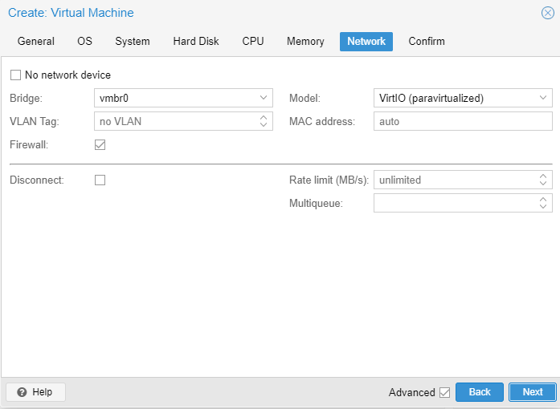

CPU
---

| The best option is always using all the CPU cores so Qemu shares the workload between all the VMs. Proxmox anyway wont let assign more CPU cores or sockets than the real ones provided by the hardware.
| 
| Depending on the needs limitations can be set, so in case the running VMs are using 100% of the CPU, the CPU time/use will be distributed according to the settings made, letting the main services have more CPU time so they dont lag.
| 
| The best way to manage that is using CPU units.
| 
| **CPU units** (also called CPU shares or CPU weight) is a relative number to the weights of all the other running VMs. The more CPU units we assign, the more CPU time the VM gets. It's passed to and used in the kernel Completely Fair Scheduler. The maximum value is 500000, minimal 8 and default 1024. 

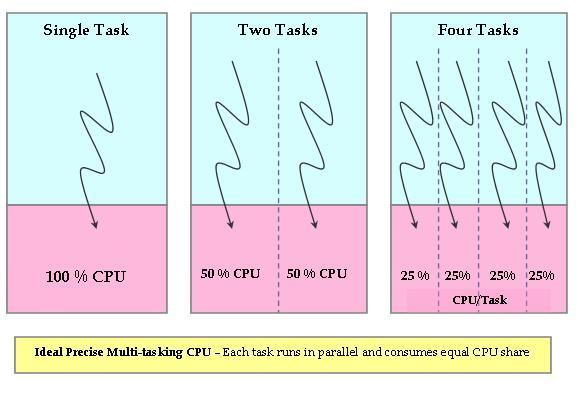

| 
| 
| 

.. rubric:: *Footnotes*

.. [#] Mebibyte
.. [#] Color Graphics Adapter. First video card with colors by IBM and also the first computer display standard
.. [#] Anything different from the CPU
.. [#] DMA Controller
.. [#] Integrated Circuit
