===
ZFS
===

Features
========

| **ZFS** is a filesystem and volume manager based in pooled storage with the advanced software RAID technology, **RAIDZ**.
| 
| Unlike traditional filesystems, its architecture eliminates the need of a separate volume manager like **LVM**.
| 
| ZFS is oriented for server structures, intended to archiving the **maximun performance** and designed to be run in a RAID.
| 
| Pros;

- Easy to admin
- Long-term storage
- Can be indefinitely scaled and resized
- High Configurability
- Highly tunable
- High availability
- Non hardware dependency
- Checksumming of all data and metadata
- Snapshots, backups and replication
- Data compression and deduplication [#]_
- Unaffected by RAID hardware changes
- ZFS file systems are not constrained to specific devices
- Advanced ARC1 & L2ARC2 Caching (100% cache hits most of the time) and tiered storage
- Automated and self-healing of data inconsistencies and write failure thanks to the ZIL
- Compatible with HBAs flashed to IT mode

| Cons:

- Can't be used with RAID cards
- Uses high amounts of RAM and a little of CPU
- Harder to master compared to MDADM

Architecture
============

------
Basics
------

| ZFS is based on Pools, Vdevs and Datasets;

- **Vdev**; Virtual Devices, array of one or more disks
- **Pool**; Group of Vdevs, Datasets and cache drives
- **Dataset**; Mount points of ZFS file subsystems and snapshots over the main file system.

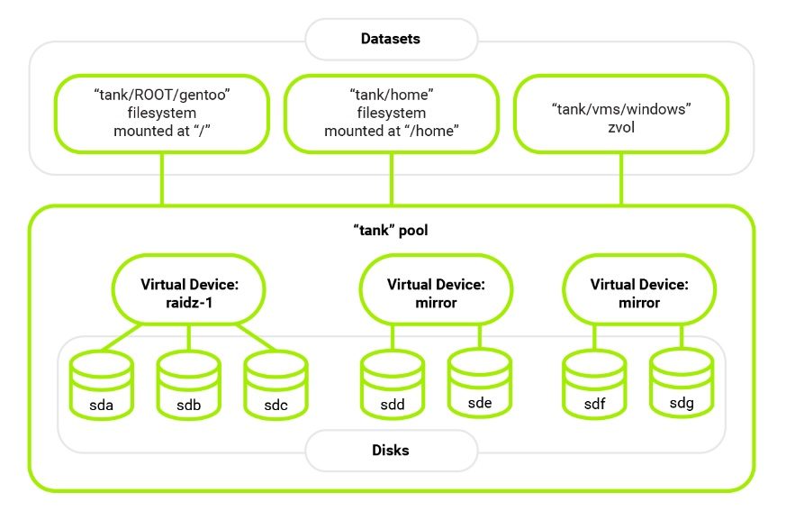

| It has a different naming when it comes to disks arrays. The most used ones are the following.

- **RAID-Z0** (RAID 0)
- **Mirror** (RAID 1)
- **RAID-Z** (RAID 5 without the write hole error [#]_)
- **RAID-Z2** (RAID 6)
- **Stripped Mirror**

-----------
Performance
-----------

| From the begginings of computing RAM has been used for running programs and HDDs for data and idle programs or games.
| 
| By that time RAM was an expensive and a very limited resource (Megabytes).
| It was circa 2009 when SSDs became popular and cheap to the consumer market.
| 
| Nowadays we store the OS and frequently used programs in SSDs, leaving the HDDs for long term storage or other programs.
| 
| **We always try to put the most used data in faster storage and leave the rest for the slower ones**.
| 
| The next step is using RAM as it was a regular disk, which is called a **RAMdisk**.
| 
| The main problems are that users are limited by the RAM size since it has to be used by programs that are being executed, having few space to store anything.
| Also, since RAM is **volatile memory**, users would have to store the data every time the computer is turned off.
|
| The best way to overcome this problem is using **RAM as cache**. That means the OS or filesystem uses the RAM that is left and not being used by programs to store the **data accesed frequently**, just like a regular CPU cache would do.
| 
| RAM Cache is just an almost perfect **time-memory tradeoff**.
| Memory which is not even being used or in idle state is spent (more RAM) to access data faster (less time).
| 
| The only little con is the CPU has to be in charge or controlling the cache algorithm, which is monitoring cache **hits** and **misses** telling when its content has to be changed to achieve the best performance.
|
| Anyway that supposes a minimal CPU use compared to the speeds achieved. 
| 
| This can also be applied to other slower storages like blazing fast **NVMe SSDs**.
| 
| ZFS supposes a change in the common storage pyramid; The higher in the piramid, the faster and smaller capacity. The lower, the slower and bigger capacity.

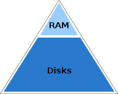

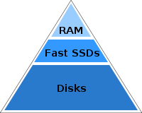

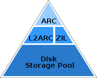

- **ARC**; Adaptive Replacement Cache, RAM cache.
- **L2ARC**; Level 2 ARC, SSDs and other fast storage cache.
- **ZIL**; ZFS Intent Log, a logging mechanism where all of the data to be the written is stored, then later flushed as a transactional write. Similar in function to a journal for journaled filesystems like ext3 or ext4. Useful to secure transactions.
- **SLOG**; Separate ZIL, a separate logging device that caches the synchronous parts of the ZIL before flushing them to a slower disk.

----------
Management
----------

- **Scrubbing**; ZFS can check periodically or on demand all data and copies of that data stored in any pool, to confirm that all copies match the expected integrity **checksums** and correct them if it's not the case. It's an intensive process which can be run in the background.

- **Resilvering**; ZFS automatically remedies any defects found and regenerates its data onto any new disks added to a Vdev. Resilvering is the ZFS equivalent of rebuilding a RAID, but since ZFS has complete knowledge of how storage is being used and which data is reliable, it can often avoid the full rebuild that other RAID rebuilds require. It only copies and verify the **minimum data needed** to restore the array.

- **Trimming**; Garbage collection technique that informs SSDs which data blocks can be erased because they are no longer in use. It prevents **performance degradation**. In ZFS it consists on writing a pattern to all the unallocated space in the pool

ZPool States
------------

| We can check the Pool status with ``zpool status -v "pool"``.
| 
| The possible states are in the following table.

+----------+---------------------------------------------------------------------------------------------------+
| ONLINE   | The Vdev is in normal working order                                                               |
+==========+===================================================================================================+
| DEGRADED | The Vdev has experienced a failure but can still function.                                        |
|          | The fault tolerance of the pool is compromised and a fault in another device is unrecoverable.    |
+----------+---------------------------------------------------------------------------------------------------+
| FAULTED  | The Vdev is completely inaccessible.                                                              |
+----------+---------------------------------------------------------------------------------------------------+
| OFFLINE  | The device has been taken offline by an admin.                                                    |
+----------+---------------------------------------------------------------------------------------------------+
| UNAVAIL  | The Vdev cannot be opened.                                                                        |
+----------+---------------------------------------------------------------------------------------------------+
| REMOVED  | The device was physically removed while the system was running.                                   |
+----------+---------------------------------------------------------------------------------------------------+

ZFS Settings
------------

| Changing the ZFS parameters can be done in 2 ways.

- Changing the values in */sys/module/zfs/parameters/”PARAMETER”* with ``cat >>`` to the file.
- Changing the values in */etc/modprobe.d/zfs.conf*.

| The second one is recommended because the **kernel** will load its configuration at boot since some of the parameters can't be changed on the spot. The config file syntax is always the same, ``options zfs “PARAMETER”=”VALUE”``

| ZFS values can be seen in the files at */proc/spl/kstat/zfs*.
| By default, (*value=0*) ZFS uses **half of the RAM size for the ARC**.
|
| Some of the most important parameters are the following

- zfs_arc_max
- zfs_arc_min
- zfs_max_dataset_nesting
- zfs_flags
- zfs_expire_snapshot

| A full chart of the parameters and explanation can be found `here <https://openzfs.github.io/openzfs-docs/Performance%20and%20tuning/ZFS%20on%20Linux%20Module%20Parameters.html>`_

Installation
============

| ZFS is installed by default in Proxmox so I just have to tune it for my needings.
| 
| After installing Proxmox I got the following devices.

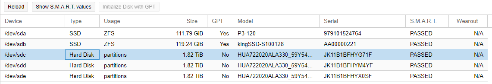

| The Hitachi disks I bought are formatted in NTFS for Windows so I checked them with fdisk.

.. code-block:: bash

   Disk /dev/sdc: 1.8 TiB, 2000398934016 bytes, 3907029168 sectors
   Disk model: HUA722020ALA330 
   Units: sectors of 1 * 512 = 512 bytes
   Sector size (logical/physical): 512 bytes / 512 bytes
   I/O size (minimum/optimal): 512 bytes / 512 bytes
   Disklabel type: dos
   Disk identifier: 0xd40cee52

   Device     Boot Start        End    Sectors  Size Id Type
   /dev/sdc1        2048 3907026943 3907024896  1.8T  7 HPFS/NTFS/exFAT

   Disk /dev/sdd: 1.8 TiB, 2000398934016 bytes, 3907029168 sectors
   Disk model: HUA722020ALA330 
   Units: sectors of 1 * 512 = 512 bytes
   Sector size (logical/physical): 512 bytes / 512 bytes
   I/O size (minimum/optimal): 512 bytes / 512 bytes
   Disklabel type: dos
   Disk identifier: 0xd40cee64

   Device     Boot Start        End    Sectors  Size Id Type
   /dev/sdd1        2048 3907026943 3907024896  1.8T  7 HPFS/NTFS/exFAT

   Disk /dev/sde: 1.8 TiB, 2000398934016 bytes, 3907029168 sectors
   Disk model: HUA722020ALA330 
   Units: sectors of 1 * 512 = 512 bytes
   Sector size (logical/physical): 512 bytes / 512 bytes
   I/O size (minimum/optimal): 512 bytes / 512 bytes
   Disklabel type: dos
   Disk identifier: 0xd40f11cd

   Device     Boot Start        End    Sectors  Size Id Type
   /dev/sde1        2048 3907026943 3907024896  1.8T  7 HPFS/NTFS/exFAT

| Then I used fdisk on each one of them to make them GPT.

.. code-block:: bash

   root@masterserver:~# fdisk /dev/sde

   Welcome to fdisk (util-linux 2.33.1).
   Changes will remain in memory only, until you decide to write them.
   Be careful before using the write command.

   Command (m for help): g
   Created a new GPT disklabel (GUID: A19F1625-8FEC-2746-8C92-BA625F6A08F3).
   The old dos signature will be removed by a write command.

   Command (m for help): p

   Disk /dev/sde: 1.8 TiB, 2000398934016 bytes, 3907029168 sectors
   Disk model: HUA722020ALA330 
   Units: sectors of 1 * 512 = 512 bytes
   Sector size (logical/physical): 512 bytes / 512 bytes
   I/O size (minimum/optimal): 512 bytes / 512 bytes
   Disklabel type: gpt
   Disk identifier: A19F1625-8FEC-2746-8C92-BA625F6A08F3

   Command (m for help): w
   The partition table has been altered.
   Calling ioctl() to re-read partition table.
   Syncing disks.

   root@masterserver:~# 

| After turning them all into GPT I created the RAIDZ from the GUI.

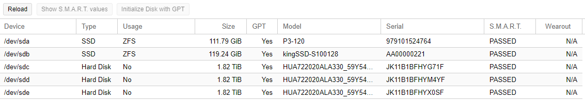

| First go to the disks section and choose ZFS.

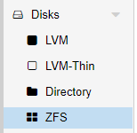

| Then select create ZFS.

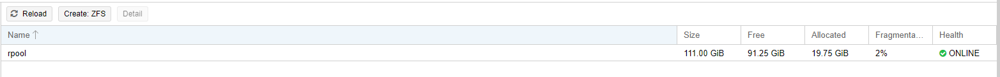

| Give a name to the pool, choose RAID-Z set **compression on** and select the 3 HDDs.

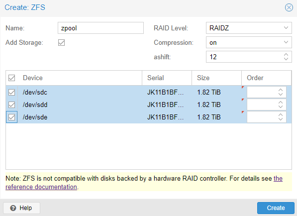

| The pool was created succesfully.

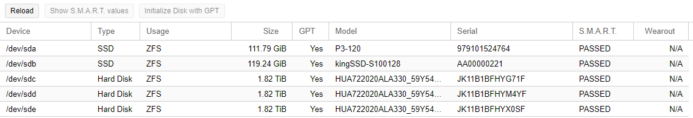

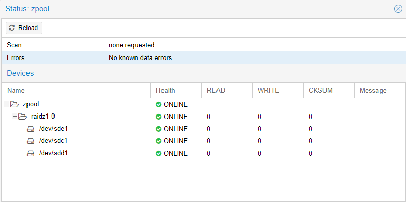

| Its status can be checked with ``zpool -v``.

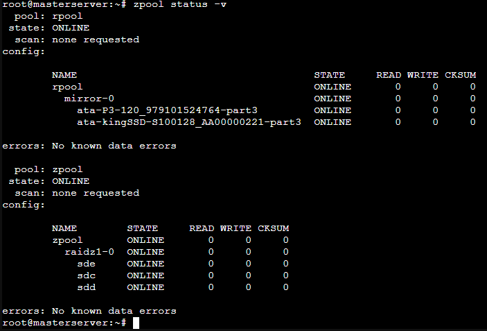

| The fdisk output looked like this.

.. code-block:: bash

   root@masterserver:~# fdisk -l
   Disk /dev/sda: 111.8 GiB, 120034123776 bytes, 234441648 sectors
   Disk model: P3-120          
   Units: sectors of 1 * 512 = 512 bytes
   Sector size (logical/physical): 512 bytes / 512 bytes
   I/O size (minimum/optimal): 512 bytes / 512 bytes
   Disklabel type: gpt
   Disk identifier: DDD9AF0C-0566-4BFD-933B-6ED6A13CD1B1

   Device       Start       End   Sectors   Size Type
   /dev/sda1       34      2047      2014  1007K BIOS boot
   /dev/sda2     2048   1050623   1048576   512M EFI System
   /dev/sda3  1050624 234441614 233390991 111.3G Solaris /usr & Apple ZFS

   Disk /dev/sdb: 119.2 GiB, 128035676160 bytes, 250069680 sectors
   Disk model: kingSSD-S100128 
   Units: sectors of 1 * 512 = 512 bytes
   Sector size (logical/physical): 512 bytes / 512 bytes
   I/O size (minimum/optimal): 512 bytes / 512 bytes
   Disklabel type: gpt
   Disk identifier: F79B10E6-9959-4FD0-B35E-A334E0337C3F

   Device       Start       End   Sectors   Size Type
   /dev/sdb1       34      2047      2014  1007K BIOS boot
   /dev/sdb2     2048   1050623   1048576   512M EFI System
   /dev/sdb3  1050624 250069646 249019023 118.8G Solaris /usr & Apple ZFS

   Disk /dev/sdc: 1.8 TiB, 2000398934016 bytes, 3907029168 sectors
   Disk model: HUA722020ALA330 
   Units: sectors of 1 * 512 = 512 bytes
   Sector size (logical/physical): 512 bytes / 512 bytes
   I/O size (minimum/optimal): 512 bytes / 512 bytes
   Disklabel type: gpt
   Disk identifier: CEAE2B5E-6AEA-F345-A8CE-58E8BEAE70B9

   Device          Start        End    Sectors  Size Type
   /dev/sdc1        2048 3907012607 3907010560  1.8T Solaris /usr & Apple ZFS
   /dev/sdc9  3907012608 3907028991      16384    8M Solaris reserved 1

   Disk /dev/sdd: 1.8 TiB, 2000398934016 bytes, 3907029168 sectors
   Disk model: HUA722020ALA330 
   Units: sectors of 1 * 512 = 512 bytes
   Sector size (logical/physical): 512 bytes / 512 bytes
   I/O size (minimum/optimal): 512 bytes / 512 bytes
   Disklabel type: gpt
   Disk identifier: 8E80C263-3D6D-DA4D-A70B-5B6134BF49D5

   Device          Start        End    Sectors  Size Type
   /dev/sdd1        2048 3907012607 3907010560  1.8T Solaris /usr & Apple ZFS
   /dev/sdd9  3907012608 3907028991      16384    8M Solaris reserved 1

   Disk /dev/sde: 1.8 TiB, 2000398934016 bytes, 3907029168 sectors
   Disk model: HUA722020ALA330 
   Units: sectors of 1 * 512 = 512 bytes
   Sector size (logical/physical): 512 bytes / 512 bytes
   I/O size (minimum/optimal): 512 bytes / 512 bytes
   Disklabel type: gpt
   Disk identifier: 6C2EA2A5-D28B-714E-87BB-215E0DF415D6

   Device          Start        End    Sectors  Size Type
   /dev/sde1        2048 3907012607 3907010560  1.8T Solaris /usr & Apple ZFS
   /dev/sde9  3907012608 3907028991      16384    8M Solaris reserved 1

   Disk /dev/zd0: 32 GiB, 34359738368 bytes, 67108864 sectors
   Units: sectors of 1 * 512 = 512 bytes
   Sector size (logical/physical): 512 bytes / 8192 bytes
   I/O size (minimum/optimal): 8192 bytes / 8192 bytes
   Disklabel type: dos
   Disk identifier: 0x000f0bd4

   Device     Boot    Start      End  Sectors  Size Id Type
   /dev/zd0p1 *        2048 50724863 50722816 24.2G 83 Linux
   /dev/zd0p2      50726910 67106815 16379906  7.8G  5 Extended
   /dev/zd0p5      50726912 67106815 16379904  7.8G 82 Linux swap / Solaris

   Partition 2 does not start on physical sector boundary.

   Disk /dev/zd16: 35 GiB, 37580963840 bytes, 73400320 sectors
   Units: sectors of 1 * 512 = 512 bytes
   Sector size (logical/physical): 512 bytes / 8192 bytes
   I/O size (minimum/optimal): 8192 bytes / 8192 bytes
   Disklabel type: dos
   Disk identifier: 0xbc63c76a

   Device      Boot   Start      End  Sectors  Size Id Type
   /dev/zd16p1 *       2048  1126399  1124352  549M  7 HPFS/NTFS/exFAT
   /dev/zd16p2      1126400 73398271 72271872 34.5G  7 HPFS/NTFS/exFAT
   root@masterserver:~# 

| The kind of storage im going to use are directories and ZFS. Each one is able to store different types of data;

- **ZFS**; Disk image and containers
- **Directories**; Any kind

| After creating the RAIDZ I had to create the datasets. That can be done with the following commands.

.. code-block:: bash

   root@masterserver:~# mkdir zpool/virtualMachines
   root@masterserver:~# mkdir zpool/containers
   root@masterserver:~# mkdir zpool/data
   root@masterserver:~# mkdir zpool/isoImages
   root@masterserver:~# zfs create zpool/virtualMachines
   root@masterserver:~# zfs create zpool/containers
   root@masterserver:~# zfs create zpool/data
   root@masterserver:~# zfs list

| To mount the dataset just go to the **datacenter tab** and then *add a new storage*.

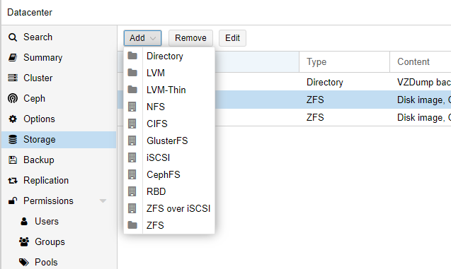

| Select ZFS and type in the ID, the created dataset, content and also make sure to enable **thin provisioning**.
|
| That means only the blocks the guest system uses will be **written**. If I had a 32GB disk, without thin provisioning after creating the ZFS storage those 32GB would be instantly taken from the available space.

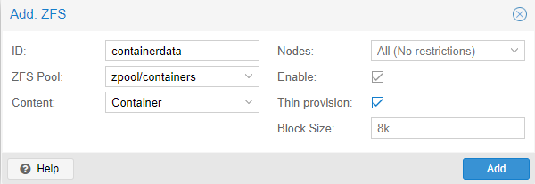

| Adding directories can be done in the same way, just choosing *Directory* instead of ZFS, then type the directory location and select its content.

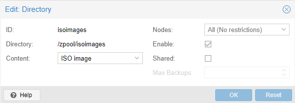

| The default Proxmox installation creates a local storage in the */var/lib/vz*. I dont want that one but also it can't be deleted, so what I did was just disable it.

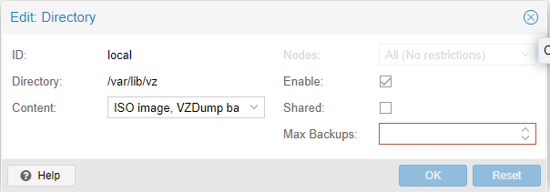

| Also Proxmox saves storage information in the */etc/pve/storage.cfg* file.

---------
Structure
---------

| Here is the final storage structure for the MasterServer

Extra: ZFS Failures
===================

---------------
Degraded Mirror
---------------

| While using the MasterServer I received a mail [#]_ saying that one of the disks in the mirror failed.
| 
| I checked it by myself and in fact one of the SSDs of the RAID failed. The pool passed to *DEGRADED* state with multiple read, write and checksum errors.

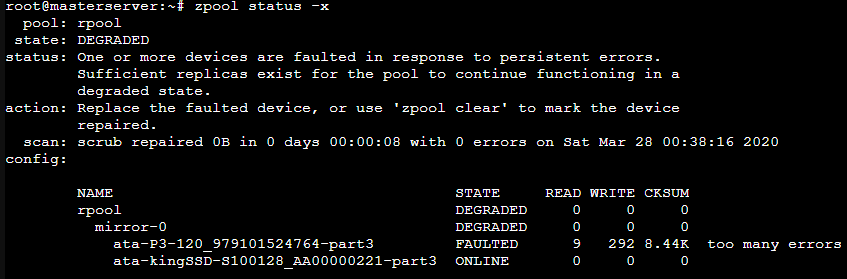

| What I did was unplug and plug back the SATA connector and it worked.

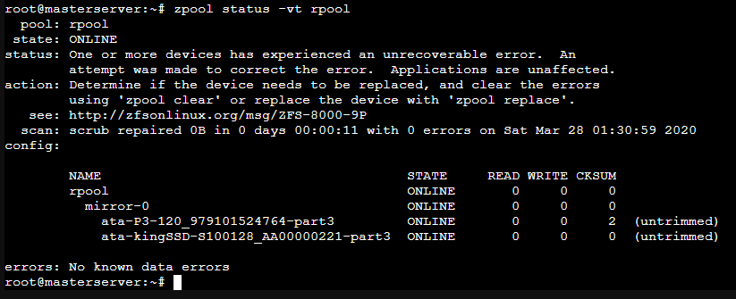

| By the way I saw they were untrimmed so I trimmed the mirror pool.

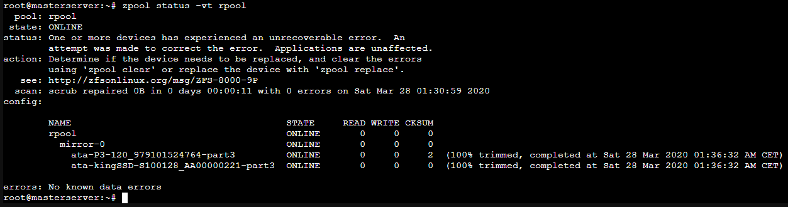

| After some time I noticed that the problem was SATA cables dont like being bent, specially if they dont have a plastic insulation.

----------------------------------
Datasets Not Being Mounted At Boot
----------------------------------

| One of the times I booted up the MasterServer I saw the ZFS pools and datasets were not mounted.
| For a second I thought the system broke and all the data was gone (Not yet), but doing ``zfs mount -Oa`` solved the error and the datasets mounted.
| 
| Anyway the following times after booting the same thing happened, so I thought it was a booting missconfiguration or error.
| After digging I found out where to change the zfs commands at startup, in the */lib/system/zfs-mount.service* file. I had to add the missing O parameter to the zfs mount command located in the *ExecStart* string.

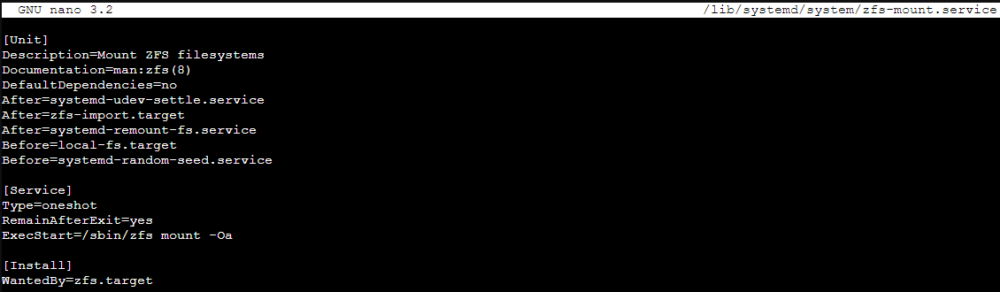

----------------
Complete Failure
----------------

| When I first installed proxmox I named the host as *masterserver*, but I wanted it to be **MasterServer** so it would be displayed in a proper way.
|
| I decided just to simply change its name in the hosts file. Well, after doing that more than a half of the basic Proxmox services stopped working and were giving failed state.
| 
| I didn't make any kind of backup, so I had all the LXCs and VMs data in the RAIDZ pool and the OS in the mirror pool.
| I decided to reinstall Proxmox and starting over again.
|
| Thanks to ZFS I did ``zfs export zpool`` so the RAIDZ would know that it was going to be exported (In this case to the same machine after reinstalling Proxmox, but it would work the same way if it was a different one).
| 
| After installing a clean Proxmox ISO all I had to do was zfs import for the RAID to be detected with ``zpool import zpool`` to import the actual pool and datasets. Finally I brought it back online with ``zpool online``.
| 
| So far, a success!
| 
| 
| 

.. rubric:: *Footnotes*

.. [#] Eliminating duplicate copies of repeating data
.. [#] Problem concerning any stripe + parity RAID layout which may produce inconsistent parity and data loss when the system is shutdown while there are active writes.
.. [#] Proxmox comes with a built-in mail server that sends error notifications
