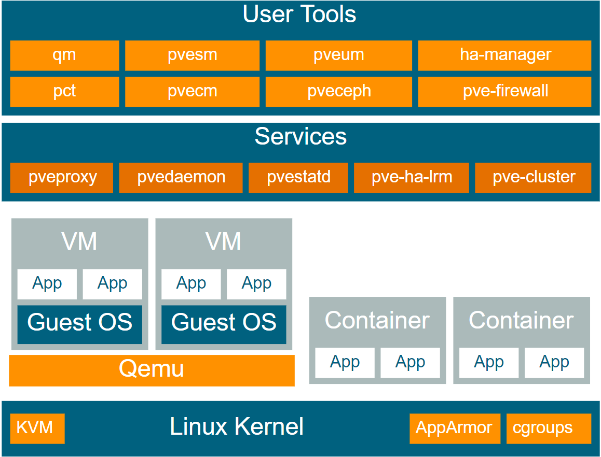
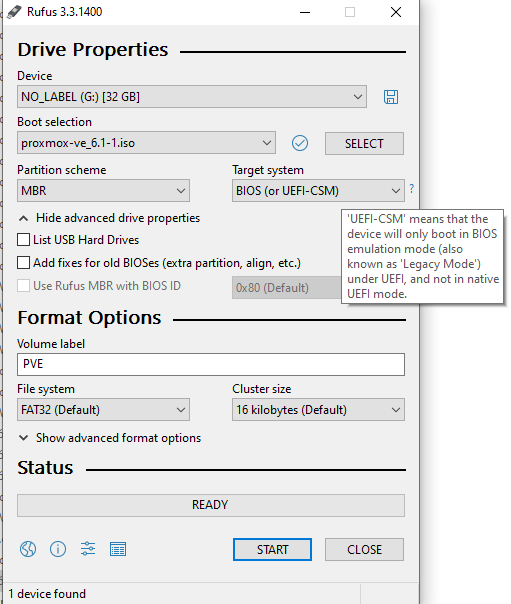
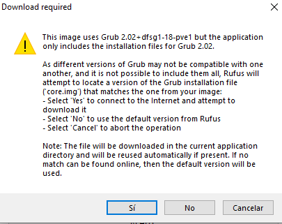
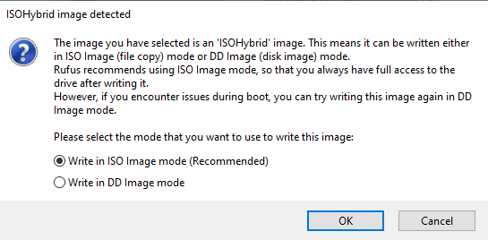
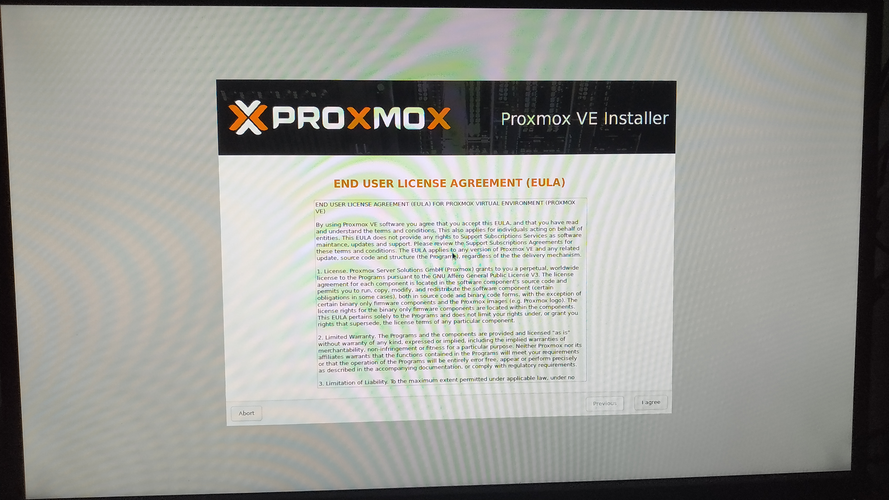
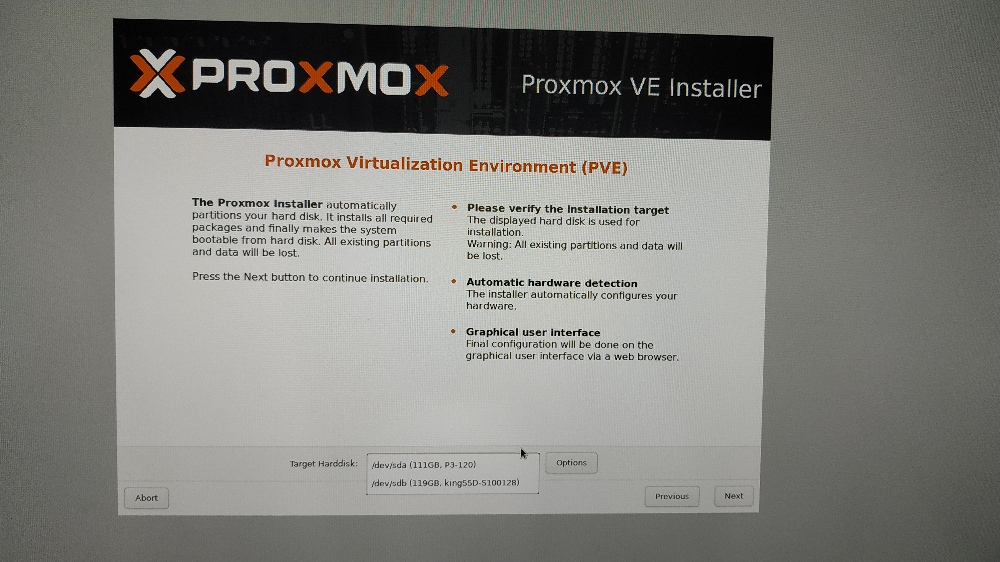
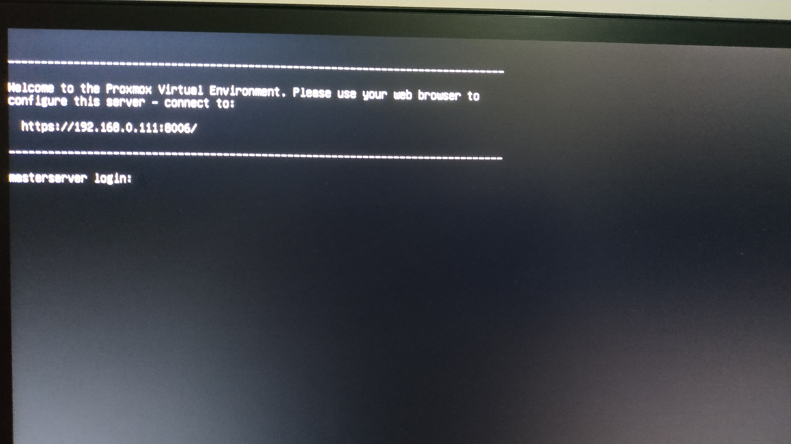
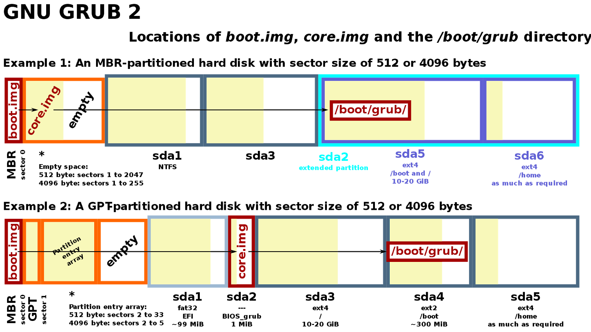
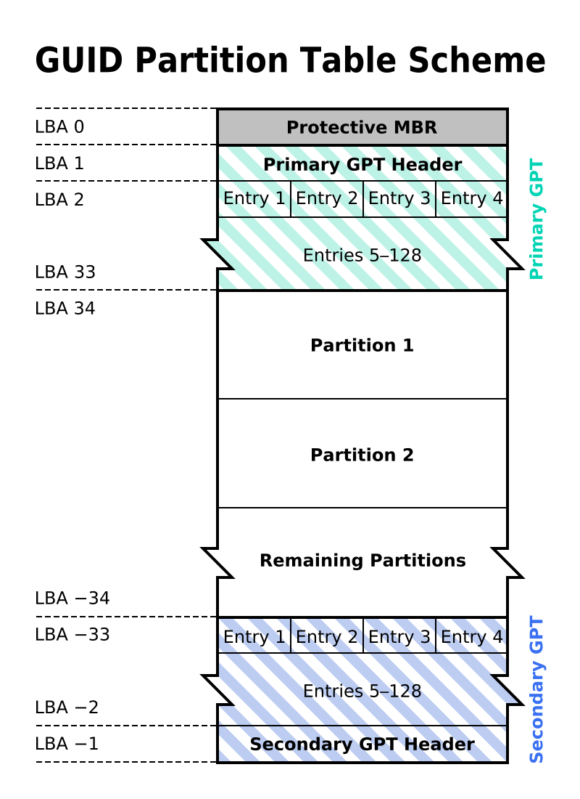

==========
Proxmox VE
==========

| **Proxmox Virtual Environment** is an hypervisor OS based in Debian and managed via web interface.
| 
| It uses QEMU VMs [#]_ and LXC [#]_ containers, it's compatible with a lot of computers and the hardware requirements are minimum.

Why I Chose It
==============

| Some alternatives to Proxmox were **VSphere** and **Citrix XenServer**, but I considered using Proxmox for the following reasons.

- The latest version of VSphere isn't compatible with the LGA771 processors, so I would have had to use an outdated version with less features. There are some ways to bypass that restriction but they were not official and barely tested.

- The license is totally **free**, unlike VSpehere which is expensive and I would have to pay a lot of money to not commit piracy.

- Compared with XenServer, Proxmox has better support and comunity, plus I like more the Proxmox web interface.

- The only part where Proxmox lacks is at Beowulf Clustering [#]_ but it features HA [#]_ clustering.

Installation
============

| Before installing, the first problem was that the MasterServer BIOS is Legacy and not UEFI.
| 
| In the Proxmox webpage it says that the installer only supports GPT, so I was thinking that the only way to install Proxmox in the MasterServer would be first installing Debian on MBR disks and then on top of it Proxmox.
| 
| That would lead me into some disadvantages such as a longer installation process, more configurations needed to be done, extra packages that are not needed and most important, no ZFS support!.
|
| Also in that case I would have to make the RAID with **MDADM** during the installation process, which is not a nice option because it's not recommended or supported installing Proxmox using MDADM RAID.
| 
| MBR based disks would not be a problem since the size im using is 120GB for the SSD’s and 2TB for the HDD’s, remembering that MBR only supports up to 2TB.
| 
| The partitions were not a problem either, since I'd not need more than 4 and I could create logic ones.
| 
| Anyway I wanted to give a try to the regular installer and see if it would actually work.

--------------
Image Creation
--------------

| First I tried using UUI [#]_ and got the “No Operative System Found” error while trying to boot from the USB.
| 
| Second time I used **Unetbootin** to burn the ISO and still got the same error.
| 
| Finally I decided using **Rufus** even tho it's normally used to burn Windows ISOs.
| 
| The first step is creating a bootable USB with the Proxmox ISO which can be downloaded `here <https://proxmox.com/en/downloads/category/iso-images-pve>`_ . At the moment im using the version 6.1
| 
| Then I formatted in FAT32 my trusty Patriot USB drive and executed the portable version of Rufus.

| After clicking START this window popped up and I chose No.

| Since im using Windows 10 in this PC to burn the image, it uses the ISO mode by default in every program instead of **DD**, which is the way to do it through command-line in Linux.
| 
| I decided to use DD this time and see if something would change.

| The resulting USB drive was not recognized by Windows and even if I tried to view its files Windows would say the USB was damaged.
| 
| Anyway it was worth a try so I tried booting from the USB drive and surprise, it worked!

-----------------
Proxmox Installer
-----------------

| First accept the EULA [#]_

| Then select the devices used to store the OS. I chose **ZFS RAID1** using the SSDs and left the advanced settings by default.

.. image:: media/installation13.jpg
   :width: 400px

.. image:: media/installation14.jpg
   :width: 400px

.. image:: media/installation15.jpg
   :width: 400px

| Type in the country and locale options, along with an email and password.

.. image:: media/installation16.jpg
   :width: 400px

.. image:: media/installation17.jpg
   :width: 400px

| Finally I typed the management interface (Gigabit onboard), Hostname FQDN [#]_, IP address, netmask, gateway and DNS server. 

.. image:: media/installation18.jpg
   :width: 400px

| The MasterServer could boot from the ZFS RAID and the installation was successful!

.. image:: media/installation19.jpg
   :width: 400px

.. image:: media/installation20.jpg
   :width: 400px

.. image:: media/installation21.jpg
   :width: 400px

.. image:: media/installation23.jpg
   :width: 400px

BIOS Boot Partition
-------------------

| At first I thought the installation would not work because the MasterServer doesn't support GPT disks.
|
| After doing the proper research about GPT [#]_ and MBR [#]_ records I came into the next statement;
|
| **Non-boot** GPT disks are supported on BIOS-only systems.
| 
| But that statement was the opposite to what happened, since it could boot Proxmox from GPT disks and the MasterServer is BIOS.
| 
| Then I thought about a concept called **Protective MBR** and guessed that was the reason why the MasterServer was able to boot the GPT disks, but I was wrong again!. Quoted from Microsoft:
| 
| “The Protective MBR, beginning in sector 0, precedes the GUID Partition Table partition table on the disk. The MBR contains one type 0xEE partition that spans the entire length of the disk”
| 
| That means the Protective MBR is just a kind of *flag* that tells old OSs without GPT support that the disk is GPT type.
| I decided using **fdisk** to check the disks and got the following results.

.. code-block:: bash

   root@masterserver:~# fdisk -l
   Disk /dev/sda: 111.8 GiB, 120034123776 bytes, 234441648 sectors
   Disk model: P3-120          
   Units: sectors of 1 * 512 = 512 bytes
   Sector size (logical/physical): 512 bytes / 512 bytes
   I/O size (minimum/optimal): 512 bytes / 512 bytes
   Disklabel type: gpt
   Disk identifier: DDD9AF0C-0566-4BFD-933B-6ED6A13CD1B1

   Device       Start       End   Sectors   Size Type
   /dev/sda1       34      2047      2014  1007K BIOS boot
   /dev/sda2     2048   1050623   1048576   512M EFI System
   /dev/sda3  1050624 234441614 233390991 111.3G Solaris /usr & Apple ZFS

   Disk /dev/sdb: 119.2 GiB, 128035676160 bytes, 250069680 sectors
   Disk model: kingSSD-S100128 
   Units: sectors of 1 * 512 = 512 bytes
   Sector size (logical/physical): 512 bytes / 512 bytes
   I/O size (minimum/optimal): 512 bytes / 512 bytes
   Disklabel type: gpt
   Disk identifier: F79B10E6-9959-4FD0-B35E-A334E0337C3F

   Device       Start       End   Sectors   Size Type
   /dev/sdb1       34      2047      2014  1007K BIOS boot
   /dev/sdb2     2048   1050623   1048576   512M EFI System
   /dev/sdb3  1050624 250069646 249019023 118.8G Solaris /usr & Apple ZFS
   root@masterserver:~# 

| The *sdx1* partition is **BIOS boot** type, first time I have seen it.
| 
| The BIOS boot partition is a partition that **GNU GRUB** uses on legacy BIOS-based personal computers in order to boot an operating system, when the actual boot device contains a GUID Partition Table. That layout is sometimes referred to as **BIOS/GPT boot**.

| The drive has both the MBR and GPT **headers**. when it boots in an **UEFI** system, it would just need to look at the entries of the GPT header to choose which partition to boot from.
| 
| On a BIOS system it would have to read the MBR and boot from the BIOS boot partition so it's able to boot a GPT disk from **GRUB 2**.
| Checking with fdisk I could see the BIOS boot partition followed by the **EFI System** partition. That means I have a dedicated partition in each of the disks for GRUB 2, the 2nd stage of the **boot loader**.

.. toctree::
   :maxdepth: 1
   :hidden:
   :caption: Contents:
	
   ZFS/index
   Customization/index
   VM & LXC/index
   Stats Server/index
   Media & Backup Server/index
   Web Server/index
   Minecraft/index

| 
| 
| 

.. rubric:: *Footnotes*

.. [#] Virtual Machine
.. [#] LinuX Container
.. [#] High Performance Cluster
.. [#] High Availability
.. [#] Universal USB Installer
.. [#] End User License Agreement
.. [#] Fully Qualified Domain Name
.. [#] GUID Partition Table
.. [#] Master Boot Record
